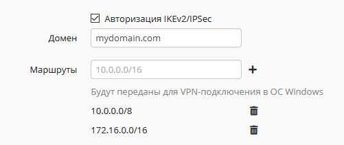
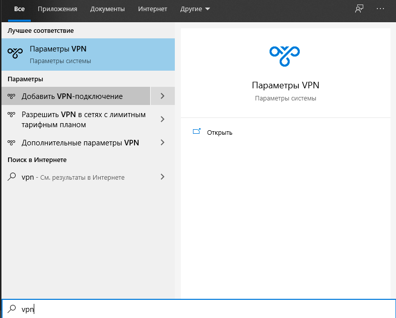
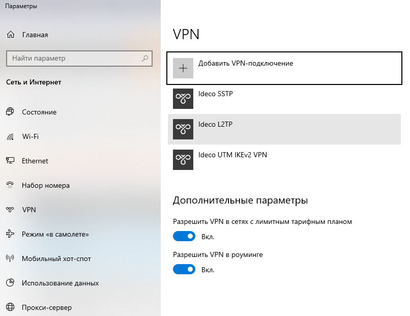
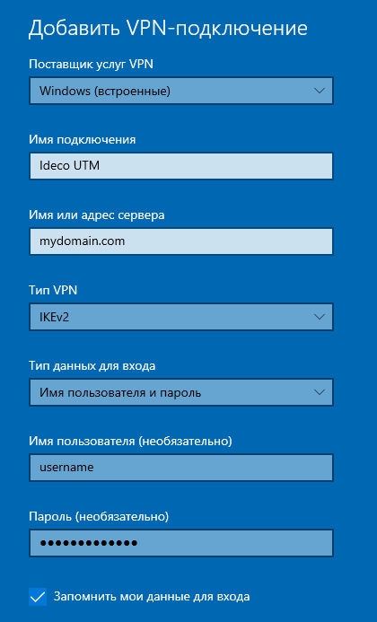

# IPSec IKEv2

Доступно начиная с версии Ideco UTM 7.9.9 build 155.

## Настройка Ideco UTM

1.  Для включения авторизации по SSTP установите соответствующий флажок
    в веб-интерфейсе в разделе **Сервисы - Авторизация пользователей -
    Общие - Авторизация IKEv2/IPSec.**
2.  При необходимости настройте передачу маршрутов клиентам до ваших
    локальных сетей.  
    
3.  Подключение возможно только по DNS-имени, поэтому IP-адрес внешнего
    интерфейса Ideco UTM должен резолвится в одно из имен вашей внешней
    доменной зоны.  
    Поэтому на этом шаге в поле "Домен" необходимо указать данное
    DNS-имя (используйте реальное имя с правильной А-записью, т.к.
    оно необходимо для выписки сертификата Let’s Encrypt).
4.  У пользователей, которым необходимо подключаться из вне по VPN
    установите флажок "Удалённый доступ через VPN" в дереве
    пользователей.  
    Указанный там логин и пароль будут использоваться для подключения.

## Настройка VPN-подключения в Windows

Для создания VPN вы можете использовать
[скрипт](./Скрипт_автоматического_создания_пользовательских_подключений_по_IPSec_IKEv2.md).
Либо создать его вручную.

1.  В меню "Пуск" введите с клавиатуры "vpn" и в появившихся программах
    выберите "Добавить VPN-подключение"  
      
      
2.  В появившемся окне параметров VPN-подключений нажмите "Добавить
    VPN-подключение"  
      
      
3.  В появившемся окне добавления подключений выберите соответствующие
    параметры:  
      
    Поставщик услуг VPN: Windows (встроенные)  
    Имя или адрес сервера: укажите ваш домен (указанный в настройках
    IKEv2 в Ideco UTM и резолвящийся в IP-адрес внешнего интерфейса
    Ideco UTM)  
    Тип VPN: IKEv2  
    Тип данных для входа: имя пользователя и пароль  
    Имя пользователя и пароль.

На некоторых установках Windows может потребоваться изменение реестра (в
случае получения ошибки 619 при подключении по VPN). Выполните команду:

    reg add HKLM\System\CurrentControlSet\Services\Rasman\Parameters /v NegotiateDH2048_AES256 /t REG_DWORD /d 1 /f

## Настройка VPN-подключения в Android

Скачайте приложение
[StrongSwan](https://play.google.com/store/apps/details?id=org.strongswan.android)
для подключения.

В нем добавьте новое подключение с доменом и вашими реквизитами доступа.

## Attachments:

[vpn.png](attachments/16842894/17072157.png) (image/png)  

[параметры.PNG](attachments/16842894/17072158.png)
(image/png)  
 [добавить
vpn.PNG](attachments/16842894/17072159.png) (image/png)  

[photo\_2020-05-20\_13-31-36.jpg](attachments/16842894/17072225.jpg)
(image/jpeg)  

