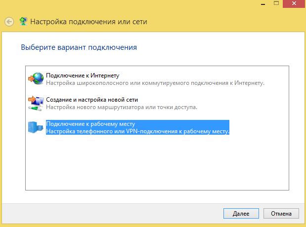

# L2TP/IPSec

## /\*\*/ Настройка глобальных параметров Ideco UTM Настройка аккаунта для подключения по VPN Общие настойки подключающегося устройства Настройка подключения к серверу в Windows 7, 8, 10. Возможные неполадки Если VPN-соединение установлено, но не получается получить доступ к ресурсам локальной сети

## Настройка глобальных параметров Ideco UTM

***Сервисы -\> IPsec -\> Пользователи -\> Разрешить подключения
пользователей***

**Укажите секретную фразу (PSK ключ)**

**  
**

## Настройка аккаунта для подключения по VPN

Разрешите пользователю подключения по VPN из сети интернет, включив в
настройках пользователя следующий флажок:

***Пользователи -\> Нужный пользователь -\> вкладка Общие -\> Удалённый
доступ через VPN***

## Общие настойки подключающегося устройства

При настройке подключения по VPN из сети Интернет, в свойствах
VPN-подключения нужно указывать:

  - Тип VPN - L2TP/IPsec
  - внешний адрес Ideco UTM в качестве VPN-сервера
  - логин и пароль созданного пользователя
  - PSK (pre-shared key) - ключ, указанный на странице Сервер - IPsec
    пользователи.
  - включить шифрование соединения

После подключения вы будете авторизованы на сервере Ideco UTM от имени
созданного пользователя и вам будут доступны сетевые хосты в локальной
сети предприятия.

Если вы не хотите чтобы после подключения по VPN интернет-трафик до
внешних ресурсов ходил через Ideco UTM, то свойствах
VPN-подключения Сеть/Протокол интернета TCP/IP версии
4/Дополнительно уберите галочку Использовать основной шлюз в
удаленной сети. Далее чтобы получить доступ к компьютерам за Ideco
UTM, вручную пропишите маршруты.

### Настройка подключения к серверу в Windows 7, 8, 10.

Вы можете создать [скрипт для подключения пользователей](./Скрипт_автоматического_создания_пользовательских_подключений_по_L2TP_IPSec.md),
тогда достаточно будет запустить полученный файл - все настройки будут
создаваться автоматически.

1.  **Центр управления сетями и общим доступом** - Создание и настройка
    нового подключения или сети.  
      
2.  Подключение к рабочему месту.  
    
3.  Использовать мое подключение к Интернету (VPN).  
    
4.  Введите адрес сервера (доменное имя или внешний IP-адрес Ideco UTM)
    и название подключения.  
    
5.  Перейдите к Свойствам данного подключения.  
    
6.  На вкладке "Безопасность" установите следующие параметры:  
    
7.  Нажмите кнопку "Дополнительные параметры", и введите общий ключ
    (PSK-ключ).  
    

 

### Возможные неполадки

  - Неправильно указан логин или пароль пользователя. Когда такое
    происходит то часто при повторном соединении предлагается
    указать домен. Старайтесь создавать цифро-буквенные пароли,
    желательно на латинице для ваших учетных записей. Если есть
    сомнения в этом пункте то временно установите логин и пароль
    пользователю "user" и "123456" соответственно.
  - Если подключение осуществляется с Windows, то для того, чтобы пакеты
    пошли через него надо убедиться, что в настройках этого подключения
    стоит чекбокс: "Свойства подключения VPN - Вкладка "Сеть" -
    Свойства опции "Протокол Интернета версии 4 (TCP/IPv4)" -
    Дополнительно - Использовать основной шлюз в удалённой сети".
    Если же маршрутизировать все пакеты в этот интерфейс не
    обязательно, то маршрут надо писать вручную.
  - Подключение происходит через DNAT, т.е. внешний интерфейс Ideco UTM
    не имеет "белого" IP-адреса, а необходимые для работы порты (500 и
    4500) "проброшены" на внешний интерфейс устройства, расположенного
    перед Ideco UTM и имеющего "белый" IP-адрес. В данном случае
    VPN-подключение либо вообще не будет устанавливаться, либо будут
    периодические обрывы. Решение только одно - исключить устройство
    перед Ideco UTM и указать на внешнем интерфейсе Ideco UTM "белый"
    IP-адрес, к которому в итоге и будут
    осуществляться L2TP/IPsec-подключения. Либо
    используйте протокол [SSTP](./SSTP.md), его проще опубликовать с
    помощью проброса портов.

 

Убедитесь, что локальная сеть (или адрес на сетевой карте) на удалённой
машине не пересекается с локальной сетью вашей организации, если
пересекается, то доступа к сети вашей организации не будет
(трафик по таблице маршрутизации пойдёт в физический интерфейс, а
не в VPN). **Адресацию надо менять.**

## Если VPN-соединение установлено, но не получается получить доступ к ресурсам локальной сети

Выполните рекомендации специальной статьи:[особенности маршрутизации и организации доступа](./Особенности_маршрутизации_и_организации_доступа.md).

## Attachments:

[ext\_vpn\_03.zoom66.png](attachments/2261077/2424862.png) (image/png)  

[ext\_vpn\_01.zoom65.png](attachments/2261077/2424863.png) (image/png)  

[ext\_vpn\_02.zoom65.png](attachments/2261077/2424864.png) (image/png)  

[vpn2.PNG](attachments/2261077/2424868.png) (image/png)  

[vpn3.PNG](attachments/2261077/2424869.png) (image/png)  

[vpn4.PNG](attachments/2261077/2424870.png) (image/png)  

[vpn5.PNG](attachments/2261077/2424871.png) (image/png)  

[vpn6.PNG](attachments/2261077/2424872.png) (image/png)  

[vpn7.PNG](attachments/2261077/2424874.png) (image/png)  

[vpn7.PNG](attachments/2261077/2424873.png) (image/png)  

[auto-proxyarp.png](attachments/2261077/5472353.png) (image/png)  

[allow-vpn-from-internet](attachments/2261077/5472319)
(application/x-upload-data)  

[allow-vpn-from-internet](attachments/2261077/5472318)
(application/x-upload-data)  

[vpn-user-properties.png](attachments/2261077/5472323.png) (image/png)  

[enable\_pptp\!.png](attachments/2261077/5472351.png) (image/png)  

[auto-proxyarp.png](attachments/2261077/5472316.png) (image/png)  

[vpn1\_new.png](attachments/2261077/6357059.png) (image/png)  

[vpn2\_new.png](attachments/2261077/6357060.png) (image/png)  

[psk.JPG](attachments/2261077/11436123.jpg) (image/jpeg)  

