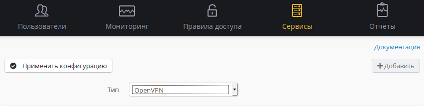
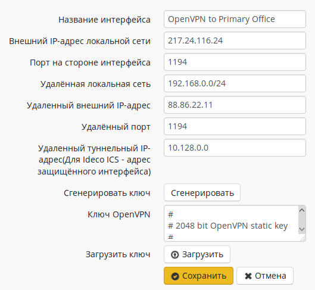

# OpenVPN

Эта технология построения защищенных каналов связи часто применяется в
корпоративных сетях для связи территориально удаленных офисов
предприятия в единую информационную инфраструктуру, обеспечивая
обмен информацией между объединяемыми сетями. Возможна настройка
шифрованного туннеля с использованием сертификата сервера и
публичного ключа для подключения клиентов.

Ideco UTM может подключаться по открытому ключу, загруженному на него с
другого сервера, или авторизовать клиентов, используя открытые ключи,
созданные им самим. Таким образом, возможна как выдача сервером
собственных публичных ключей, так и подключение к удаленным
серверам, используя сгенерированный ими публичный ключ. В
настройке туннеля участвуют два сервера, как правило,
являющиеся шлюзами в сеть Интернет из локальной сети
предприятия. Инициировать создание туннеля по технологии
OpenVPN может любая из сторон, аутентификация соединения при этом
происходит на сервере путем проверки предоставленного клиентом
ключа с сертификатом сервера.

Перед настройкой сетевых интерфейсов нужно убедиться в том, что оба
сервера имеют публичный IP-адрес от интернет-провайдера.

Туннель может быть организован как между двумя серверами Ideco UTM, так
и между Ideco UTM и другим сетевым устройством, поддерживающем OpenVPN
с аутентификацией по публичным ключам.

## Организация туннеля между двумя серверами Ideco UTM

Рассмотрим настройки интерфейса для сервера в центральном офисе, к
которому будут подключаться устройсва из других офисов. Для
настройки туннеля перейдите в меню ***Сервер -\> Интерфейсы*** и
создайте новый интерфейс нажатием на кнопку ***"Добавить"***. Выберите
тип интерфейса ***"OpenVPN"***. Меню выбора подключения по OpenVPN
представлено на фрагменте экрана ниже.

После создания интерфейса необходимо его настроить. Для этого нам
предстоит определить все параметры, описанные в этой таблице.

| Параметр                   | Описание                                                                                                                                                                                                                                                                                                                            |
| -------------------------- | ----------------------------------------------------------------------------------------------------------------------------------------------------------------------------------------------------------------------------------------------------------------------------------------------------------------------------------- |
| Имя интерфейса             | Кратко опишите назначение интерфейса в инфраструктуре вашей сети.                                                                                                                                                                                                                                                                   |
| Включен                    | Отметьте для того чтобы активировать интерфейс.                                                                                                                                                                                                                                                                                     |
| Внешний IP-адрес           | Укажите внешний публичный адрес этого сервера.                                                                                                                                                                                                                                                                                      |
| Локальный порт             | Укажите UDP-порт для установления OpenVPN на стороне этого сервера.                                                                                                                                                                                                                                                                 |
| Удалённая локальная сеть   | Укажите адрес локальной сети удалённого сервера. В зависимости от этого адреса автоматически пропишется маршрут.                                                                                                                                                                                                                    |
| Удаленный внешний IP-адрес | Укажите публичный IP-адрес удаленного сервера, с которым нужно организовать защищенный канал связи.                                                                                                                                                                                                                                 |
| Удалённый порт             | Укажите UDP-порт для установления OpenVPN на стороне удалённого сервера.                                                                                                                                                                                                                                                            |
| Сгенерировать ключ         | Сгенерируйте публичный ключ, если удаленные сервера должны подключаться к этому серверу. Как правило, центральный офис предоставляет публичные ключи для подключения удаленных офисов к нему по этому ключу, а удаленные офисы используют ключ главного сервера для подключения к серверу по этому ключу.                           |
| RSA-ключ в текстовой форме | Позволяет скопировать содержимое ключа в текстовой форме и отправить его администратору удалённого сервера по ICQ, почте и т.д.                                                                                                                                                                                                     |
| Скачать ключ               | Позволяет сохранить публичный ключ этого сервера на локальной машине для дальнейшей передачи на удаленный сервер. В дальнейшем удаленный сервер будет подключаться к этому серверу по выданному ему ключу. Как правило, используется в центральном офисе. Выгрузите ключ для дальнейшей передачи его на сервер в удаленном филиале. |
| Отправить ключ             | Используется для помещения публичного ключа удаленного сервера на этот сервер для дальнейшего подключения к удаленной стороне по этому ключу. Как правило, используется в филиалах. Так как мы настраиваем подключение в головном офисе, то мы не сохраняем на него сторонние ключи, предназначенные для подключения клиентов.      |

Форма настройки интерфейса для сервера в центральном офисе показана
ниже.

Сохраняем настройки интерфейса в головном офисе, нажав кнопку
**"Сохранить"**.

Настройки интерфейса OpenVPN на сервере в удаленном офисе будут
отличаться тем, что значения параметров локальной сети и
параметров удаленной сети нужно будет симметрично поменять
местами, а также поместить на удаленный сервер публичный ключ,
сгенерированный на сервере головного офиса ранее. Форма настройки
интерфейса для сервера в удаленном офисе представлена на фрагменте
ниже.

После сохранения настроек необходимо выполнить перезагрузку обоих
серверов, в результате туннель между ними должен установиться.

Также для корректного функционирования OpenVPN-туннеля необходимо
настроить некоторые параметры. Для этого в web-интерфейсе
перейдите в меню ***Серисы*** ***-\> Дополнительно*** и
выполните следующие действия:

  - отключите проверку обратного пути (RP\_FILTER).

Проверить это можно по индикатору состояния OpenVPN интерфейса. Маршруты
между локальными сетями настраиваются автоматически, если правильно
заполнено поле ***"Удалённая локальная сеть"*** на обоих серверах.

После проведения этих настроек выполните перезагрузку UTM и запустите
openvpn сервер на удаленном роутере. Если настройки указаны верно,
туннель должен установиться, маршруты между локальными сетями
прописаться в таблицах маршрутизации обоих серверов. Клиенты обоих
сетей должны стать доступны друг другу по сети.

  - Если на одном конце нет внешнего публичного адреса, воспользуйтесь
    другим типом VPN-подключений, например [IPSec](./IPSec.md).
  - К одному Ideco UTM можно подключить несколько серверов по OpenVPN,
    но в этом случае на каждом новом соединении надо менять порты.

## Организация point-to-point (peer-to-peer, p2p) туннеля м/у Ideco и сторонним open vpn сервером

Ideco UTM может быть подключен к удаленному unix-подобному openvpn
серверу в режиме p2p с использованием pre-shared-key (PSK). Для
этого нужно:

1.  Создать и настроить openvpn интерфейс на UTM, заполнив все параметры
    подключения. В поле "Удаленный туннельный IP-адрес" следует указать
    адрес openvpn сервера в туннеле, в данном примере это 172.16.0.2.
    Это не адрес на сетевой карте удаленного сервера, а адрес сервера
    внутри создаваемого м/у серверами туннеля. Адрессацию для устройств
    (UTM, openvpn сервер) выберите самостоятельно. Туннельная сеть
    должна отличаться от сетей на интерфейсах ideco и от сети за
    openvpn-сервером. В этой статье подключение описано на примере
    сети 172.16.0.0/24.

2.  Сгенерируйте PSK ключ на UTM и скопируйте его. Позже он будет
    использован при настройке openvpn-сервера.

3.  Для openvpn сервера создайте конфигурационный файл, примерно
    следущего содержания :
    
    

    
    

    
        mode p2p
        dev tun
        ifconfig 172.16.0.1 172.16.0.2
        local <local external ip>
        remote <ideco external ip>
        secret /etc/openvpn/keys/static.key
        port 1194
        proto udp
        keepalive 10 120
        ping-timer-rem
        persist-tun
        persist-key
        comp-lzo
        route <ideco local network address> <ideco local network mask>
        max-clients 8
        user nobody
        group nobody
        daemon
        verb 4
        status /var/log/openvpn-status.log
        log /var/log/openvpn.log
    
    

    
    

    
    Параметры **ifconfig**, **local**, **remote** и **route**
    отредактируйте в соответствии с вашими настройками сетей.

4.  Скопированный с UTM PSK ключ поместите
    в /etc/openvpn/keys/static.key.

[Подключение pfSense к Ideco UTM с использованием OpenVPN](./Подключение_pfSense_к_Ideco_UTM_с_использованием_OpenVPN.md)

## Attachments:

 [image2017-12-20
10:41:54.png](attachments/1278087/5832800.png) (image/png)  
 [image2017-12-20
10:55:22.png](attachments/1278087/5832802.png) (image/png)  
 [image2017-12-20
10:58:51.png](attachments/1278087/5832803.png) (image/png)  

[open.jpg](attachments/1278087/12025890.jpg) (image/jpeg)  

