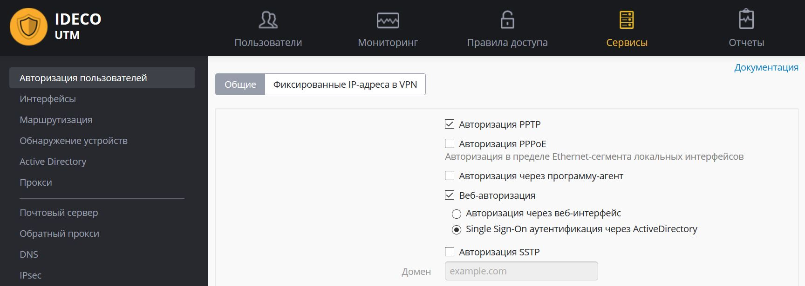

# PPTP

Внимание\! Не рекомендуется использовать данный тип подключения.
По-возможности используйте IKEv2, как более безопасный протокол.

/\*\*/ Настройка глобальных параметров Ideco UTM Настройка аккаунта для
подключения по VPN Настройка VPN на клиенте Возможные неполадки Если
VPN-соединение установлено, но не получается получить доступ к ресурсам
локальной сети

## Настройка глобальных параметров Ideco UTM

***Сервисы -\> Авторизация пользователей -\> Авторизация PPTP  
***

## Настройка аккаунта для подключения по VPN

Разрешите пользователю подключения по VPN из сети интернет, включив в
настройках пользователя следующий флажок:

***Пользователи -\> Нужный пользователь -\> вкладка Общие -\> Удалённый
доступ через VPN  
***

## Настройка VPN на клиенте

При настройке подключения по VPN из сети Интернет, в свойствах
VPN-подключения нужно указать:

  - тип VPN - PPTP
  - внешний адрес Ideco UTM в качестве VPN-сервера
  - логин и пароль созданного пользователя
  - шифрование MPPE, протокол авторизации - только MSCHAPV2
  - Шифрование данных: обязательное (отключиться, если нет шифрования)

После подключения вы будете авторизованы на сервере Ideco UTM от имени
созданного пользователя и вам будут доступны сетевые хосты в локальной
сети предприятия.

### Возможные неполадки

  - Часто бывает что провайдер со стороны шлюза или со стороны
    подключаемого клиента не пропускает GRE-протокол, с
    помощью которого происходит PPTP-соединение. В таком случае
    при попытке подключиться на внешний адрес Ideco UTM будет получена
    **ошибка 619**. Определить с какой стороны проблема с прохождением
    GRE можно, подключаясь с разных мест, от разных провайдеров. Если из
    некоторых мест удастся подключиться, значит проблема со стороны тех
    клиентов, которые не могут подключиться. Когда провайдер будет
    определен, то нужно попытаться решить проблему с ним, либо
    использовать [IKEv2/IPSec](./IPSec_IKEv2.md) или [SSTP](./SSTP.md).
  - Заблокирован порт 1723 TCP. Проверить доступность порта можно с
    помощью стандартных сетевых утилит, таких как telnet. Если
    соединения на этот порт нет, то туннель не может быть
    установлен.
  - Неправильно указан логин или пароль пользователя. Когда такое
    происходит то часто при повторном соединении предлагается
    указать домен. Старайтесь создавать цифробуквенные пароли,
    желательно на латинице для ваших учетных записей. При
    неправильном вводе пароля более 6 раз, произойдет
    [блокировка](./Защита_от_bruteforce-атак.md) IP-адреса
    пользователя службой защиты от подбора паролей.
  - Если подключение осуществляется с Windows, то для того, чтобы пакеты
    пошли через него надо убедиться, что в настройках этого подключения
    стоит чекбокс: "Свойства подключения VPN - Вкладка "Сеть" -
    Свойства опции "Протокол Интернета версии 4 (TCP/IPv4)" -
    Дополнительно - Использовать основной шлюз в удалённой сети".
    Если же маршрутизировать все пакеты в этот интерфейс не
    обязательно, то маршрут надо писать вручную.
  - При возникновении ошибки "Подключение было закрыто удаленным
    компьютером" необходимо включить поддержку MPPE 128-bit (В
    Windows эта опция включена по умолчанию) и среди протоколов
    аутентификации отмечать только MSCHAPV2.

## Если VPN-соединение установлено, но не получается получить доступ к ресурсам локальной сети

Выполните рекомендации специальной статьи: [особенности маршрутизации и организации доступа](./Особенности_маршрутизации_и_организации_доступа.md).

## Attachments:

[vpn1\_new.png](attachments/2261064/6357062.png) (image/png)  
 [основной
шлюз.PNG](attachments/2261064/6586926.png) (image/png)  

[PPTP-01.JPG](attachments/2261064/11436114.jpg) (image/jpeg)  
 [proxy
arp.png](attachments/2261064/11436116.png) (image/png)  

[Снимок.JPG](attachments/2261064/16842754.jpg) (image/jpeg)  

