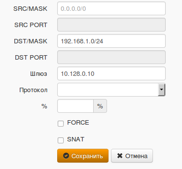
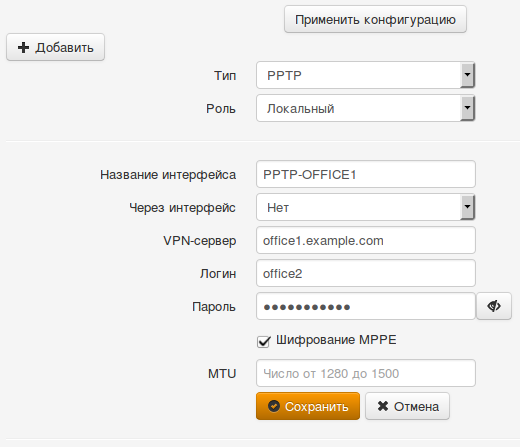
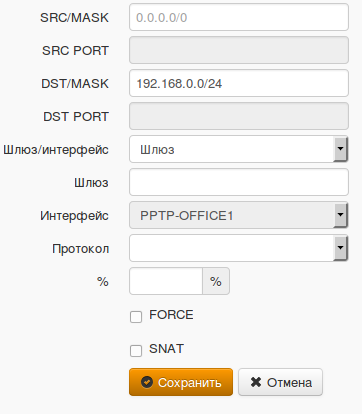

# PPTP VPN

**По-возможности используйте более надежный и безопасный протокол для
подключения филиалов - IPsec. Подробности по настройке: [подключение устройств по IPsec](./Подключение_устройств.md).**

**Для связи Ideco UTM с Ideco UTM также используйте [IPSec](./IPSec.md).  
**

По протоколу PPTP вы можете подключить к вашему главному офису филиалы,
использующие устаревшие роутеры, поддерживающие только протокол PPTP
(если устройство поддерживает IPsec, рекомендуется использовать этот
протокол).

Процесс настройки состоит из двух этапов:

  - Подготовка сервера и конфигурирование локальных сетей.
  - Создание VPN-туннелей и настройка маршрутизации.

## Подготовка интернет-шлюза и конфигурирование локальных сетей

Для объединения локальных сетей офисов вам необходимо обеспечить в них
уникальность пространства IP-адресов. В каждом офисе должна быть своя
уникальная сеть. В противном случае, при создании VPN-туннеля вы можете
столкнуться с некорректной работой маршрутизации.

В нашем примере мы рассмотрим объединение сетей двух офисов. Настройте
вашу сеть и шлюз безопасности Ideco UTM в соответствии с данными,
описанными в таблице ниже.

<table>
<thead>
<tr class="header">
<th>Параметр</th>
<th>Офис №1. Ideco UTM</th>
<th>Офис №2. Роутер.</th>
</tr>
</thead>
<tbody>
<tr class="odd">
<td>Пространство IP-адресов</td>
<td>IP-адрес: 192.168.0.0 
Маска сети: 255.255.255.0</td>
<td>IP-адрес: 192.168.1.0 
Маска сети: 255.255.255.0</td>
</tr>
<tr class="even">
<td>Локальный IP-адрес</td>
<td>IP-адрес: 192.168.0.1 
Маска сети: 255.255.255.0</td>
<td>IP-адрес: 192.168.1.1 
Маска сети: 255.255.255.0</td>
</tr>
</tbody>
</table>

Для корректного функционирования VPN-соединения в Ideco UTM необходимо в
разделе ***Сервисы*** ***-\> Дополнительно***:

  - отключите проверку обратного пути (RP\_FILTER).

## Создание VPN-туннелей и настройка маршрутизации

### Настройка интернет-шлюза Ideco UTM в офисе №1

Необходимо выполнить следующие действия:

  - Создать учетную запись пользователя, например office2, от имени
    которой сервер Ideco UTM в офисе №2 будет осуществлять
    подключение к серверу Ideco UTM в офисе №1.

  - Разрешить созданной учетной записи "Удаленный доступ через VPN".

  - Создайте фиксированную привязку выдаваемого по VPN IP-адреса для
    данного пользователя (она нужна будет для работы маршрутов).  
    В разделе "Сервисы" -\> "Авторизация пользователей" -\>
    "Фиксированные IP-адреса в VPN"

  - Добавить маршруты в таблицу маршрутизации. Для этого в
    web-интерфейсе перейдите в меню ***Сервер -\> Сетевые
    параметры -\> Маршруты*** и нажмите кнопку ***"Добавить"***. На
    экране появится форма добавления маршрута, которая приведена на
    фрагменте ниже. Укажите необходимые значения и нажмите кнопку
    ***"Сохранить"***. Нам необходимо добавить следующие маршруты:  
    192.168.1.0/255.255.255.0 10.128.0.10  
    10.129.0.0/255.255.0.0 10.128.0.10

### Настройка роутера в офисе №2

В примере настройки приводятся для Ideco UTM, выступающего в качестве
роутера, как правила роутеры различных производителей настраиваются
аналогично. Нужно создать VPN-подключение к удаленному серверу и
прописать маршрут до удаленной сети через VPN-подключение.

Необходимо выполнить следующие действия:

  - Создать новый интерфейс типа PPTP. В качестве роли используйте
    Local, а в качестве внешнего IP-адреса – внешний адрес
    интернет-шлюза Ideco UTM в офисе №1. В качестве логина
    используйте имя учетной записи, которая была создана на сервере в
    офисе №1 (в нашем примере – office2). Обязательно установите
    чекбокс ***"Шифрование MPPE"***.

  

  - Добавить маршруты в таблицу маршрутизации. Для этого в
    web-интерфейсе перейдите в меню ***Сервисы -\> Маршруты***
    и нажмите кнопку ***"Добавить"***. На экране появится форма
    добавления маршрута, которая показана на фрагменте ниже.
    Укажите необходимые значения и нажмите кнопку ***"Сохранить"***.
    Нам необходимо добавить следующие маршруты:  
    192.168.0.0/255.255.255.0 4  
    10.128.0.0/255.255.0.0 4  
    Где 4 – идентификатор созданного PPTP-интерфейса (в вашем случае он
    может быть другим).

После добавления маршрутов необходимо применить их нажав кнопку
"Применить" вверху страницы с маршрутами.

## Attachments:

[pptp\_02\_ng.png](attachments/1278096/4981640.png) (image/png)  

[pptp\_03\_ng.png](attachments/1278096/4981641.png) (image/png)  

[pptp\_04\_ng.png](attachments/1278096/4981642.png) (image/png)  

[server-other-settings.png](attachments/1278096/5472330.png)
(image/png)  

[server-other-settings.png](attachments/1278096/5472331.png)
(image/png)  

[server-other-settings.png](attachments/1278096/5472329.png)
(image/png)  

