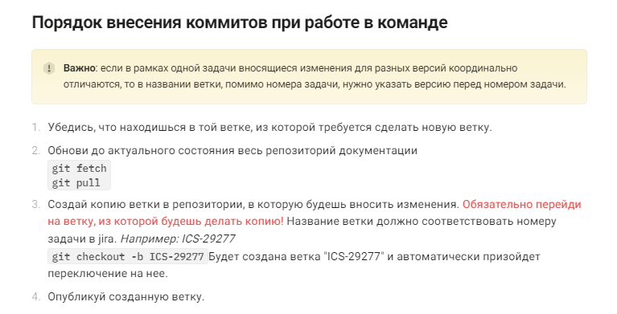

# Стажировка в Айдеко

Основная проблема, которая затрудняет погружение в процессы - необходимость освоения понятийного аппарата, используемого в организации. В документации описана часть терминов в разделе [Глоссарий](https://ideco.gitbook.io/tekhnicheskaya-dokumentaciya/doc/jcp-text/glossary), но для понимания все равно приходится использовать Google. На мой взгляд, в раздел нужно включить, например, определения следующих терминов: дебаг, отладка, репозиторий, коммит, ветка в Git, алиас, API.

| Термин      | Определение                                                                                              |
| ----------- | -------------------------------------------------------------------------------------------------------- |
| Дебаг       | Программа, которую используют для проверки и отладки выполняемых файлов                                  |
| Отладка     | Поиск, анализ и устранение ошибок, найденных во время тестирования ПО                                    |
| Репозиторий | Хранилище всех версий данных для совместного использования несколькими сотрудниками                      |
| Коммит      | Завершенное изменение в коде. Каждый commit содержит информацию, кто и какое изменение внес в код        |
| Ветка в Git | Набор коммитов, расположенных в хронологическом порядке                                                  |
| Алиас       | Дополнительное название основного доменного имени. Как правило, более короткое и удобное для запоминания |
| API         | Набор правил, по которым одна программа может обмениваться данными с другой программой                   |

Важно в статьи для новых сотрудников вводить понятийный аппарат поэтапно, по мере погружения в текст обучающей документации. Для этого предлагаю сделать цветные сноски или гиперссылки на глоссарий в текстах для нового сотрудника, содержащие узкопрофильные термины.


Гиперссылка - часть текста на странице, нажатие на которую позволяет переходить по другим страницам сайта или перемещаться на другие веб-ресурсы.


Например, из-за непонимания части терминов у меня вызвало трудности выполнение части алгоритмов работы, представленных в разделе VSСode:

<figure><figcaption></figcaption></figure>

Кроме того, значительные трудности вызвал блок заданий по работе с продуктами. Ранее я не сталкивалась с подобными задачами, а предложенная инструкция, на мой взгляд, не исчерпывает все возможные трудности. Так, в разделе Практика по работе с продуктами не хватает более подробного описания работы с продуктами и ожидаемого результата в ходе выполнения заданий.

<figure><figcaption></figcaption></figure>

В отмеченной на скриншоте области я предлагаю более подробно описать суть и последовательность практики по работе с продуктом:

* [x] рассказать, где хранятся образы продуктов и как с ними работать;
* [x] указать гиперссылки, по которым можно скачать необходимые для работы файлы;
* [x] перечислить необходимые для работы с ПО требования. В ходе прохождения стажировки я столкнулась с тем, что технические возможности моего устройства не позволяют выполнить блок заданий по работе с продуктами: необходимый объем оперативной памяти составляет как минимум 16 Гб, а на моем ноутбуке - 8 Гб;
* [x] описать результаты, которые должны получиться в ходе прохождения блока.

Наиболее сложным показался блок задач по работе с продуктами. На мой взгляд, в описании задачи не хватает ссылок на ресурсы, которые могут помочь в выполнении задачи, а также определений необходимых для понимания терминов. Например, для выполнения задачи, представленной на скриншоте ниже, нужно понимать, что такое виртуалка, локальное меню, начальное и конечное правило файрвола.&#x20;

<figure><figcaption></figcaption></figure>

Кроме того, важно описать:

* [x] способы, как поднять виртуалку на ПК (через облачный сервис, через сервер и т.д.);
* [x] алгоритм настройки синхронизации Ideco CENTER с UTM;
* [x] алгоритм установки начального и конечного правила файрвола.

В задании №1 Ideco NGFW (UTM), во время выполнения которого необходимо создать простейший тестовый стенд, не хватает определения терминов стенд и виртуальная машина. Важно описать, для чего создается виртуальная машина, а также алгоритм ее создания на одной из возможных программ.

В задании №3 Ideco NGFW (UTM) не хватило&#x20;

Решить все перечисленные выше проблемы помогла коммуникация с наставником и другими техническими писателями.&#x20;

Предполагается, что в ходе прохождения стажировки данная статья будет дополняться, однако уже на данном этапе удалось продемонстрировать владение основными инструментами при написании текста в GitBook:&#x20;

* разбивка текста на параграфы;
* создание заголовков, сносок и списков;
* оформление таблицы;
* создание и добавление визуальных материалов (скриншотов и Gif).
