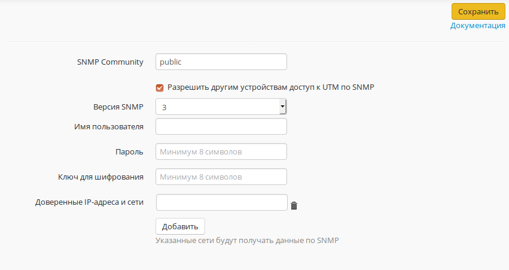

# SNMP

Данный модуль позволяет осуществлять мониторинг работы Ideco UTM по
протоколу SNMP версий 1/2c/3.

Для доступа настройте имя пользователя, пароль и ключ шифрования.

Также можно внести IP-адреса и сети в доверенные, чтобы они получили
доступ к данным с Ideco UTM.

## Attachments:

[SNMP.PNG](attachments/6587045/11436177.png) (image/png)  

[SNMP.PNG](attachments/6587045/6587047.png) (image/png)  

[SNMP\_NEW.png](attachments/6587045/11436178.png) (image/png)  

