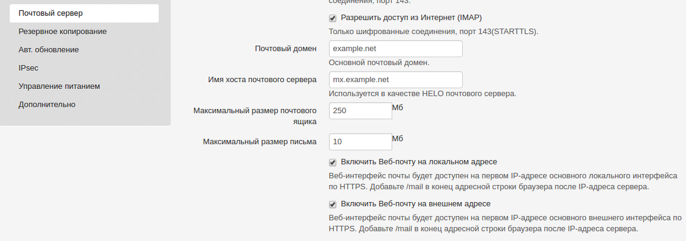
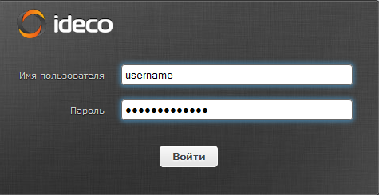

# Web-почта

Почтовый веб-интерфейс в нашем продукте может работать как на локальном,
так и на внешнем интерфейсе. Для его работы необходимо отметить
чекбокс ***Сервисы -\> Почтовый сервер -\> Доставка -\>
Использовать web-почту*** для веб-почты на локальном
интерфейсе. И ***Сервисы -\> Обратный прокси -\> Web-почта на
внешнем интерфейсе*** для работы веб-почты на внешнем интерфейсе.

На фрагменте ниже веб-интерфейс почты включен для локальных и внешних
подключений:

Далее, чтобы пользователь мог подключиться из локальной сети к почтовому
веб-интерфейсу на локальный адрес Ideco UTM, в его настройках должен
быть отмечен чекбокс Разрешить почту на вкладке Почта.

Для возможности пользователя подключаться к интерфейсу web-почты из
Интернет на внешний IP-адрес основного внешнего интерфейса Ideco
UTM, в его настройках также должен быть отмечен чекбокс Доступ к почте
из Интернет на вкладке Почта.

 

Подключиться к веб-интерфейсу почты из локальной сети можно только на
первый IP-адрес основного локального интерфейса.

К внешнему веб-интерфейсу почты можно подключаться по первому IP-адресу
основного внешнего интерфейса или по доменному имени, ассоциированному
с этим IP-адресом.

 

Когда все настройки произведены, из локальной сети в браузере
наберите <https://192.168.0.1/mail>, где 192.168.0.1 - адрес
локального интерфейса; из Интернет наберите в
браузере <https://66.77.88.99/mail>, где 66.77.88.99 - адрес
внешнего интерфейса. Для подключения обязательно использовать HTTPS.

  - В открывшейся в вашем браузере форме входа в почтовый ящик в
    качестве логина укажите логин от учётной записи пользователя
    или полностью название почтового ящика, если тот прописан в
    поле Почтовый ящик пользователя на вкладке Почта у
    настраиваемого пользователя.
  - В качестве пароля всегда прописывается пароль от учётной записи
    пользователя, сделать отдельный пароль на почту нельзя.

При успешном входе в браузере будет открыт веб-интерфейс к почтовому
ящику пользователя:

  

Веб-интерфейс встроенного почтового клиента работает с почтовым сервером
по протоколу IMAP и обладает следующими возможностями:

  - Создавать и отправлять письма. Поддерживается загрузка множественных
    вложений.
  - Просматривать, удалять, перемещать письма. Управлять IMAP-папками
    ящика.
  - Глобальная и персональная (для конкретного ящика) адресные книги,
    работающие только в рамках веб-приложения.
  - Адресная книга поддерживает формат контактов VCARD и может быть
    экспортирована и сохранена на вашем компьютере в этом формате.
  - Календарь с возможностью создавать события и уведомлять о них
    сотрудников по почте.
  - Цветные метки писем, как это принято в почтовом клиенте Thunderbird.
    Проставляются клавишами от 1 до 5. Изменения сохраняются на сервере
    так, что в другом почтовом клиенте метки будут видны.
  - Гибкий расширенный поиск по всем письмам ящика. Находится в разделе
    "Еще..." панели инструментов ящика.

### Смена логотипа и текста приветствия на странице входа

Чтобы заменить надпись и логотип на странице входа в web-почту, нужно
подменить системные файлы на диске и изменить их.  
Сделать это можно, войдя на UTM по ssh от root, включив на UTM [режим удаленного помощника](./Режим_удаленного_помощника.md) и выполнив команды,
приведенные ниже.

Скопируйте конфигурационный файл на диск с изменяемыми данными:

    cp /usr/share/www/mail/config/config.inc.php /mnt/rw_disc/

Временно разрешите запись на диск с системными данными и измените файл
ics\_tune.sh, как показано ниже.

    mount -o rw,remount /
    nano /usr/local/ics/bin/ics_tune.sh

Внесите в файл следующее содержимое. Оно сообщает системе о том, что
файл логотипа и конфигурации нужно подменить копиями с раздела с
изменяемыми данными.

    #!/bin/bash

    if [ "$1" = "networkd" ]; then
        mount --bind /mnt/rw_disc/config.inc.php /usr/share/www/mail/config/config.inc.php
        mount --bind /mnt/rw_disc/logo.png /usr/share/www/mail/skins/classic/images/ideco-logo.png
        mount --bind /mnt/rw_disc/logo.png /usr/share/www/mail/skins/larry/images/ideco-logo.png
    fi

Убедитесь, что в конце файла присутствует пустая строка. Нажмите
***Ctrl+x*** для выхода и ***y*** для подтверждения записи данных в
файл.

Находясь в консоли, верните режим работы системного раздела *только для
чтения*.

    mount -o ro,remount /

В конфигурации web-почты (***/mnt/rw\_disc/config.inc.php***) поменяйте
параметр ***$config\['product\_name'\] = 'Ideco Webmail';*** , указав в
нем ваш текст.

Ваш логотип поместите в файл ***/mnt/rw\_disc/logo.png***.

После проделанных действий выполните перезагрузку UTM.

## Attachments:

[web-mail.png](attachments/4982583/4982582.png) (image/png)  

[rclogin.png](attachments/4982583/4982585.png) (image/png)  

[webmail\_main\_view.png](attachments/4982583/4982620.png) (image/png)  

