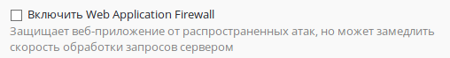

# Web Application Firewall

Данный модуль позволяет защитить опубликованные с помощью Ideco UTM
веб-приложения от различного вида атак (включая атаки SQLi, XSS,
DoS, и другие).

Для наибольшей защиты вашего веб-сайта рекомендуется:

1.  Опубликовать веб-сайт с помощью [обратного прокси-сервера](./Обратный_прокси.md)
2.  При публикации установить галочку "Включить Web Application
    Firewall"  
      
    Данный модуль производит синтаксический анализ запросов к сайту и
    блокирует атаки на уязвимые компоненты веб-приложения (в
    частности типы атак, входящие в [OWASP
    TOP-10](https://www.owasp.org/index.php/Category:OWASP_Top_Ten_Project)).  
    При активации данного модуля также будут блокироваться
    злоумышленники, ведущие сканирование сайта на
    уязвимости, с помощью модуля защиты от брутфорс-атак.  
      
3.  Для дополнительной защиты веб-сайта рекомендуется также активировать
    [систему предотвращения вторжений](./Предотвращение_вторжений.md),
    включив в ней следующие группы правил:  
    Атаки на web-приложения (блокирует атаки на основе регулярно
    обновляющегося списка сигнатур)  
    Черный список IP-адресов (блокирует злоумышленников на основе
    регулярно обновляющейся базы IP Reputation)  
      

## Attachments:

[waf.JPG](attachments/4981576/4981575.jpg) (image/jpeg)  

[4\_waf\_warning.png](attachments/4981576/6586624.png) (image/png)  

