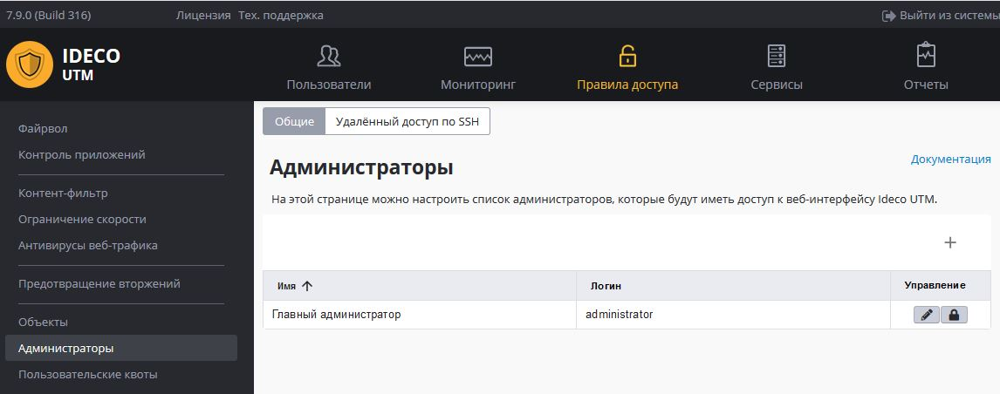

# Администраторы

Существует возможность задать учетные данные нескольких администраторов сервера Ideco UTM, для доступа к веб-интерфейсам настроек.

Предустановленную запись администратора нельзя удалить, можно только сменить ее данные - имя, логин, пароль.

Создать дополнительных администраторов сервера и управлять учетными записями можно в разделе **Правила -> Администраторы -> Общие**.

Добавить нового администратора можно нажав кнопку обозначенную знаком "+".
