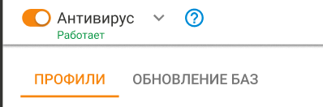

# Антивирусы веб-трафика

Для удобства администрирования оптимальные настройки производительности антивирусных модулей и настроек антивирусной фильтрации преднастроены в продукте и не требуют ручного конфигурирования. При необходимости настройки оптимизируются в обновлениях версий Ideco UTM.

В настройках вы можете выбрать между антивирусной фильтрацией модулями ClamAV \(OpenSource-антивирус\) или антивирусом от Лаборатории Касперского \(лицензируется отдельно и может быть не доступен по условиям лицензии\).

Модуль антивируса связан с прокси-сервером и контент-фильтром, поэтому фильтрует веб-трафик при выполнении следующих условий:

* Веб-ресурс не находится в списках исключений прокси-сервера по назначению.
* Пользователь, к которому поступает трафик, не включен в исключения прокси-сервера по источнику.
* HTTPS-сайт проверяется только в случае расшифровки HTTPS-трафика контент-фильтром.

## Проверка работы антивируса

Вы можете попробовать скачать тестовые файлы с сайта: [https://www.eicar.org/?page\_id=3950](https://www.eicar.org/?page_id=3950).

В случае правильной настройки браузер выведет ошибку доступа:

## Лицензирование антивируса Касперского

Данный модуль в нашем продукте создан на базе Kaspersky Anti-Virus Software Development Kit и лицензируется совместно с Ideco UTM компании **Айдеко**.

Корпоративные ключи для других продуктов Лаборатории Касперского не могут быть использованы для его активации.

