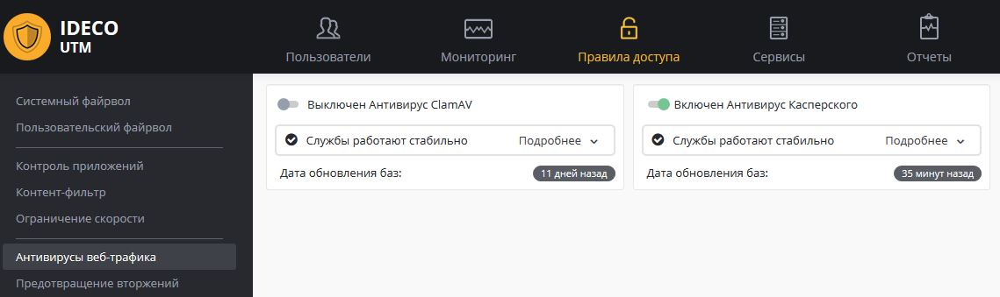

# Антивирусы веб-трафика

Для удобства администрирования оптимальные настройки производительности антивирусных модулей и настроек антивирусной фильтрации преднастроены в продукте и не требуют ручного конфигурирования. При необходимости настройки оптимизируются в обновлениях версий Ideco UTM.

В настройках вы можете включить или выключить антивирусную фильтрацию модулями ClamAV (OpenSource-антивирус) и антивируса от Лаборатории Касперского (лицензируется отдельно и может быть не доступен по условиям лицензии).

## Какой трафик попадает в антивирусную проверку

Модуль антивируса являются связанным с прокси-сервером и контент-фильтром модулем.

В антивирус попадает веб-трафик при выполнении следующих условий:

* веб-ресурс не находится в списках исключений [прокси-сервера](../services/proxy/) по назначению,
* пользователь, к которому поступает трафик не включен в исключения [прокси-сервера](../services/proxy/) по источнику,
* HTTPS-сайт проверяется только в случае [расшифровки](content-filter/filtering-https-traffic.md) HTTPS-трафика [контент-фильтром](content-filter/).

## Проверка работы антивируса

Вы можете попробовать скачать тестовые файлы с сайта: [https://www.eicar.org/?page\_id=3950](https://www.eicar.org/?page\_id=3950)

В случае правильной настройки браузер выведет ошибку доступа.

## Лицензирование антивируса Касперского

Данный модуль в нашем продукте создан на базе Kaspersky Anti-Virus Software Development Kit и лицензируется совместно с Ideco UTM компанией "Айдеко".

Корпоративные ключи для других продуктов Лаборатории Касперского не могут быть использованы для его активации.
