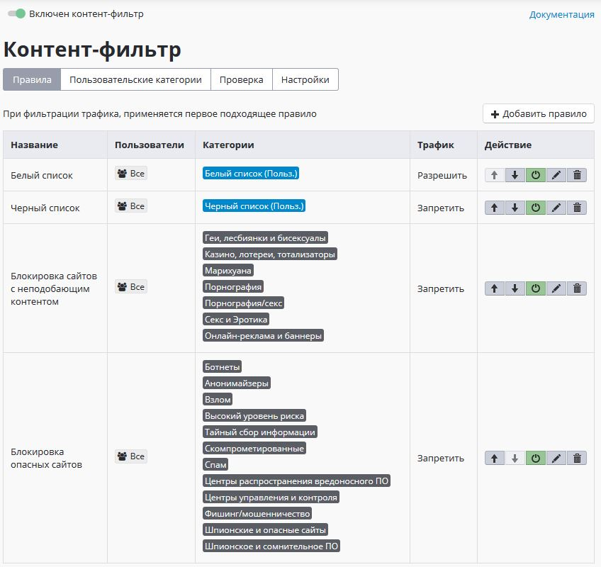
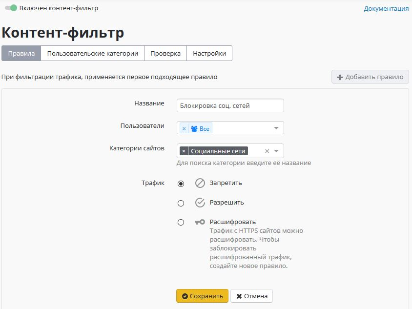

# Контент-фильтр

Контентная фильтрация на нашем сервере реализована на основе данных о веб-трафике, получаемых от модуля проксирования веб-трафика. Таким образом контент-фильтр позволяет эффективно блокировать доступ к различным интернет-ресурсам по веб. Механизм контентной фильтрации заключается в проверке принадлежности адреса, запрашиваемого пользователем сайта или отдельной страницы сайта на наличие его в списках запрещенных ресурсов. Списки, в свою очередь, поделены на категории для удобства администрирования.

Модуль контент-фильтра работает только при активной подписке на обновления в редакции Enterprise.


HTTPS-сайты без расшифровки трафика фильтруются только по домену \(а не полному URL\), правила категории **Файлы** на них также применить невозможно. Для полной фильтрации HTTPS создавайте правила [расшифровки](filtering-https-traffic.md) HTTPS-трафика нужных категорий.




## Настройка контент-фильтра

Рассмотрим подробнее устройство и настройку контент-фильтра. Перейдем в раздел административного веб-интерфейса **Правила доступа -&gt; Контент-фильтр -&gt; Настройки** и активируем базу расширенного контент-фильтра установив флажок **Использовать расширенную базу категорий**.

На этой же вкладке можно настроить дополнительные параметры фильтрации:

* Блокировать протокол [QUIC](https://ru.wikipedia.org/wiki/QUIC). Экспериментальный протокол, используемый браузером Chrome для доступа к некоторым ресурсам \(например, youtube\). Рекомендуется блокировать его, т.к. иначе фильтрация ресурсов, работающих по этому протоколу, будет невозможна.
* Безопасный поиск. Принудительно включает безопасный поиск в поисковых системах. Для работы данной функции нужно включить HTTPS-фильтрацию методом подмены сертификата для данных ресурсов.

## Категории контент-фильтра

### Расширенная база категорий

Более 140 категорий \(включающих миллионы URL\), автоматически обновляемая сервером.

Статус обновлений и использование базы можно посмотреть на вкладке **Настройки** Контент-фильтра. Данные категории работают только при активной подписке на обновления в коммерческих редакциях.

### Пользовательские категории

На одноименной вкладке вы можете создавать собственные категории правил для разрешения, запрещения для пользователей или расшифровки HTTPS-трафика данных доменов.

Созданные категории правил можно наполнять URL веб-страниц вручную.

### Специальные

Категории для страниц которые были категоризированы контент-фильтром, не были категоризированы, всех запросов и запросов с прямыми обращениями по IP-адресам.

С помощью нее, например, вы можете блокировать все неизвестные запросы в случае использовании фильтрации по "Белому списку".

### Файлы

Восемь сформированных категорий файлов, блокируемых по расширениям и MIME-type. Предустановленные группы файлов \(Исполняемые файлы, Архивы, Видеофайлы, Аудифайлы, Flash-видео, Active-X, Torrent-файлы, Документы\) нельзя редактировать.

Работа по фильтрации HTTPS-трафика по данному типу категорий возможна только при его [расшифровке](filtering-https-traffic.md).

## Применение правил фильтрации для пользователей

Для того чтобы доступ пользователя к ресурсам сети интернет контролировался по настроенным категориям, нужно создать список правил.

Правила в списке применяются сверху вниз до первого срабатывания. Таким образом если вышестоящим правилом будет разрешен какой-то ресурс для определенной группы пользователей, то правила ниже применяться не будут. Таким образом можно создавать гибкие настройки фильтрации, исключая нужных пользователей вышестоящими правилами из правил блокировки. Аналогичным образом действуют правила расшифровки HTTPS.

Кнопками со стрелками можно менять приоритет правила в списке, а кнопкой включения/выключения активировать или деактивировать правило. Правила контентной фильтрации применяются сразу же после создания или их включения.

При добавлении правила заполните следующие поля:

**Название** - наименование правила в списке.  
**Применяется для** - пользователи или группы пользователей, к которым будет применяться правило. Возможно выбрать несколько пользователей или групп.  
**Категории** - пользовательские, специальные и расширенные категории веб-ресурсов.  
**Действие** - действие данного правила на веб-запросы. Можно запретить, разрешить или расшифровать HTTPS-трафик.

## Диагностика

Если правила контентной фильтрации не действуют, проверьте следующие параметры в настройках:

1. IP-адрес компьютера пользователя соответствует его адресу в авторизации \(Мониторинг - Авторизованные пользователи\), и пользователь находится в нужной группе, на которую назначено правило.
2. IP-адрес пользователи и ресурса, к которому он обращается, не входит в исключения [прокси-сервера](../../services/proxy/).
3. На вкладке "Проверка" контент-фильтра, ресурс, к которому вы обращаетесь, правильно категоризируется.
4. В браузере и на компьютере пользователя не используются функции или плагины VPN, не прописаны сторонние прокси-сервера.
5. **Проверить настройки контентной фильтрации по блокировке опасных и потенциально опасных файлов можно с помощью сервиса** [**security.ideco.ru**](https://security.ideco.ru/)**.**

