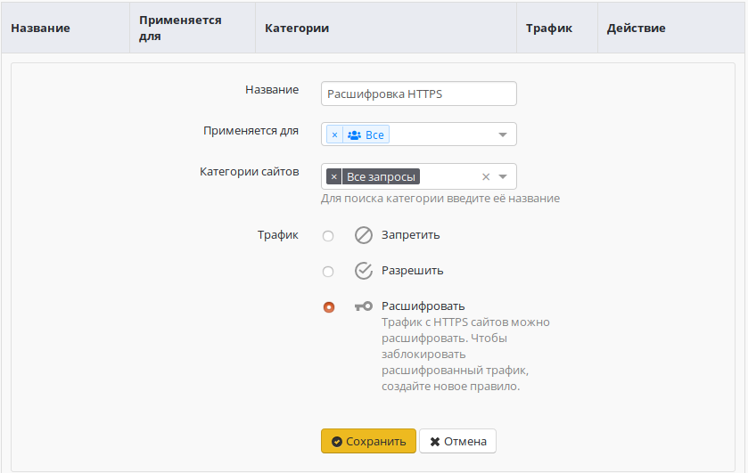
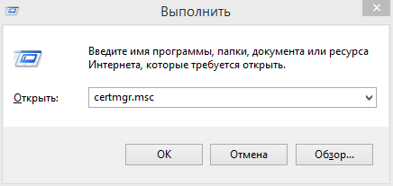
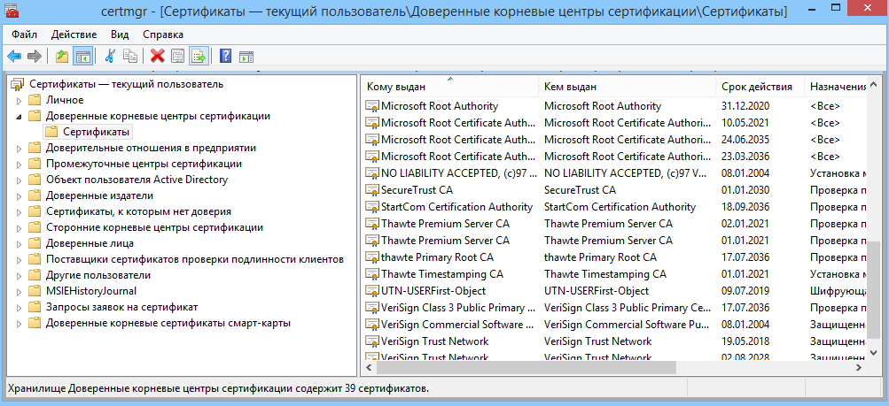
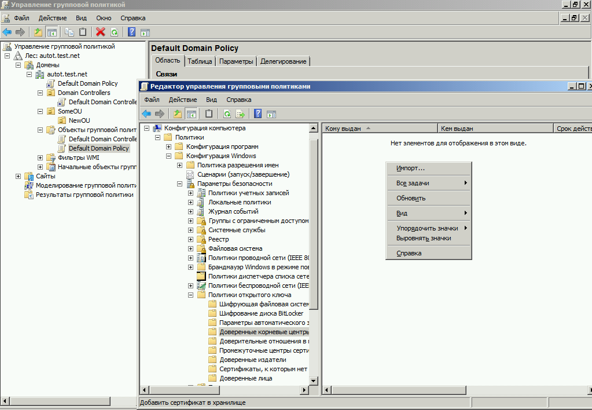

# Настройка фильтрации HTTPS

Фильтрация HTTPS-трафика обеспечивает возможность последующей обработки сайтов, доступных по HTTPS.\
Фильтрация реализуется несколькими методами:

* Анализом заголовков Server Name Indication (SNI) - благодаря этому методу возможен анализ домена, на который подключается клиент, без подмены сертификата и вмешательства в HTTPS-трафик. Также анализируются домены указанные в сертификате.
*   Методом SSL-bump. Путём подмены «на лету» сертификата, которым подписан запрашиваемый сайт. Оригинальный сертификат сайта подменяется новым, подписанным не центром сертификации, а корневым сертификатом Ideco UTM. Таким образом, передающийся по защищённому HTTPS-соединению трафик становится доступным для обработки всеми модулями, предоставляемыми Ideco UTM: контент-фильтром (возможно категоризировать полный URL запроса и MIME-type контента), антивирусами Касперского и ClamAV, а также внешним ICAP-сервисам.&#x20;

    **Специфика реализации фильтрации HTTPS-трафика с подменой сертификата**

    **требует настройки обеих сторон подключения: сервера Ideco UTM и**

    **рабочей станции каждого пользователя в локальной сети.**

## Настройка сервера Ideco UTM

По умолчанию сервер осуществляет фильтрацию HTTPS без подмены сертификатов с помощью анализа SNI и доменов в сертификате.

Настройка дешифрации HTTPS-трафика осуществляется в разделе **Правила -> Контент-фильтр** с помощью создаваемых администратором правил с действием **Расшифровать**.  ****  \
****

Можно расшифровывать трафик только для выбранных категорий ресурсов и для определенных пользователей, либо для всех запросов и всех пользователей. Пример правила представлен ниже:

## Настройка рабочей станции пользователя

**При включенной опции расшифровки HTTPS-трафика** браузер и другое сетевое ПО (например, антивирусы, клиенты IM и пр.) на рабочей станции пользователя потребует явного подтверждения на использование подменного сертификата, созданного и выданного сервером Ideco UTM. Для повышения удобства работы пользователя следует установить в операционную систему рабочей станции корневой сертификат сервера Ideco UTM и сделать его доверенным. Корневой SSL-сертификат доступен для скачивания со страницы логина в панели управления сервером.

Чтобы установить корневой сертификат на рабочей станции пользователя, требуется выполнить следующие действия:

1\. Скачать корневой SSL-сертификат, открыв страницу логина в web-интерфейс панели управления сервера Ideco UTMю

2\. Открыть на рабочей станции центр управления сертификатами: **Пуск -> Выполнить**, выполнив в диалоге команду `certmgr.msc:`

3\. В центре управления сертификатами выбрать раздел **Доверенные корневые сертификаты -> Сертификаты:**

4\. В правой части окна нажать правую кнопку мыши и выбрать действие **Все задачи -> Импорт...**.\
Откроется окно мастера импорта сертификатов. Следуя инструкциям мастера импортировать корневой сертификат сервера Ideco UTM. Импортированный сертификат появится в списке в правой части окна.

## Добавление сертификата через политики домена Microsoft Active Directory

В сетях, где управление пользователями осуществляется с помощью Microsoft Active Directory, вы можете установить сертификат Ideco UTM для всех пользователей автоматически с помощью Active Directory.

1\. Скачайте корневой SSL-сертификат, открыв страницу логина в web-интерфейс панели управления сервера Ideco UTM.

2\. Зайдите на контроллер домена с помощью аккаунта, имеющего права администратора домена.

3\. Запустите оснастку управления групповой политикой, выполнив команду`gpmc.msc.`

4\. Найдите **политику домена**, использующуюся на компьютерах пользователей в **Объектах групповой политики** (на скриншоте - Default Domain Policy). &#x20;

Нажмите на неё правой кнопкой мышки и выберите **Изменить**.

5\. В открывшемся редакторе управления групповыми политиками выберите:  **Конфигурация компьютера -> Политики -> Конфигурация Windows -> Параметры безопасности -> Политики открытого ключа -> Доверенные корневые центры сертификации.**

6\. Нажмите правой кнопкой мыши по открывшемуся списку, выберите **Импорт...** и импортируйте ключ Ideco UTM. &#x20;

7\. **После перезагрузки** рабочих станций или выполнения на них команды `gpupdate /force` сертификат появится в локальных хранилищах сертификатов и будет установлен нужный уровень доверия к нему.

## Возможные проблемы и методы их решения

*   Некоторые браузеры, например Mozilla Firefox, могут не использовать системное хранилище сертификатов. В таком случае нужно добавить сертификат Ideco UTM в доверенные сертификаты таких браузеров.  В Firefox также можно включить параметр

    `security.enterprise_roots.enabled` (в about:config) в значение true, для доверия системным сертификатам.
* Если на локальной машине используется антивирус, проверяющий HTTPS-трафик методом подмены сертификатов, сайты могут не открываться из-за двойной подмены сертификатов. Нужно отключить в антивирусе проверку HTTPS-трафика.
* При включенной SNI-фильтрации сервер не будет пропускать по HTTPS-порту не HTTPS-трафик. Таким образом могут возникнуть проблемы с программами, пытающимися это сделать. Для их работы необходимо разрешить [обход прокси-сервера](../../services/proxy/exclusions.md) к нужным им ресурсам.
* Для отображения страницы блокировки при блокировке HTTPS-ресурсов необходимо настроить доверие корневому SSL-сертификату UTM даже если включена только SNI-фильтрация, т.к. в случае срабатывания блокировки ресурса, открываемого по HTTPS, будет применен SSL-bumping с подстановкой SSL-сертификата UTM для возможности подмены контента ресурса страницей о его блокировке сервером.
