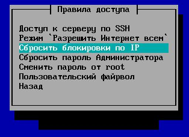

# Защита от bruteforce-атак

После 6-ти неудачных попыток ввода пароля в течение 15 минут, IP-адрес подбирающего блокируется на 45 минут.

Модуль не настраивается в веб-интерфейсе.

Посмотреть логи работы службы можно в веб-интерфейсе во вкладке **Мониторинг > Журналы > Служба защиты от подбора паролей**. Либо в консоли сервера по адресу: `/var/log/fail2ban/fail2ban.log`

Сбросить блокировки можно из локального меню шлюза: **Правила доступа > Сбросить блокировки по IP.**

