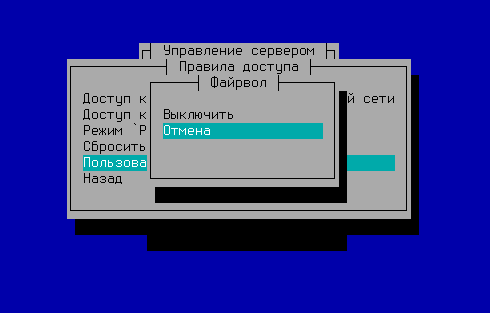
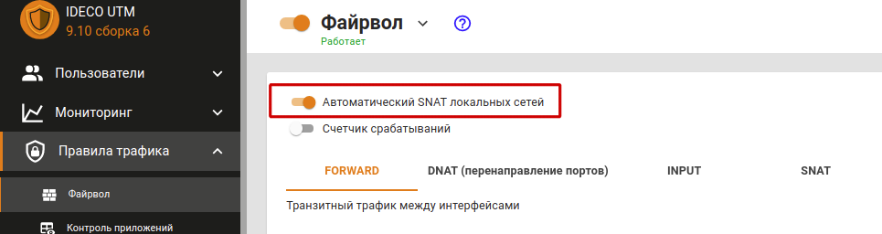
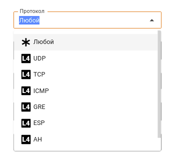
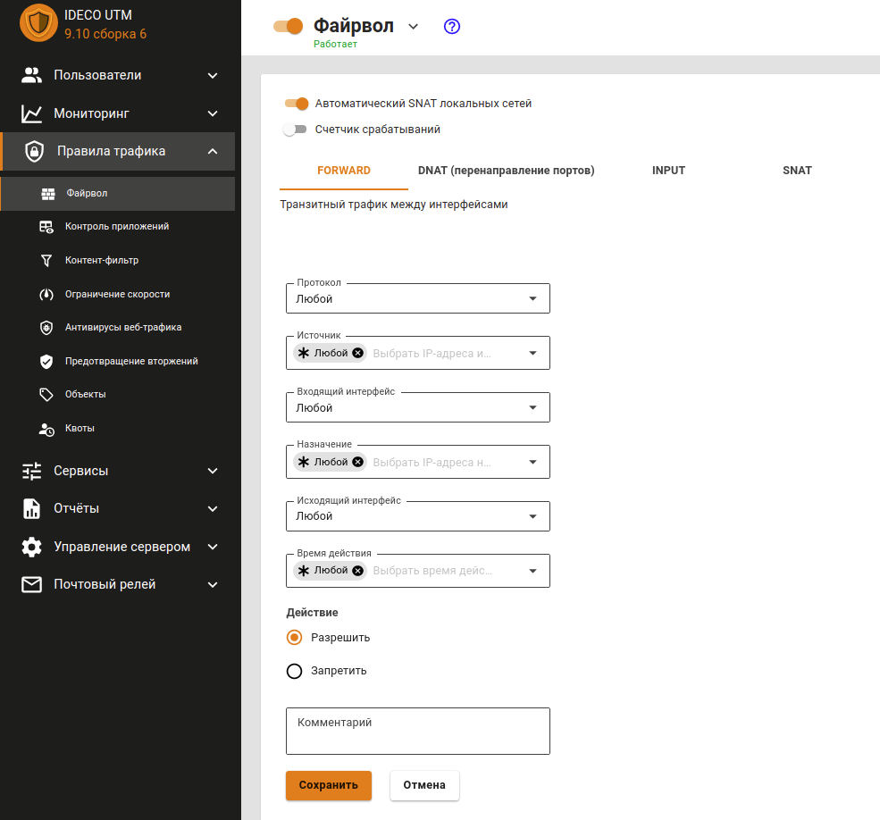

# Файрвол

**Видео по настройке файрвола:** 



## Принцип работы

Одним из основных средств управления трафиком на сервере является файрвол \(межсетевой экран\). С его помощью можно по различным критериям ограничивать пользовательский трафик, проходящий:

* из локальных сетей во внешние через сервер;
* между разными локальными сетями сервера;
* на сам сервер Ideco UTM.

Принцип работы файрвола заключается в проведении анализа заголовков пакетов, проходящих через интерфейсы сервера. Эта низкоуровневая задача решается шлюзом на основе стека протоколов TCP/IP. Поэтому файрвол хорошо подходит для определения глобальных правил управления трафиком по сетевым протоколам, портам, принадлежности к определенным IP-сетям и другим критериям, основанным на значениях полей в заголовках сетевых пакетов.


Сетевой экран не предназначен для решения задач, связанных с контролем доступа к ресурсам сети Интернет, исходя из адреса URL, доменного имени или типа контента на веб-сайтах. Эти задачи более высокого уровня, как правило, касающиеся веб-трафика, решаются с помощью модуля [Контент фильтр](content-filter/).


Настройка файрвола производится в разделе веб-интерфейса **Правила трафика -&gt; Файрвол**.


В Ideco UTM имеются преднастроенные и автоматически включаемые системные правила. Они обеспечивают защиту служб почтового сервера, прокси и обратного прокси-сервера, и других. Как правило, нет необходимости дополнительно настраивать защиту сервера Ideco UTM с помощью пользовательских правил. Используйте их для фильтрации трафика локальной сети и публикации ресурсов. Даже при отключении пользовательского файрвола в веб-интерфейсе системные правила продолжают работу. 



В случае создания некорректных правил \(например, запрет доступа в веб-интерфейс Ideco UTM\), вы можете отключить пользовательский файрвол из локального меню сервера. Для этого перейдите в пункт **Правила доступа -&gt; Пользовательский файрвол** и отключите файрвол кнопкой **Выключить**.

 


## Автоматический SNAT локальных сетей

**NAT \(от англ. Network Address Translation — «преобразование сетевых адресов»\)** — это механизм в сетях TCP/IP, позволяющий преобразовывать IP-адреса транзитных пакетов. [Читать подробнее](https://ru.wikipedia.org/wiki/NAT).

Параметр **Автоматический SNAT локальных сетей** включает в файрволе автоматические правила NAT для локальных сетей. Таким образом вам не нужно создавать такие правила вручную и изменять их при добавлении или изменении локальных сетей.

Отключите данную настройку, если есть необходимость доступа с каких-то внешних сетей \(например ведомственных, либо DMZ\) до локальной сети Ideco UTM без NAT.

Вы можете создать правила SNAT вручную для тех, кому он необходим и отключить \(правилом «не SNAT»\) для тех, кого необходимо допустить в сеть без сетевой трансляции адресов.

## Таблицы файрвола

Для удобства управления правилами в интерфейсе они разбиты на четыре таблицы:

* **FORWARD** - правила в данной таблице действуют на трафик, проходящий между интерфейсами сервера, т.е. сетью Интернет и локальной сетью, а также между локальными сетями. Это основная таблица, в которую могут быть добавлены правила, ограничивающие трафик пользователей.
* **DNAT \(перенаправление портов\)** - правила этой таблицы используются для прямого перенаправления портов с внешнего интерфейса на определенные ресурсы в локальной сети. Такие правила часто называются правилами проброса портов \(port forwarding, portmapper\).
* **INPUT** - таблица для правил входящего трафика на интерфейсы сервера. Как правило, это трафик для служб сервера \(например, почтового сервера\).
* **SNAT** - таблица правил для управления трансляцией сетевых адресов.


Правила в таблицах имеют приоритет сверху вниз \(т.е. верхнее правило приоритетнее нижнего\). 



Перед созданием правил для сетей, IP-адресов или диапазонов IP-адресов, предварительно создайте их в разделе [Объекты](aliases.md). 


## Протоколы

При создании правила необходимо выбрать протокол передачи данных, на который будет действовать создаваемое вами правило. Если вы выбираете из списка параметр **Любой**, то правило будет действовать на весь трафик.

В таблице ниже находится описание каждого протокола из списка.

| Название | Описание |
| :---: | :--- |
| UDP | Является  одним из самых простых протоколов транспортного уровня модели OSI. Не гарантирует доставку  пакета. Это позволяет ему  гораздо быстрее и эффективнее доставлять данные для приложений, которым  требуется большая пропускная способность линий связи или требуется малое  время доставки данных |
| TCP | Выполняет функции протокола транспортного уровня модели OSI. В отличие от UDP, TCP гарантирует доставку  пакета |
| ICMP | В основном используется для передачи сообщений об ошибках и других исключительных ситуациях, возникших при передаче данных |
| GRE | Назначение протокола – инкапсуляция пакетов сетевого уровня  модели OSI в IP-пакеты. Номер протокола в IP – 47. В основном  используется при создании VPN \(Virtual Private Network\) |
| AH | Протокол защиты передаваемых данных в IPsec. Обеспечивает идентификацию, проверку целостности и защиту от воспроизведения информации |
| ESP | Протокол защиты передаваемых данных в IPsec. Обеспечивает идентификацию, проверку целостности и защиту от воспроизведения информации. **Отличие протокола ESP от AH состоит в том, что ESP выполняет шифрование данных**. При работе с ESP для шифрования и расшифровки данных обе конечные системы применяют общий ключ |

## Правила файрвола


По-умолчанию используется политика **РАЗРЕШИТЬ**. Если вы не создадите запрещающих правил, все порты и протоколы для пользователей будут разрешены. 


Параметры правил файрвола описаны в таблице ниже:

| Название | Описание |
| :--- | :--- |
| Протокол | Протокол передачи данных \(UDP/TCP/ICMP/GRE/ESP/AH либо **Любой**\) |
| Источник | IP-адрес  источника трафика \(src\), проходящего через шлюз. В этом поле могут быть  указаны IP-адреса, диапазоны IP-адресов, сети или домены - данные  берутся из [Объектов](aliases.md), заданных пользователем. Также  в качестве источника могут использоваться пользователи и группы \(при  смене их IP-адресов, файрвол автоматически это учтет\) |
| Входящий интерфейс | Интерфейс UTM, в который будет входить трафик |
| Назначение | IP-адрес назначения трафика \(dst\), проходящего через шлюз. В этом поле могут быть указаны IP-адреса, диапазоны IP-адресов, сети или домены - данные берутся из [Объектов](aliases.md), заданных пользователем. Также  в качестве назначения могут использоваться пользователи и группы \(при  смене их IP-адресов, файрвол автоматически это учтет\) |
| Порт назначения | Указывается при создании правила с протоколами TCP/UDP. Это может быть отдельный порт, список портов или диапазон  портов, определенных в [Объектах](aliases.md) |
| Исходящий интерфейс | Интерфейс UTM, через который будет выходить трафик |
| Время действия | Время действия правила. Указываются временные промежутки \(например, **рабочее время**\), которые определяются в [Объектах](aliases.md) |
| Комментарий | Произвольный текст, поясняющий цель действия правила. Значение не должно быть длиннее 255 символов |

## Действие

Значения этого параметра описаны в следующей таблице:

| Значение | Описание |
| :--- | :--- |
| Запретить | Запрещает трафик |
| Разрешить | Разрешает трафик |
| DNAT | Транслирует адреса назначения, тем самым позволяет перенаправить входящий трафик. Ниже в поле **Изменить IP-адрес назначения** вы можете указать один IP-адрес или диапазон \(при указании диапазона IP-адресов пакет будет перенаправлен на любой из них\). Аналогично, если при создании правила вы указали протоколы TCP или UDP, то появится поле **Сменить порт назначения**. С помощью этой возможности можно прозрачно переадресовать входящий трафик на другой адрес или порт |
| SNAT | Транслирует адреса источника |
| Не производить SNAT | Отменяет действие SNAT для трафика, удовлетворяющего критериям правила |
| Не производить DNAT | Отменяет действие DNAT для трафика, удовлетворяющего критериям правила |

## Создание правил

Для того чтобы создать правила в нужной таблице, нажмите кнопку добавления \(**+**\) в правом верхнем углу экрана.

Укажите необходимые параметры и действия правила и нажмите кнопку **Сохранить**. Правило будет добавлено в конец списка. Если необходимо, измените его приоритет кнопками .


При создании правил для фильтрации веб-трафика из локальных сетей \(80, 443 TCP порты\), для полноценной работы правила, в поле **Входящий интерфейс** должен указываться объект **Любой**. Если будет указан иной входящий интерфейс, то правило не будет обрабатывать веб-трафик. 


## Примеры правил и техник

### Портмаппинг, DNAT, публикация сервера в локальной сети

Этот пример подробно описан в соответствующей статье в разделе [Публикация ресурсов.](../publishing-resources/)

### Блокировка различных ресурсов средствами файрвола

Вопросы блокировки различных ресурсов: программ удаленного управления \(AmmyAdmin и TeamViewer\), месенджеров и другого ПО описаны в отдельной [статье](../popular-recipes/blocking-popular-resources.md).

