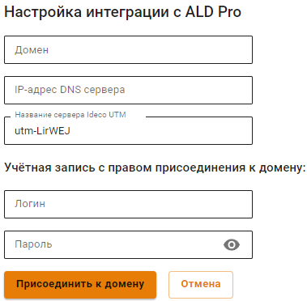

## Настройка интеграции с ALD Pro

[ALD Pro](https://www.aldpro.ru/) предназначен для централизованного управления ресурсами под управлением ОС Astra Linux и может использоваться в организациях различного масштаба.
Руководства по эксплуатации ALD Pro доступны на [официальном сайте](https://www.aldpro.ru/docs/).


Доступен только функционал ввода в домен. Импорт пользователей заработает в ближайших версиях.


### Ввод сервера в домен

1. Перейдите на вкладку **Пользователи -> ALD Pro** и нажмите **Добавить**.
2. Заполните следующие поля:
   * **Домен**: введите полное имя домена (не контроллера домена). Например: `mydomain.example`. Домен может содержать только латинские символы, цифры, подчеркивание, дефис и точку;
   * **IP-адрес DNS-сервера**: введите адрес сервера, обладающий ролью DNS-сервера в ALD Pro, доступный с локального интерфейса Ideco UTM VPP;
   * **Имя сервера Ideco UTM VPP**: введите имя сервера. Оно может содержать только буквенные символы (A-z), цифры (0-9), а также не может начинаться или заканчиваться на дефис. Максимальное количество символов - 15;
   * **Логин и пароль**: Пользователь должен обладать правами на присоединение компьютеров к домену (пользователь может не быть администратором домена).


Логин и пароль не сохраняются на сервере и использутся один раз при присоединении к домену.



Инструкции по развертыванию и управлению ресурсами через ALD Pro доступны на [официальном сайте](https://www.aldpro.ru/docs/).
