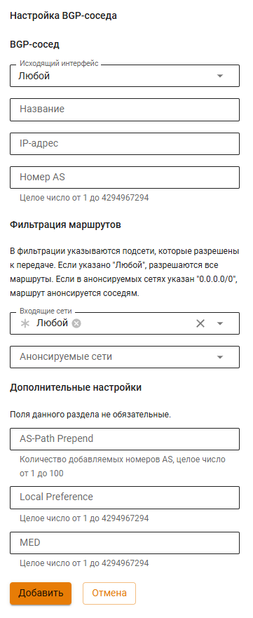

# BGP


Название службы раздела **BGP**: `ideco-frr-vpp`, `ideco-routing-backend-vpp`.


BGP (Border Gateway Protocol) - это основной протокол динамической маршрутизации, который используется в интернете.


В Ideco NGFW VPP пока возможны только исходящие BGP-соединения. Из-за этого связать два NGFW VPP между собой по BGP нельзя.


## Настройка своей автономной системы

1\. Введите номер автономной системы в строку **Номер AS** и нажмите **Сохранить**:

2\. Переведите переключатель раздела **BGP** в положение **включен**. Ideco NGFW заполнит поле **Router ID** автоматически;

3\. Модуль BGP запустится, если будет настроен хотя бы один BGP-сосед.

## Настройка BGP-соседей

1\. Для добавления BGP-соседа нажмите кнопку **Добавить**;

2\. Заполните следующие поля:

* **Название** - любое значение;
* **IP-адрес** - IP-адрес BGP-соседа;
* **Номер AS** - номер AS BGP-соседа;
* **Входящие сети** - фильтр, в котором нужно выбрать сети, информацию от которых хотите получать. Если выбран объект **Любой**, то фильтрация будет отключена и будут приниматься все сети от BGP-соседа. Предустановленный объект фильтров **Маршрут по умолчанию** соответствует фильтру **0.0.0.0/0**;
* **Анонсируемые сети** - фильтр, в котором нужно выбрать сети, информацию о которых хотите отправлять. Если выбран объект **Любой**, фильтрация будет отключена и передаваться будет информация обо всех статических маршрутах, известных NGFW VPP. Предустановленный объект фильтров **Маршрут по умолчанию** соответствует фильтру **0.0.0.0/0**;


Пока BGP в Ideco NGFW VPP анонсирует только статические маршруты и маршруты, полученные от соседей (redistribute static), но не присоединенные сети.


* **AS-Path Prepend** - чем больше значение, тем менее приоритетным становится канал;
* **Local Preference** - определяет приоритет пути для выхода трафика. Чем больше значение, тем менее приоритетным становится канал;
* **MED** - определяет приоритет пути для входа трафика. Чем меньше значение, тем приоритетнее путь.


Для **Входящих сетей** и **Анонсируемых сетей** объект **Любой** не может быть установлен одновременно с другими фильтрами.


Если нужного объекта для фильтрации нет, то создать его можно, выбрав **Создать новый объект** в поле **Входящие сети** или **Анонсируемые сети**:

* **Название** - любое значение;
* **Значение** - значение подсети в формате: _подсеть/маска подсети_, например, _192.168.100.0/24_.

