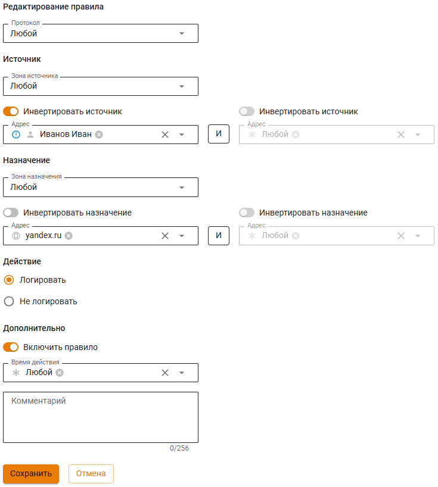
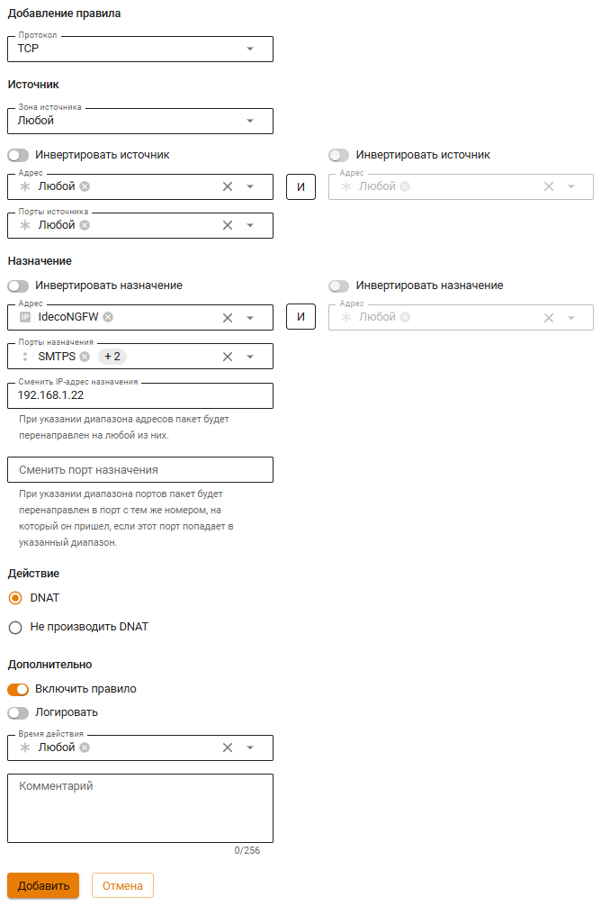
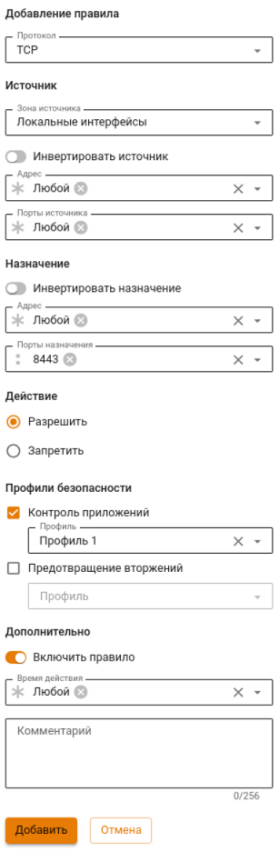
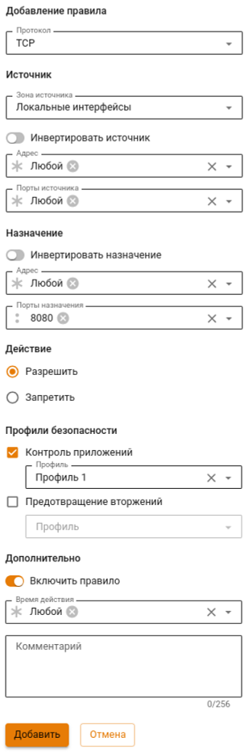

# Файрвол


Правила в таблицах имеют приоритет сверху вниз (т.е. верхнее правило приоритетнее нижнего). \
По умолчанию используется политика **ЗАПРЕТИТЬ**. Если не будут созданы разрешающие правила, все протоколы для пользователей будут запрещены.


## Создание FORWARD правил

FORWARD правила действуют на трафик, проходящий между Data Plane интерфейсами сервера. Это основная таблица, в которую могут быть добавлены правила, ограничивающие трафик пользователей.


Трафик, обрабатываемый файрволом, по умолчанию не попадает в обработку службы предотвращения вторжений.


Для настройки FORWARD правил в веб-интерфейсе:
1. Перейдите в раздел **Правила трафика -> Файрвол -> FORWARD**.
2. Нажмите **Добавить**.
3. Заполните необходимые поля настройки правил.
4. Выберите действие для правила. При действии **Запретить** трафик не будет обрабатываться службами **Контроля приложений** и **Предотвращения вторжений**.
5. Выберите опцию **Контроль приложений** или **Предотвращение вторжений** для дополнительной обработки трафика.
6. Для обработки трафика модулем контроля приложений нужно указать заранее созданный профиль.
7. Укажите время применения правила.


Для блокировки набора приложений создайте профиль в разделе **Профили безопасности -> Контроль приложений** и выберите его в списке после активации опции **Контроль приложений**. Для обработки трафика службой предотвращения вторжений и модулем контроля приложений может использоваться только действие **Разрешить**.


## Создание DNAT правила

Для настройки DNAT правила в веб-интерфейсе:
1. Перейдите в раздел **Правила трафика -> Файрвол -> DNAT**.
2. Нажмите **Добавить**.
3. Заполните поле **Протокол** или оставьте **Любой**. При заполнении поля **Протокол** может понадобиться указать порт назначения (протокол TCP/UDP). 
4. Выберите объект **Источник** и заполните поле **Входящая зона**.
5. Выберите объект **Назначение** и введите IP-адрес назначения. 
6. Выберите действие для правила.
7. Нажмите **Сохранить** для добавления правила.

## Создание SNAT правила


Для автоматического SNAT локальных Data Plane сетей NGFW создается системное SNAT правило в разделе **Правила трафика -> Файрвол -> SNAT**.


Для настройки SNAT правил в веб-интерфейсе:
1. Перейдите в раздел **Правила трафика -> Файрвол -> SNAT**.
2. Нажмите **Добавить**.
3. Заполните поле **Протокол** или оставьте **Любой**. При заполнии поля **Протокол** может понадобиться указать порт назначения. 
4. Выберите **Источник** и заполните поле **IP-адрес источника** при необходимости SNAT от конкретного IP-адреса.
5. Выберите **Назначение** и заполните поле **Исходящая зона**. 
6. Выберите действие для правила.
7. Нажмите **Сохранить** для добавления правила.

## Создание INPUT правил

INPUT правила управляют входящим трафиком на Control Plane интерфейс сервера для служб сервера.

Для настройки INPUT правил в веб-интерфейсе:

1. Перейдите в раздел **Правила трафика -> Файрвол -> INPUT**.
2. Нажмите **Добавить**.
3. Заполните необходимые поля настройки правила.
4. Выберите действие для правила.
5. Укажите время действия для правила или оставьте любой.


Для инвертирования условия по источнику или назначению выберите соответствующую опцию.


