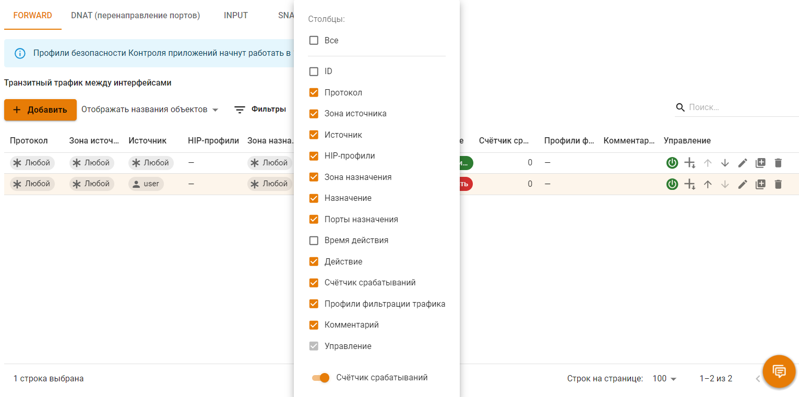

# Файрвол


Правила в таблицах имеют приоритет сверху вниз (т.е. верхнее правило приоритетнее нижнего). \
По умолчанию используется политика **РАЗРЕШИТЬ**. Если не будут созданы запрещающие правила, все протоколы для пользователей будут разрешены.


## Создание FORWARD правил

FORWARD правила действуют на трафик, проходящий между интерфейсами сервера, т.е. сетью Интернет и локальной сетью, а также между локальными сетями. Это основная таблица, в которую могут быть добавлены правила, ограничивающие трафик пользователей.


Трафик, обрабатываемый файрволом, по умолчанию не попадает в обработку службы предотвращения вторжений.


Для настройки FORWARD правил в веб-интерфейсе:
1. Перейдите в раздел **Правила трафика -> Файрвол -> FORWARD**.
2. Нажмите **Добавить**.
3. Заполните необходимые поля настройки правил.
4. Выберите действие для правила.
5. Выберите модуль контроля приложений или предотвращения вторжений для дополнительной обработки трафика.
6. Укажите время применения правила.


Для блокировки конкретного приложения выберите его в списке после активации опции **Контроль приложений** и выберите действие **Запретить**.


## Создание NAT правил

NAT правила позволяют управлять трансляцией сетевых адресов. NAT подразделяется на:
* DNAT - используется для трансляции внешних адресов к локальным. 
* SNAT - используется для трансляции локальных адресов к внешним.


Для автоматического SNAT включите соответствующую опцию.


Для настройки NAT правил в веб-интерфейсе:
1. Перейдите в раздел **Правила трафика -> Файрвол -> NAT**.
2. Нажмите **Добавить**.
3. Заполните необходимые поля настройки правил.
4. Выберите действие для правила:
   * При активации DNAT укажите IP-адрес назначения для смены.
   * При активации SNAT укажите IP-адрес источника для смены.

## Создание INPUT правил

INPUT правила управляют входящим трафиком на Control Plane интерфейс сервера для служб сервера.

Для настройки INPUT правил в веб-интерфейсе:

1. Перейдите в раздел **Правила трафика -> Файрвол -> INPUT**.
2. Нажмите **Добавить**.
3. Заполните необходимые поля настройки правила.


Для инвертирования условия по источнику или назначению выберите соответствующую опцию.


4. Выберите действие для правила.
5. Укажите время действия для правила или оставьте любой.

