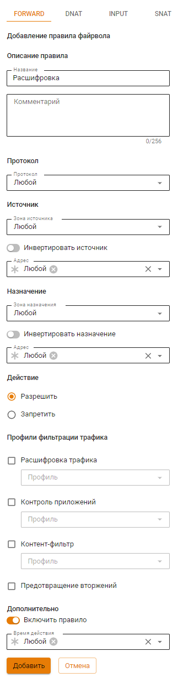

# Профили TLS/SSL-инспекций

Для настройки расшифровки трафика нужно создать профиль TLS/SSL-инспекции.
Для создания профиля TLS/SSL-инспекции выполните действия:

1. Перейдите в раздел **Профили безопасности->TLS/SSL-инспекций**;
2. Нажмите **Добавить** для создания профиля и выберите корневой сертификат, которым будут подписываться выпускаемые сертификаты для расшифровки трафика:

3. Нажмите **Сохранить** для добавления профиля.

## Настройка файрвола для расшифровки трафика

Для использования профиля TLS/SSL-инспекций нужно добавить правило с профилем фильтрации трафика. Выполните действия:

1. Перейдите в раздел **Правила трафика->Файрвол->FORWARD**.
2. Нажмите **Добавить** и укажите действие **Разрешить**, предварительно выбрав профиль TLS/SSL-инспекции:

