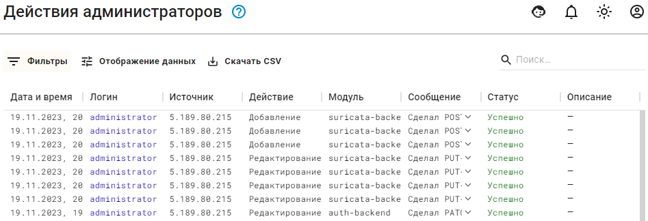

## Действия администраторов

Ideco UTM VPP логирует действия администраторов при внесении изменений в конфигурацию UTM VPP из **веб-интерфейса**, **терминала**, **локального интерфейса**.\
Для просмотра логов действий администратора в веб-интерфейсе перейдите в раздел **Отчеты и журналы -> Действия администраторов**.


Для просмотра действий одного из администраторов воспользуйтесь фильтром по столбцу **Логин**.
