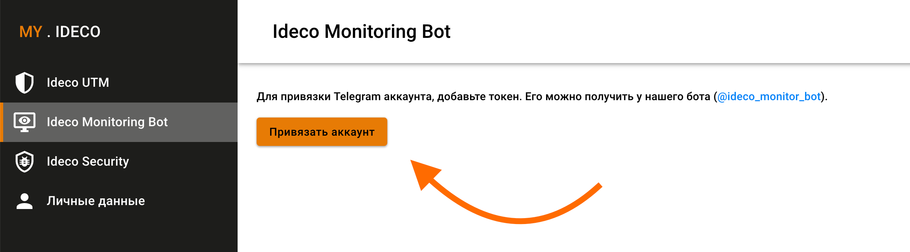
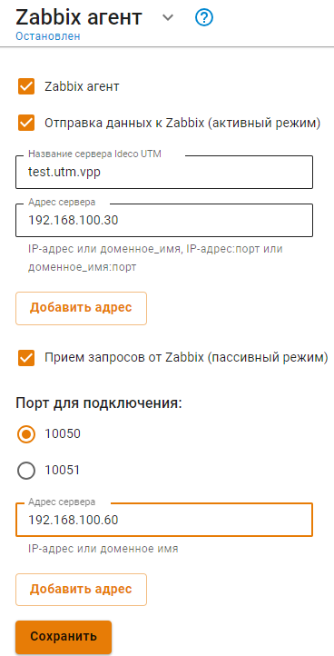
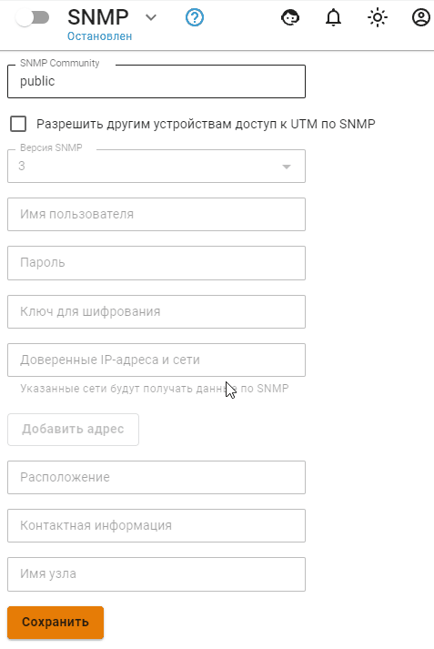
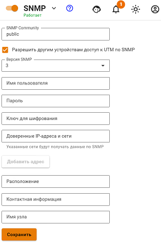

# Подключение сторонних сервисов для мониторинга

## Интеграция с Telegram

Для отправки сообщений мониторинга UTM VPP в Telegram нужно настроить привязку Ideco Monitoring Bot.\
Привязанный бот может отправлять оповещения:
* в личные сообщения
* в беседы, где 2 и более пользователей.

Привязка бота и настройка оповещений осуществляется на [MY.IDECO](https://my.ideco.ru/).

### Привязка Ideco Monitoring Bot

Для привязки бота выполните действия:

1. Настройте **Management** интерфейс c выходом в Интернет на Ideco UTM VPP.
2. [Привяжите лицензию](../../initial-setup/initial-setup-web.md#registraciya-servera) к серверу.
3. Выберите удобный способ коммуникации с ботом:
   * Привязка бота к одному пользователю - перейдите к диалогу с ботом [@ideco\_monitor\_bot](https://telegram.im/@ideco_monitor_bot).
   * Привязка бота к группе с пользователями - перейдите в группу и добавьте пользователя Ideco monitoring bot.
4. Напишите `/start`.
5. Скопируйте код привязки к аккаунту.
6. Перейдите в раздел **Ideco Monitoring Bot** на [MY.IDECO](https://my.ideco.ru/#/ideco-monitoring-bot).
7. Нажмите на кнопку **Привязать аккаунт**.
8. Введите код в соответствующее поле и нажмите на кнопку **Привязать**.


Для настройки подключения Ideco Monitoring Bot к беседе нельзя использовать **меню** команд, поскольку требуется ввод команды `/start` вручную.



Уведомления начнут приходить в Telegram аккаунт или беседу


Управления оповещениями

После привязки бота есть возможность настроить оповещения Ideco Monitoring Bot для каждой беседы:
1. Перейдите в раздел настройки, нажав на иконку .
2. Проставьте галочки напротив тех уведомлений, которые хотели бы получать в выбранной беседе.

Если требуется временно отключить отправку уведомлений, нажмите на иконку . Оповещение перестанут приходить, пока снова не нажмете на эту иконку.

## Интеграция с Zabbix агент
Ознакомиться с Zabbix, можно на [официальной странице Zabbix](https://www.zabbix.com/ru/).
Опробуйте Zabbix в виде [готового решения](https://www.zabbix.com/documentation/6.2/en/manual/appliance) или установить его, воспользовавшись [документацией Zabbix](https://www.zabbix.com/documentation/current/en/manual).

Интеграция с системой мониторинга Zabbix возможна в двух режимах:

1. **Активный режим** - соединение с Zabbix-сервером происходит со стороны Ideco UTM VPP. Для настройки этого режима включите опцию **Отправка данных к Zabbix (активный режим)** и заполните поля:
   * **Название сервера Ideco UTM VPP** - имя, которое будет отображаться на сервере мониторинга;
   * **Адрес сервера** - IP-адрес, доменное имя, либо IP-адрес:порт, доменное имя:порт в случаях, если используется не стандартный для Zabbix входящий порт. Для добавления еще одного адреса нажмите на кнопку **Добавить адрес**.
2. **Пассивный режим** - подключение происходит со стороны Zabbix-сервера. Для настройки этого режима включите опцию **Приём запросов от Zabbix (пассивный режим)** и заполните поля:
   * **Порт для подключения** - выберите 10050 или 10051 порт;
   * **Адрес сервера** - IP-адрес или доменное имя Zabbix-серверов. Для добавления еще одного адреса нажмите на кнопку **Добавить адрес**.

В обоих случаях интеграции Zabbix-сервер должен находиться внутри **Management** сети Ideco UTM VPP. Подключение мониторинга возможно только к **Management** интерфейсам.


В качестве шаблонов данных можно использовать стандартные шаблоны для Linux-серверов.


## SNMP


Для перевода раздела в рабочий режим, переключите ползунок в положение Включен.


Данный модуль позволяет осуществлять мониторинг работы Ideco UTM VPP по протоколу SNMP версий 1/2c и 3. Для этого необходимо настроить имя пользователя, пароль (минимальное количество символов - 8) и ключ шифрования.


**Рекомендуем**: На сервере, с которым будет осуществляться соединение по SNMPv3, указать алгоритмы: Auth Algorithm MD5 и Crypto Algorithm AES.

Поле SNMP community для SNMPv3 необязательно для заполнения.


Также можно внести IP-адреса и сети в доверенные, чтобы они получили доступ к данным с Ideco UTM VPP. Поля **Расположение**, **Контактная информация** и **Имя узла** носят информационный характер и являются необязательными.

