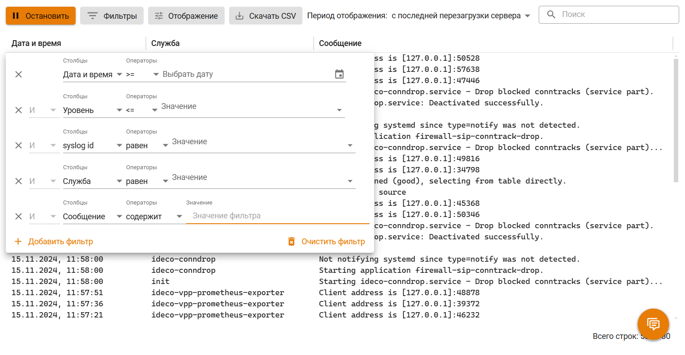
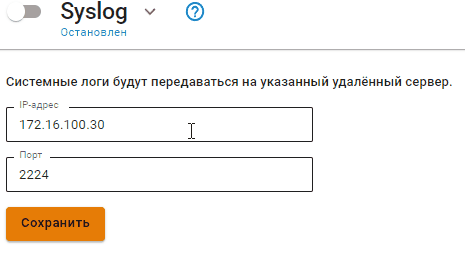

# Логирование

## Журнал событий


Время хранения логов в разделе **Журнал событий** 3 месяца. Далее просматривать логи можно в разделе **Управление сервером -> Терминал**.


Для просмотра логов в веб-интерфейсе перейдите в раздел **Отчеты и журналы-> Журнал событий**.

В разделе можно просматривать логи работы служб таблицы:

| Раздел                                        | Имя службы   |
| :-------------------------------------------- | :------------------------- |
| Файрвол                                       | ideco-firewall-backend; ideco-nflog |
| Предотвращение вторжений                      | ideco-suricata-backend; ideco-suricata; ideco-suricata-event-syncer; ideco-suricata-event-to-syslog |
| Объекты                                       | ideco-alias-backend |
| Сетевые интерфейсы                            | ideco-network-backend; ideco-network-nic |
| Балансировка и резервирование, Маршрутизация  | ideco-routing-backend |
| DNS                                 	        | ideco-dns-backend; unbound |
| Центральная консоль	                          | ideco-central-console-backend |
| Автоматическое обновление	                    | ideco-sysupdate-backend |
| Резервное копирование                         | ideco-backup-backend; ideco-backup-create; ideco-backup-restore; ideco-backup-rotate |
| Лицензия	                                    | ideco-license-backend |
| Авторизация	                                  | ideco-auth-backend|
| Active Directory	                            | ideco-ad-backend; ideco-ad-log-collector@<имя домена> |
| ALD Pro                                       | ideco-ald-rest; ideco-ald-backend |
| Syslog	                                      | ideco-monitor-backend |

Чтобы посмотреть логи конкретной службы, воспользуйтесь строкой поиска или фильтром. 
Для фильтрации логов по нескольким критериям нажмите **Добавить фильтр** и выберите соответствующий критерий, значение и оператор в форме.

Пример фильтрации по нескольким критериям:



## Syslog-отправка логов на сервер
Для настройки отправки логов на сторонний сервер в веб-интерфейсе перейдите в раздел **Отчеты и журналы -> Syslog**.

Настройте **Syslog**:
1. Укажите **IP-адрес** удаленного сервера.
2. Укажите **порт** для отправки логов из диапазона от 1 до 65535.

Пример настройки **Syslog**:




Передача логов происходит согласно RFC-5424 (транспорт UDP).


### Пример расшифровки передаваемых логов

<details>

<summary>Предотвращение вторжений</summary>


```
192.168.100.2	Dec 14 15:48:38		daemon	warning		timestamp:2022-12-14 10:48:34.808465+00:00,flow_id:1189034483406353,in_iface:seq:Leth1:3:m,sensor_name:suricata_debug,event_type:alert,src_ip:192.168.100.11,src_port:61790,src_country:,src_country_code:,src_session_uuid:7100d1c8-017f-4cbf-8b78-482839300211,src_user_id:2,src_user_name:a.istomina,dest_ip:192.168.100.2,dest_port:53,dest_country:,dest_country_code:,dest_session_uuid:,dest_user_id:-1,dest_user_name:,proto:UDP,alert.signature_id:1003892,alert.signature:Windows Telemetry,alert.category:Telemetry Windows,alert.severity:3,alert.gid:1,alert.action:blocked,http.hostname:,http.url:,http.http_user_agent:,flow.pkts_toserver:1,flow.pkts_toclient:0,flow.bytes_toserver:73,flow.bytes_toclient:0,flow.start:2022-12-14 10:48:34.808465+00:00,flow.end:2022-12-14 10:48:35.580143+00:00,flow.age:0,flow.state:,flow.reason:,flow.alerted:0,tcp.tcp_flags:,tcp.tcp_flags_ts:,tcp.tcp_flags_tc:,tcp.cwr:0,tcp.ecn:0,tcp.urg:0,tcp.ack:0,tcp.psh:0,tcp.rst:0,tcp.syn:0,tcp.fin:0,tcp.state:
```


где:
* **192.168.100.2** - ip-адрес NGFW VPP отправителя;
* **Dec 14 15:48:38** - время получения события по Syslog;	
* **timestamp:** 2022-12-14 10:48:34.808465+00:00 - время события в системе предотвращения вторжений, может не совпадать с временем получения события по Syslog;
* **flow_id:** 1189034483406353- внутренний идентификатор системы предотвращения вторжений flow(сессии);
* **in_iface:** seq:Leth1:3:m - содержит идентификатор входящего интерфейса;
* **sensor_name:** suricata_debug - имя экземпляра системы предотвращения вторжений;
* **event_type:** alert - тип события;
* **src_ip:** 192.168.100.11 - IP-адрес источника;
* **src_port:** 61790 - порт источника;
* **src_country:** - название местоположения источника;
* **src_country_code:** - ISO-код страны источника;
* **src_session_uuid:** 7100d1c8-017f-4cbf-8b78-482839300211 - внутренний идентификатор сессии Ideco NGFW источника;
* **src_user_id:** 2 - идентификатор пользователя источника;
* **src_user_name:** a.istomina- имя пользователя источника;
* **dest_ip:** 192.168.100.2 - IP-адрес назначения;
* **dest_port:** 53 - порт назначения;
* **dest_country:** - название местоположения назначения;
* **dest_country_code:** - ISO-код страны назначения;
* **dest_session_uuid:** - внутренний идентификатор сессии Ideco NGFW назначения;
* **dest_user_id:** -1 - идентификатор пользователя назначения;
* **dest_user_name:** - имя пользователя назначения;
* **proto:** UDP - протокол;
* **alert.signature_id:** 1003892 - ID правила системы предотвращения вторжений;
* **alert.signature:** Windows Telemetry - сообщение из сработавшего правила;
* **alert.category:** Telemetry Windows - описание колонки в веб-интерфейсе События безопасности; \
  Соответствие *alert.category:* -> *alert.signature* описаны в [файле](https://static.ideco.ru/static/alert.category%20-%20alert.signature.pdf).
* **alert.severity:** 3 - уровень угрозы, может принимать значения 1, 2, 3 и 256, где 1 - самый высокий уровень угрозы;


Служебные поля результата анализа HTTP-трафика. Заполняются в случае, если в процессе анализа трафика был определен HTTP-протокол:
* **http.hostname:** - идентификатор хоста;
* **http.url:** - url на который велось обращение;
* **http.http_user_agent:** - информация, идентифицирующая HTTP-клиента.
  
Служебные поля flow(сессии):
* **flow.pkts_toserver** :1 - количество пакетов, переданное от клиента к серверу;
* **flow.pkts_toclient:** 0 - количество пакетов, переданное от сервера к клиенту;
* **flow.bytes_toserver:** 73 - количество байт, переданное от клиента к серверу;
* **flow.bytes_toclient:** 0 - количество байт, переданное от сервера к клиенту;
* **flow.start:** 2022-12-14 10:48:34.808465+00:00 - начало;
* **flow.end:** 2022-12-14 10:48:35.580143+00:00 - окончание;
* **flow.age:** 0 - возраст;
* **flow.state:** - текущее состояние;
* **flow.reason:** - запущена ли IPsec в режиме отладки;
* **flow.alerted:** 0 - сгенерировался ли поток alert;

Состояние флага [TCP flow(сессии)](https://ru.wikipedia.org/wiki/Transmission_Control_Protocol#%D0%A4%D0%BB%D0%B0%D0%B3%D0%B8_(%D1%83%D0%BF%D1%80%D0%B0%D0%B2%D0%BB%D1%8F%D1%8E%D1%89%D0%B8%D0%B5_%D0%B1%D0%B8%D1%82%D1%8B)): 
* **tcp.tcp_flags:** - значение поля flags в заголовке TCP;
* **tcp.tcp_flags_ts:** -  [timestamp флаги](https://www.atraining.ru/windows-network-tuning/#:~:text=TCP%20Timestamps%20–%20базовая%20низкоуровневая,не%20может%20высчитать%20данные%20значения);
* **tcp.tcp_flags_tc:** - [флаг Truncated response](https://www.rfc-editor.org/rfc/rfc5966);
* **tcp.cwr:** 0;
* **tcp.ecn:** 0;
* **tcp.urg:** 0;
* **tcp.ack:** 0;
* **tcp.psh:** 0;
* **tcp.rst:** 0;
* **tcp.syn:** 0;
* **tcp.fin:** 0;
* **tcp.state:** - [состояния сеанса TCP](https://ru.wikipedia.org/wiki/Transmission_Control_Protocol#Состояния_сеанса_TCP).

</details>
