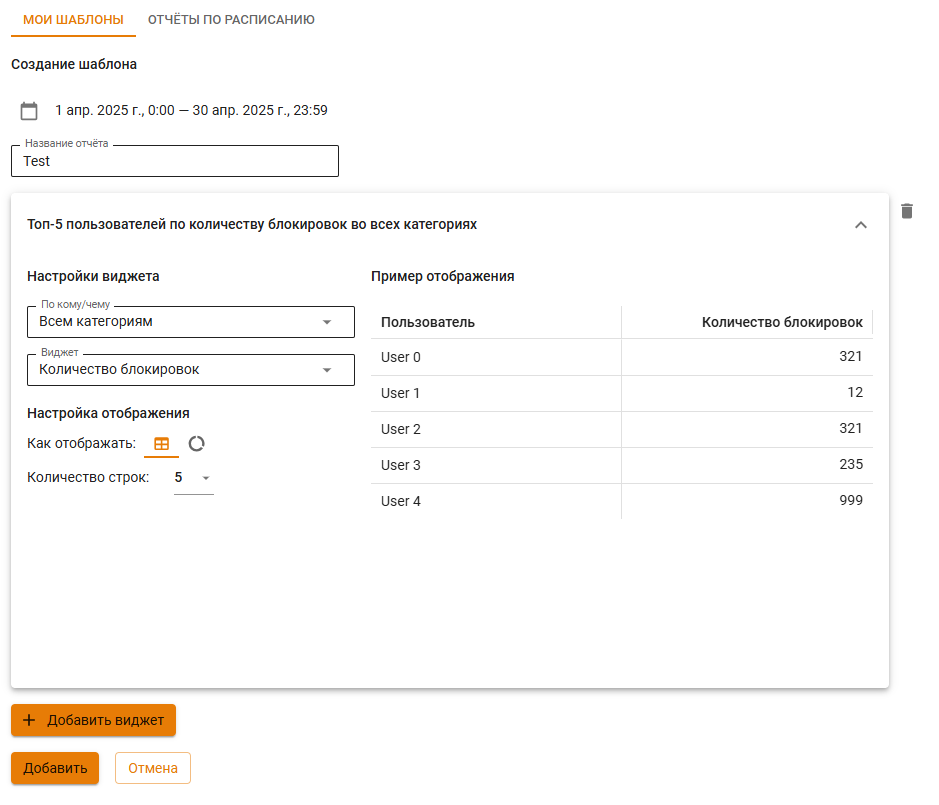
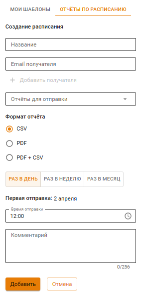

# Отчеты: создание шаблонов и отправка на почту


В текущий момент есть возможность сгенерировать отчет только по работе службы **Предотвращения вторжений** и **Журнала авторизации**.


Раздел предоставляет возможность создать шаблоны отчетов и настроить их рассылку в формате .pdf на электронную почту.

### Создание шаблона

Для создания шаблона со статистикой выполните действия:
1. Нажмите **Добавить** на вкладке **Мои шаблоны**.
2. Задайте временной промежуток и название отчета.
3. Нажмите **Добавить виджет** и настройте его: 
   * Выберите в строке **По кому/чему** объект для сбора статистики.
   * В строке **Виджет** укажите информацию, которую хотите видеть по выбранному объекту.
   * Задайте **Настройки отображения**.
4. После окончания настройки шаблона нажмите **Создать**.

### Настройка рассылки отчетов на электронную почту

Для настройки рассылки отчетов на электронную почту, выполните действия:
1. Нажмите **Добавить** на вкладке **Отчеты по расписанию**.
2. Заполните требуемые поля и выберите **Отчеты для отправки**.
3. Настройте периодичность рассылки:
   * **Раз в день** - отправка произойдет на следующий день после сохранения, если время отправки меньше текущего на сервере;
   * **Раз в неделю** - укажите день и время отправки;
   * **Раз в месяц** - укажите определенный по счету день и время или каждое 1-ое число месяца. Если выбрано 31-е число, но в месяце меньше дней, то выберется последнее число месяца.
4. Нажмите **Создать**.


При нажатии на кнопку **Создать** NGFW VPP сохранит все пользовательские настройки времени отправки во всех фильтрах (раз в день, раз в неделю и раз в месяц), но отправляться шаблон будет только в период, выбранный пользователем.

