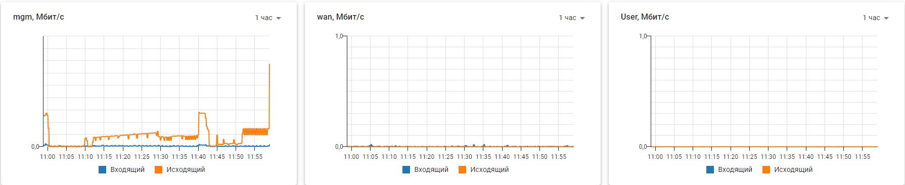
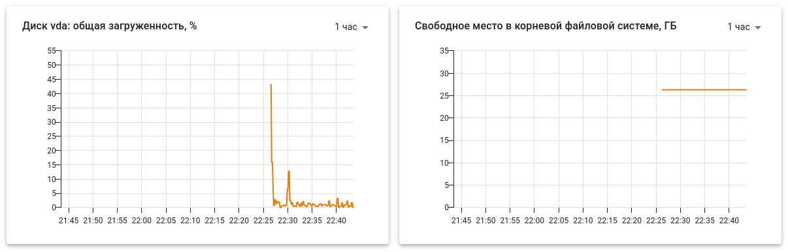

# Информация о загруженности системы

Модуль позволяет просматривать графики о загруженности NGFW VPP в режиме реального времени. В качестве времени всегда используется горизонтальная шкала графика.\
Для просмотра загруженности в веб-интерфейсе перейдите в раздел **Мониторинг->График загруженности**.\
Статистика загруженности хранится до 90 дней.

## Ядро
Вкладка содержит информацию по следующим параметрам:

* Количество авторизованных пользователей;
* Процент загрузки процессора;
* Температура процессора;
* Частота процессора;
* Занятая оперативная память;
* Средняя загрузка;
* Количество соединений Control Plane.
* Количество соединений Data Plane.

## Сеть
Вкладка позволяет посмотреть информацию о входящем и исходящем трафике по всем сетевым интерфейсам NGFW VPP, настроенных в разделе **Сервисы-> Сетевые интерфейсы**.

## Диск 
Вкладка содержит информацию о загруженности диска и об оставшемся месте на нем:

