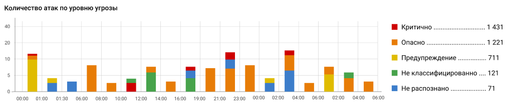

# Cобытия безопасности

События безопасности структурируют информацию раздела **Предотвращение вторжений** и позволяют узнать статистику по блокировкам пользователей.\
Для просмотра событий безопасности в веб-интерфейсе перейдите в раздел **Отчеты и журналы -> События безопасности**.  


Все виджеты формируются в часовом поясе сервера.


Отображаемые данные можно фильтровать по дате и времени, воспользовавшись предустановленным фильтром или настроив временной период самостоятельно по кнопке :


По умолчанию при отсутствии настроенного фильтра по дате и времени устанавливается интервал **Сегодня** в часовом поясе сервера.


## Графики IDS/IPS

Раздел содержит краткую информацию службы **Предотвращение вторжений**. Подробная информация службы **Предотвращение вторжений** находится на вкладке **Журнал IDS/IPS**.

**Значения угроз безопасности:**

* **Критично** - уровень угрозы 1;
* **Важно** - уровень угрозы 2;
* **Предупреждение** - уровень угрозы 3;
* **Не классифицировано** - уровень угрозы 4;
* **Не распознано** - уровень угрозы 255.

**Описание виджетов:**

Топ атакованных адресов

В топ атакованных попадают внешние и внутренние адреса. Пример атаки внешнего адреса - работа трояна изнутри защищаемой сети.

Топ заблокированных типов атак

Виджет подсчитывает статистику типов атак по количеству срабатываний с данным типом атаки. Тип атаки указан в столбце Событие безопасности в таблице внизу раздела.

Топ атакующих стран

Топ атакующих стран строится по IP-адресам, полученным при срабатывании правил в разделе Предотвращение вторжений. Если IP-адрес не геокодируется в наименование страны, такой адрес не отображается в виджете.
По этой причине локальные IP-адреса не отображаются в виджете.

Топ внешних узлов по количеству блокировок

Представляет собой круговую диаграмму с внешними адресами и количеством блокировок по ним.

Топ подозрительных локальных узлов

В топ попадают как авторизованные пользователи так и не авторизованные пользователи, запросы которых блокировались.


При нажатии на уровень угрозы, все виджеты фильтруют содержание для этого уровня. Для перехода к списку уровней угроз, нажмите еще раз по выбранному уровню.


## Журнал IDS/IPS

Раздел содержит таблицу с информацией о всех срабатываниях правил службы **Предотвращение вторжений**.
Удобно использовать для просмотра блокировок пользователей.


При нажатии на IP-адреса в столбцах **Источник** и **Назначение** происходит переход на сервис [Whois](https://www.nic.ru/whois/?searchWord) для получения информации о регистрации домена.



В **Журнале IDS/IPS** можно найти ID правила, которое сработало, и при необходимости создать исключение в разделе **Предотвращение вторжений**.


# Конструктор отчетов


В текущий момент есть возможность сгенерировать отчет только по работе службы **Предотвращения вторжений** и **Журнала авторизации**.


Раздел предоставляет возможность создать шаблоны отчетов и настроить их рассылку в формате .pdf на электронную почту.\
Для просмотра конструктора отчетов в веб-интерфейсе перейдите в раздел **Отчеты и журналы -> Конструктор отчетов**.

## Мои шаблоны

Для создания шаблона со статистикой выполните действия:
1. Нажмите **Добавить** на вкладке **Мои шаблоны**.
2. Задайте временной промежуток и название отчета.
3. Нажмите **Добавить виджет** и настройте его: 
   * Выберите в строке **По кому/чему** объект для сбора статистики.
   * В строке **Виджет** укажите информацию, которую хотите видеть по выбранному объекту.
   * Задайте **Настройки отображения**.
4. После окончания настройки шаблона нажмите **Создать**.

## Отчеты по расписанию

Для настройки рассылки отчетов на электронную почту, выполните действия:
1. Нажмите **Добавить** на вкладке **Отчеты по расписанию**.
2. Заполните требуемые поля и выберите **Отчеты для отправки**.
3. Настройте периодичность рассылки:
   * **Раз в день** - отправка произойдет на следующий день после сохранения, если время отправки меньше текущего на сервере;
   * **Раз в неделю** - укажите день и время отправки;
   * **Раз в месяц** - укажите определенный по счету день и время или каждое 1-ое число месяца. Если выбрано 31-е число, но в месяце меньше дней, то выберется последнее число месяца.
4. Нажмите **Создать**.


При нажатии на кнопку **Создать** UTM VPP сохранит все пользовательские настройки времени отправки во всех фильтрах (раз в день, раз в неделю и раз в месяц), но отправляться шаблон будет только в период, выбранный пользователем.


# Журнал авторизации

Раздел позволяет посмотреть историю авторизации пользователей на UTM VPP. Для просмотра журнала авторизации в веб-интерфейсе перейдите в раздел **Отчеты и журналы -> Журнал авторизации**.

Для поиска истории по конкретным пользователям, которые были когда-то авторизованы на UTM VPP, воспользуйтесь фильтром.


Для открытой сессии каждые 5 минут происходит запись этой сессии в базу и в поле «конец сессии» записывается текущее время.
Для завершённой сессии информация о времени закрытия не меняется.
