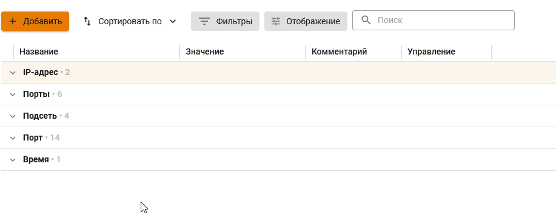
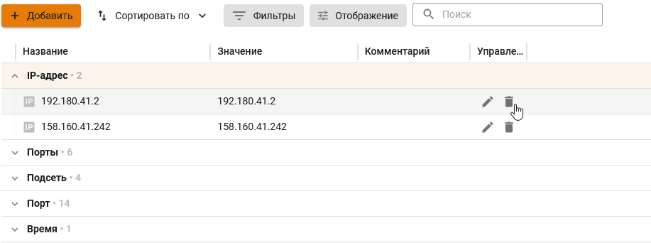

# Объекты: создание, редактирование и удаление

Объектом называется сохраненный в NGFW VPP определенный тип данных, который можно использовать при создании правил. В зависимости от типа данных, реализованы типы следующие объектов:

Типы объектов

* **IP-адрес** - IP-адрес IPv4. Пример: 10.0.0.1;
* **Диапазон IP-адресов** - Диапазон IP-адресов от 1-го до последнего, указанного в диапазоне. Пример: 10.0.0.1-10.0.0.25;
* **Подсеть** - Логический блок IP-адресации. Префикс маршрутизации выражается в нотации CIDR. Пример: 10.0.0.0/24;
* **Домен** - Символьное имя служащее для идентификации объектов в сети Интернет. Пример: ideco.ru;
* **Порт** - Номер порта от 1 до 65535; Пример: 3389;
* **Диапазон портов** - Диапазон портов от 1-го до последнего, указанного в диапазоне. Пример: 1024-65535;
* **Время** - Диапазон времени. Пример: ПН 9:00-18:00 ;
* **Список IP-объектов** - Группа объектов, состоящая из отдельных объектов, таких как IP-адрес, диапазон IP-адресов, подсеть и домен. Пример: 10.0.0.1, 10.0.0.4, 10.0.0.126;
* **Список IP-адресов** - Объект, состоящий из списка IP-адресов. Для создания объекта требуется загрузить любой текстовый файл (например: TXT/CSV). При этом в одной строке должен быть один адрес. Также допускается использование маски /24 или 255.255.255.0
* **Порты** - Группа портов. Пример: 25, 110, 143, 445, 465, 587, 993, 995;
* **Расписание** - Группа диапазонов времени. Пример: ПН 9:00-12:00, ВТ 13:00-18:00;
* **Список стран** - Группа объектов, содержащая GeoIP.

Для просмотра полного списка созданных автоматически и вручную объектов перейдите в раздел **Правила трафика -> Объекты**

## Создание объектов и групп объектов

### Создание объектов

Создание объектов реализовано несколькими способами:

1. При создании правил фильтрации трафика по кнопке **Создать новый объект**.
2. В разделе **Правила трафика -> Объекты** по кнопке **Добавить**.

Список необходимых для заполнения полей зависит от выбранного типа объекта.

### Создание групп объектов

Для создания групп объектов перейдите в раздел **Правила трафика -> Объекты**. \
Так как группа создается из объектов, то предварительно необходимо создать сами объекты. 

К группам объектов относятся: список IP-адресов, порты и расписание.

Для создания объекта типа **Список IP-адресов** используйте любой текстовый файл (например: TXT/CSV), в котором будут перечислены нужные IP-адреса. Правила заполнения:
* строке должен быть один адрес;  
* допускается использование маски /24 или 255.255.255.0.

## Редактирование и удаление объектов

Для редактирования и удаления объектов перейдите в раздел **Правила трафика -> Объекты**.

### Редактирование объекта

### Удаление объекта

