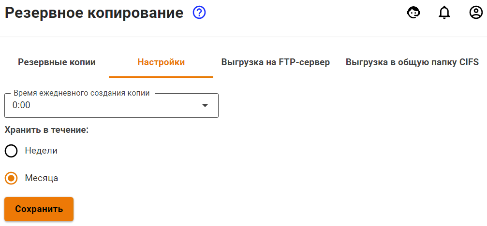
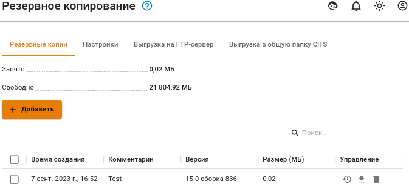
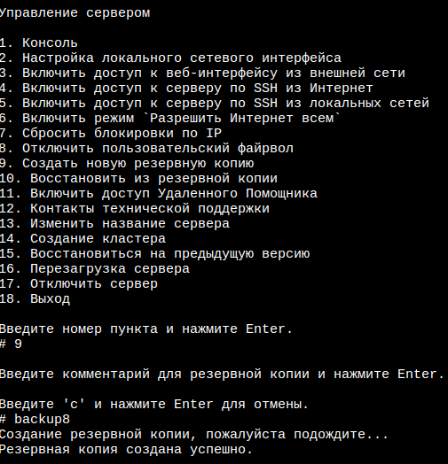
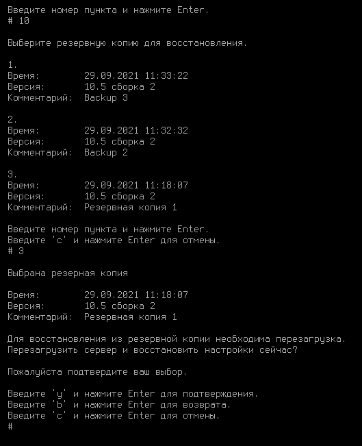

# Резервное копирование

Интернет-шлюз поддерживает следующие типы автоматического резервного копирования:

* на сетевое файловое хранилище по протоколу FTP;
* на сетевое файловое хранилище по протоколу NetBIOS;
* на локальный жесткий диск.

Для настройки автоматического резервного копирования перейдите в раздел **Управление сервером -> Резервное копирование -> Настройки**. Резервная копия создается каждый день в указанный в настройках час (рекомендуется выбирать ночное время).

Хранить резервные копии можно в течение недели или месяца.

## Резервное копирование на удаленное файловое хранилище по протоколу FTP

Данный тип предусматривает запись резервных копий на FTP-сервер. Ключевые параметры, необходимые для настройки резервного копирования на FTP-сервер, описаны в таблице ниже:

<table>
<thead>
<tr>
<th width="115">Параметр</th>
<th>Описание</th>
</tr>
</thead>
<tbody>
<tr>
<td>Адрес сервера</td>
<td>IP-адрес удаленного FTP-сервера, на котором будут размещаться копии базы данных</td>
</tr>
<tr>
<td>Логин</td>
<td>Имя пользователя для авторизации на FTP-сервере</td>
</tr>
<tr>
<td>Пароль</td>
<td>Пароль для авторизации на FTP-сервере</td>
</tr>
<tr>
<td>Путь к каталогу</td>
<td>Каталог, в который будут записываться копии базы данных</td>
</tr>
</tbody>
</table>

## Резервное копирование на сетевое файловое хранилище по протоколу NetBIOS(CIFS)

Данный тип резервного копирования предусматривает запись копии на сервер по протоколу NetBIOS (CIFS). Ключевые параметры, необходимые для настройки резервного копирования на NetBIOS-сервер, описаны в таблице:

<table>
<thead>
<tr>
<th width="115">Параметр</th>
<th>Описание</th>
</tr>
</thead>
<tbody>
<tr>
<td>Адрес сервера</td>
<td>IP-адрес удаленного NetBIOS-сервера, на котором будут размещаться копии базы данных</td>
</tr>
<tr>
<td>Логин</td>
<td>Имя пользователя для авторизации на сетевом ресурсе Windows</td>
</tr>
<tr>
<td>Пароль</td>
<td>Пароль для авторизации на сетевом ресурсе Windows</td>
</tr>
<tr>
<td>Путь к каталогу</td>
<td>Каталог, в который будут записываться копии базы данных</td>
</tr>
</tbody>
</table>


Для доменной учётной записи формат поля **Логин** должен иметь вид: **Имя\_пользователя**. 

Путь к каталогу нужно указывать в UNIX-формате. К примеру, в ОС Windows каталог открывается по следующему пути `\\192.168.1.1\dir_1\dir_2\backup`, значит в поле **Путь к каталогу** нужно прописать `dir_1/dir_2/backup`.


## Резервное копирование на локальный жесткий диск

Загрузить резервную копию с сервера или с компьютера на сервер можно с помощью веб-интерфейса либо локального меню.

### Управление резервными копиями через веб-интерфейс

* **Добавить** позволяет создать резервную копию настроек сервера. Копии настроек создаются автоматически ежедневно;
* **Применить** позволяет восстановить резервную копию настроек. Возможно восстановление настроек только для бэкапа версии одинаковой с установленной на сервере;
* **Скачать** позволяет скачать резервную копию с сервера на ваш компьютер;
* **Удалить** удаляет резервную копию с сервера.

Интерфейс управления резервными копиями в веб-интерфейсе представлен на скриншоте ниже:

### Управление резервными копиями через локальное меню

#### Cоздание резервной копии

Для создания новой резервной копии через локальное меню Ideco UTM, выберите пункт **9** и нажмите **Enter**. Далее введите комментарий для резервной копии и нажмите **Enter**.

Пример создания резервной копии через локальное меню приведен на скриншоте ниже:

#### Восстановление из резервной копии

Для восстановления конфигурации из резервной копии, выберите пункт **10** и нажмите **Enter**. Выберите из списка резервную копию (если копий несколько), введя пункт нужной копии, и нажмите **Enter**. Для восстановления из резервной копии необходимо перезагрузить сервер. Введите **y**, а затем **Enter** для перезагрузки.

Пример восстановления из резервной копии через локальное меню приведен на скриншоте ниже:

