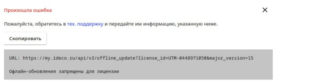

# Управление лицензиями

## Добавление коммерческой лицензии

После покупки лицензии будет выдан токен формата: `owhYLGvT6Xmt819JyinSxREkJfvjVO63`.

Чтобы добавить лицензию в личный кабинет, нажмите на кнопку **Добавить коммерческую лицензию** в разделе **Лицензирование**. Затем скопируйте в поле **Токен лицензии** имеющийся токен.

После этого токен будет недействителен, а в таблице **Свободные лицензии** отобразится купленная лицензия.

## Добавление SMB-лицензии

Чтобы добавить лицензию SMB в личный кабинет, нажмите кнопку **Добавить бесплатную лицензию** в разделе **Лицензирование**. Добавленная лицензия отобразится в таблице **Свободные лицензии**.

## Привязка лицензии к серверу

### Онлайн-привязка лицензии

Привязать лицензию можно двумя способами:

1\. Во вкладке **Лицензирование** нажмите . Далее в открывшемся окне выберите нужную лицензию и сохраните изменения нажав **Привязать лицензию**.

2\. Во вкладке **Лицензирование** выберите **Свободные лицензии** и нажмите . Далее укажите нужный сервер и сохраните изменения нажав **Привязать**.


Назначьте имеющиеся коммерческие лицензии на любой зарегистрированный сервер Ideco NGFW с учетом следующих ограничений:

* Одна лицензия может быть привязана только к одному серверу;
* Демо-лицензию нельзя привязать к другому серверу;
* Демо-лицензию нельзя повторно получить на одну и ту же инсталляцию сервера;
* При удалении сервера с демо-лицензией, лицензия будет так же удалена.


### Оффлайн-привязка лицензии

1\. Для предоставления оффлайн-лицензии - обратитесь к менеджеру.

2\. Привяжите предоставленную лицензию к серверу:

* Во вкладке **Лицензирование** нажмите . Далее в открывшемся окне выберите нужную лицензию и сохраните изменения, нажав **Привязать лицензию**.
* Во вкладке **Лицензирование** выберите **Свободные лицензии** и нажмите . Далее укажите нужный сервер и сохраните изменения, нажав **Привязать**.

Пример наименования сервера для **оффлайн**-регистрации: `UTM (UTM Unknown)`

Если была выбрана лицензия, не подходящая для оффлайн-регистрации сервера, то появится ошибка:

3\. Перейдите в раздел **NGFW -> Оффлайн** и введите в соответствующие поля мажорный номер версии и номер лицензии:

4\. Нажмите **Получить ссылки** и сохраните файл конфигураций, нажав на license:

Помимо информации о лицензии личный кабинет предоставит файлы для обновления баз модулей безопасности. Подробнее о процессе обновления - в статье [Регистрация сервера](../../initial-setup/server-registration.md#obnovlenie-baz-modulei-bezopasnosti).

5\. Добавьте конфигурационный файл c информацией о лицензии в Ideco NGFW:

* Перейдите в раздел **Управление сервером -> Терминал**;
* Загрузите полученный файл `license.json` на сервер Ideco UTM в директорию `/var/cache/ideco/license-backend/`;
* Перезапустите сервис лицензий командой `systemctl restart ideco-license-backend.service`;
* Перейдите в раздел **Управление сервером -> Лицензия** и убедитесь, что лицензия установлена.

## Просмотр информации о лицензиях

Просмотр информации о сервере и лицензии доступен при нажатии на иконку  в колонке **Лицензия** вкладки **Лицензирование**.

Информация о лицензии содержит сведения о сроке действия лицензии, количестве пользователей, сроке окончания обновлений, технической поддержки продукта и др.
