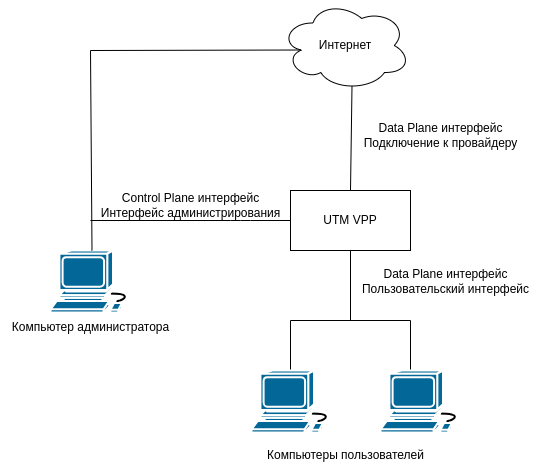
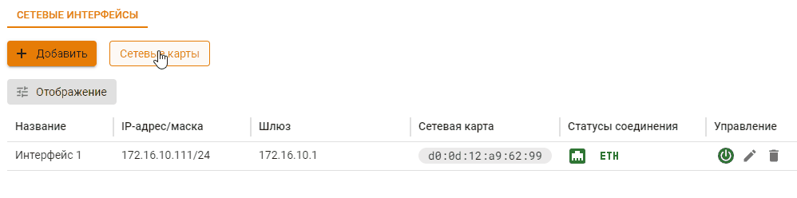
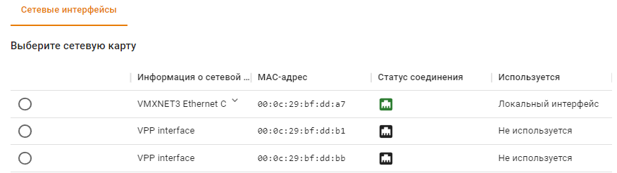
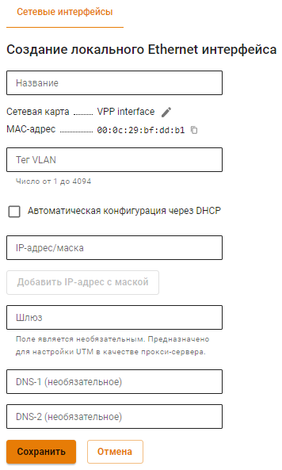

# Управление сетевыми интерфейсами

Работа с сетевыми интерфейсами проводится в разделе **Сервисы -> Сетевые интерфейсы**.

Ideco NGFW VPP использует в работе два типа сетевых интерфейсов:
* Control Plane - интерфейсы администрирования, используемые для настройки NGFW VPP через браузер. Имеет свой выход в Интернет;
* Data Plane - интерфейсы, используемые для подключения пользователей к NGFW VPP и для подключения NGFW VPP к провайдеру.

Для просмотра списка доступных сетевых карт нажмите на кнопку **Сетевые карты**:

## Создание интерфейса

1\. Нажмите **Добавить** и выберите:
* **Локальный Ethernet** - для пользовательских интерфейсов (Data Plane);
* **Внешний Ethernet** - для интерфейсов администрирования (Control Plane) и подключения к провайдеру (Data Plane).

2\. Укажите сетевую карту: \
Важно: сетевая карта, подходящая для Data Plane интерфейса имеет название **VPP interface**, а для Control Plane интерфейса название самой сетевой карты, например **VMXNET3 Ethernet Controller**.

3\. Заполните нужные поля:
* **Название интерфейса** - имя для идентификации интерфейса;
* **Сетевая карта** - сетевой адаптер, который будет использоваться для подключения к интернет-провайдеру;
* **Тег VLAN**- VLAN ID. Поле заполняется в том случае если сетевая карта уже используется;
* **Автоматическая настройка через DHCP** - Используйте, если ваш интернет-провайдер поддерживает автоматическую настройку Ethernet-интерфейса с помощью протокола DHCP;
* **IP-адрес/маска** - Можно назначить на интерфейс несколько IP-адресов. Должен быть указан хотя бы один IP-адрес;
* **Шлюз** - IP-адрес шлюза. Шлюз не будет использоваться, если в разделе **Сервисы -> DNS** \
**-> Внешние DNS-серверы** не создано правило **Использования DNS, выданного подключению**;
  


Для корректной работы NGFW VPP **не указывайте** шлюз при настройке пользовательских DataPlane интерфейсов. 
