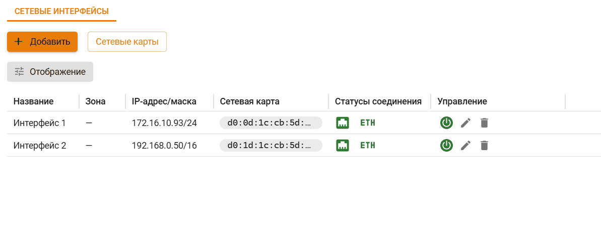

# Управление сетевыми интерфейсами

Работа с сетевыми интерфейсами проводится в разделе **Сервисы -> Сетевые интерфейсы**.

Ideco UTM VPP использует в работе три типа сетевых интерфейсов:
* Management - интерфейс администратора, используемый для настройки UTM VPP через браузер. Имеет свой выход в Интернет;
* WAN - интерфейс, используемый для выхода пользователей и UTM VPP в сеть Интернет.
* LAN - интерфейс для пользователей локальной сети UTM VPP. Не имеет выхода в Интернет.

Для просмотра списка доступных сетевых карт нажмите на кнопку **Сетевые карты**:

## Создание интерфейса

1\. Нажмите **Добавить** и выберите:
* **Локальный Ethernet** - для LAN и Management интерфейсов;
* **Внешний Ethernet** - для WAN-интерфейса.

2\. Укажите сетевую карту: \
Важно: сетевая карта, подходящая для LAN интерфейса имеет название **VPP interface**, а для Management интерфейса название самой сетевой карты, например **VMXNET3 Ethernet Controller**.

3\. Заполните нужные поля:
* **Название интерфейса** - имя для идентификации интерфейса;
* **Сетевая карта** - сетевой адаптер, который будет использоваться для подключения к интернет-провайдеру;
* **Тег VLAN**- VLAN ID. Поле заполняется в том случае если сетевая карта уже используется;
* **Автоматическая настройка через DHCP** - Используйте, если ваш интернет-провайдер поддерживает автоматическую настройку Ethernet-интерфейса с помощью протокола DHCP;
* **IP-адрес/маска** - Можно назначить на интерфейс несколько IP-адресов. Должен быть указан хотя бы один IP-адрес;
* **Шлюз** - IP-адрес шлюза. Шлюз не будет использоваться, если в разделе **Сервисы -> DNS** \
**-> Внешние DNS-серверы** не создано правило **Использования DNS, выданного подключению**;
  


Для корректной работы UTM VPP **не указывайте** шлюз при настройке пользовательских LAN интерфейсов. 
