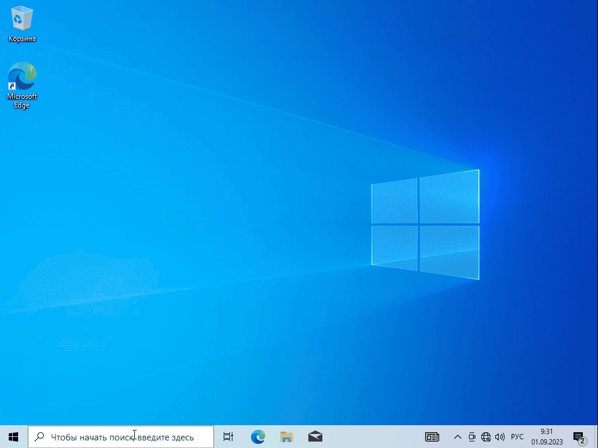
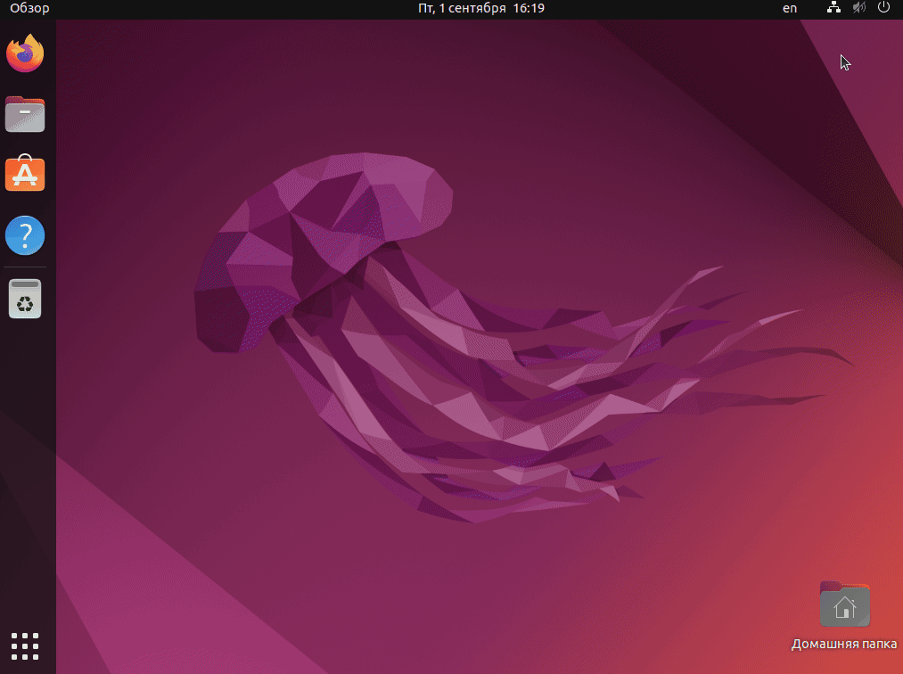
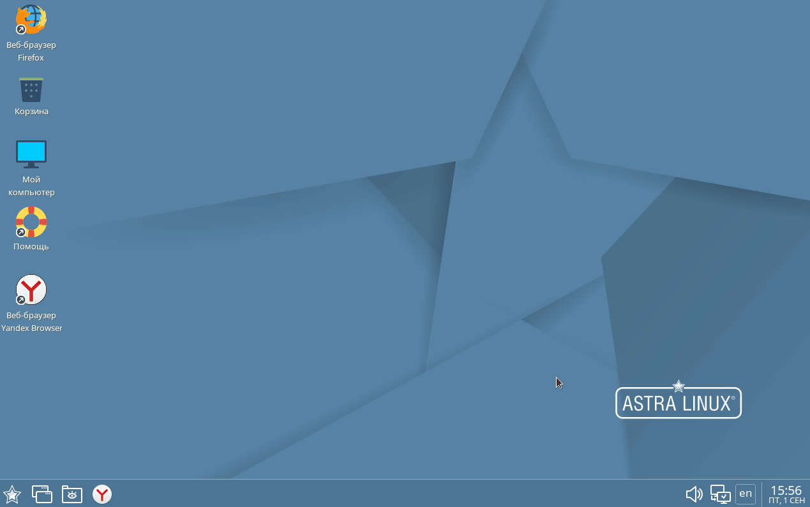

# Настройка соединения c UTM VPP


Перед настройкой сети на клиентской машине убедитесь, что на UTM VPP создан пользователь с авторизацией по IP-адресу, который будет использован на клиентской машине.


Для выхода в интернет через UTM VPP требуется настроить соединение на клиентской машине. При настройке для авторизации по IP потребуется ввести **статический IP-адрес**, выделенный под пользователя, **IP-адрес UTM VPP**, **IP-адрес DNS-сервера**.


При авторизации по MAC потребуется MAC-адрес сетевой карты клиентской машины.


Ниже будут рассмотрены примеры настройки на разных системах при авторизации по IP. 

В примерах использованы:\
**192.168.100.50** - cтатический IP-адрес, выделенный под пользователя;\
**192.168.100.1** - IP-адрес UTM VPP в LAN сети;\
**192.168.50.1** - IP-адрес DNS-сервера провайдера.

## Настройка сети на Windows

## Настройка сети на Ubuntu

## Настройка сети на Astra Linux

