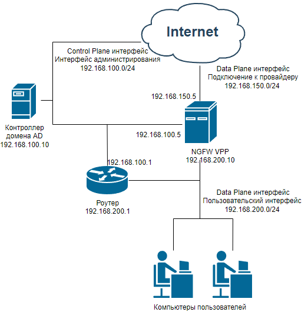
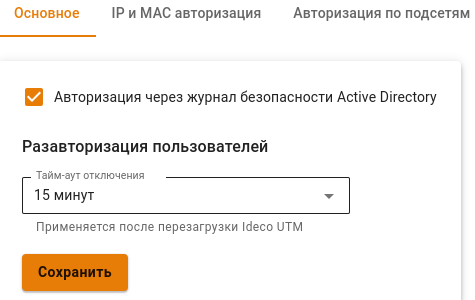

# Авторизация через журнал безопасности Active Directory


Приостанавливается синхронизация с контроллером домена, если локальные пользователи Ideco NGFW VPP находятся в группах AD. \
Для возобновления синхронизации вынесите локальных пользователей из групп AD. Автоматическая синхронизация произойдет через 15 минут.



Если на контроллере домена отключить пользователя, который уже импортирован, то после включения ему присвоится новый ID и ранее настроенные правила фильтрации перестанут работать.


Для авторизации через журнал безопасности AD сеть должна соответствовать топологии:




## Настройка клиентских машин

Для авторизации через журнал безопасности AD выполните действия:

1. Установите в качестве шлюза по умолчанию IP-адрес NGFW VPP на **пользовательском интерфейсе** (например `192.168.200.10`).
2. Установите в качестве ДНС-сервера на клиентской машине внешний ДНС сервер (например: `8.8.8.8`).
3. Откройте командную строку и пропишите статический маршрут до **интерфейса администрирования** при помощи команды:
```
route -p add 192.168.100.0 mask 255.255.255.0 192.168.200.1
```
* 192.168.100.0 - сеть **интерфейса администрирования**.
* 192.168.200.1 - сеть **пользовательского интерфейса**.

4. После указания маршрута должен появиться доступ до контроллера домена AD.


## Настройка Ideco NGFW VPP 


Для включения **Авторизации через журнал безопасности Active Directory** перейдите на вкладку **Пользователи -> Авторизация -> Основное** и включите опцию **Авторизация через журнал безопасности Active Directory**. Нажмите кнопку **Сохранить**.




## Настройка сервера Microsoft Active Directory

**Авторизация через журнал безопасности Active Directory:**


При аутентификации через журнал безопасности контроллера домена AD пользователи будут аутентифицированы при попытке выхода в Интернет. Автоматической аутентификации без прохождения трафика через NGFW VPP не происходит, т.к. используется конкурентная политика аутентификации.


Для работы авторизации через журнал безопасности выполните настройку на основном контроллере домена:

1. В настройках брандмауэра Windows на всех контроллерах домена (или доменов) разрешите **удаленное управление журналом событий (Remote Event Log Management)**:


2. Добавьте Ideco NGFW VPP в группу безопасности **Читатели журнала событий (Event Log Readers)**:


3. Перезапустите службу **Авторизация через журнал безопасности Active Directory** на Ideco NGFW VPP. Отключите эту настройку и заново включите;

При изменении стандартной политики безопасности контроллеров домена выполните действия:

**Англоязычная версия:**


**Русскоязычная версия:**



Для обновления политик контроллеров доменов выполните `gpupdate /force`;\
Если авторизация пользователей при логине не происходит, нужно проверить в журнале безопасности наличие событий 4768, 4769, 4624.

