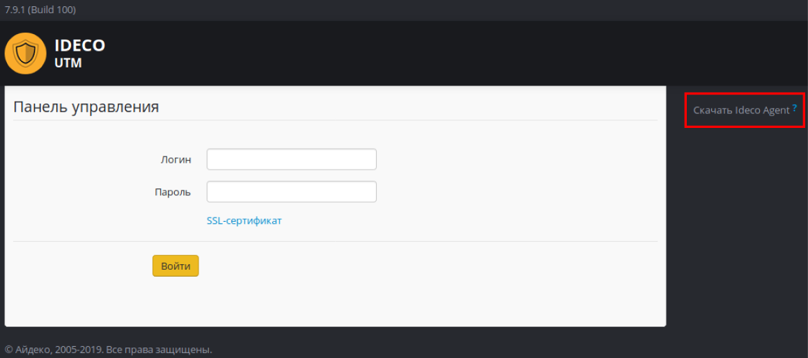

# Авторизация через Ideco Agent

Для управления доступом в интернет пользователей с установленной специализированной программой-агентом. Доступ будет обеспечен только в то время, когда пользователь авторизован с помощью этой программы. Программа должна быть установлена на рабочей станции пользователя или запускаться с удаленного сервера при входе в систему.

Для авторизации с помощью программы-агента необходимо загрузить программу с локального web-сайта и сохранить ее в произвольный каталог. Получить программу-авторизатор Ideco Agent можно на странице авторизации при входе в систему, в меню справа, как показано ниже \(ссылка появится при включении возможности авторизации через программу-агент в разделе Сервисы - Авторизация пользователей\).

Необходимым условием успешной авторизации с помощью Ideco Agent является указание в настройках сетевой карты в качестве шлюза и в качестве сервера DNS локального адреса интернет-шлюза Ideco UTM. При необходимости нужно разрешить в межсетевом экране подключение на сетевой порт 800/TCP из внутренней сети.

После запуска программы необходимо ввести логин и пароль пользователя. Состояние авторизации отображается иконкой в системном лотке. Возможные состояния представлены в следующей таблице:

| Индикация | Описание |
| :---: | :--- |
|   | Программа не активна |
|   | Идет подключение к серверу |
|   | Доступ в интернет разрешен |
|   | Сработал лимит предупреждения |
|   | Сработал лимит отключения |
|   | Произошла ошибка. Доступ в интернет запрещен |

В контекстном меню иконки доступны пункты, описанные в таблице ниже.

<table>
  <thead>
    <tr>
      <th style="text-align:left">&#x41F;&#x443;&#x43D;&#x43A;&#x442; &#x43C;&#x435;&#x43D;&#x44E;</th>
      <th
      style="text-align:left">&#x417;&#x43D;&#x430;&#x447;&#x435;&#x43D;&#x438;&#x435;</th>
    </tr>
  </thead>
  <tbody>
    <tr>
      <td style="text-align:left">&#x41F;&#x43E;&#x434;&#x43A;&#x43B;&#x44E;&#x447;&#x438;&#x442;&#x44C;</td>
      <td
      style="text-align:left">
        
&#x41E;&#x442;&#x43E;&#x431;&#x440;&#x430;&#x436;&#x435;&#x43D;&#x438;&#x435;
          &#x434;&#x438;&#x430;&#x43B;&#x43E;&#x433;&#x430; &#x43F;&#x43E;&#x434;&#x43A;&#x43B;&#x44E;&#x447;&#x435;&#x43D;&#x438;&#x44F;

        

          
        

        </td>
    </tr>
    <tr>
      <td style="text-align:left">&#x41E;&#x442;&#x43A;&#x43B;&#x44E;&#x447;&#x438;&#x442;&#x44C;</td>
      <td
      style="text-align:left">&#x41E;&#x442;&#x43A;&#x43B;&#x44E;&#x447;&#x438;&#x442;&#x44C;&#x441;&#x44F;
        &#x43E;&#x442; &#x441;&#x435;&#x440;&#x432;&#x435;&#x440;&#x430;</td>
    </tr>
    <tr>
      <td style="text-align:left">&#x418;&#x43D;&#x444;&#x43E;&#x440;&#x43C;&#x430;&#x446;&#x438;&#x44F;</td>
      <td
      style="text-align:left">
        
&#x41E;&#x442;&#x43E;&#x431;&#x440;&#x430;&#x437;&#x438;&#x442;&#x44C;
          &#x438;&#x43D;&#x444;&#x43E;&#x440;&#x43C;&#x430;&#x446;&#x438;&#x44E;
          &#x43E; &#x43F;&#x43E;&#x434;&#x43A;&#x43B;&#x44E;&#x447;&#x435;&#x43D;&#x438;&#x438;
          &#x43A; &#x438;&#x43D;&#x442;&#x435;&#x440;&#x43D;&#x435;&#x442;

        

          
        

        </td>
    </tr>
    <tr>
      <td style="text-align:left">&#x417;&#x430;&#x43F;&#x443;&#x441;&#x43A;&#x430;&#x442;&#x44C;&#x441;&#x44F;
        &#x43F;&#x440;&#x438; &#x432;&#x445;&#x43E;&#x434;&#x435; &#x432; &#x441;&#x438;&#x441;&#x442;&#x435;&#x43C;&#x443;</td>
      <td
      style="text-align:left">&#x423;&#x441;&#x442;&#x430;&#x43D;&#x43E;&#x432;&#x438;&#x442;&#x44C;
        &#x430;&#x432;&#x442;&#x43E;&#x43C;&#x430;&#x442;&#x438;&#x447;&#x435;&#x441;&#x43A;&#x438;&#x439;
        &#x437;&#x430;&#x43F;&#x443;&#x441;&#x43A; &#x43F;&#x440;&#x43E;&#x433;&#x440;&#x430;&#x43C;&#x43C;&#x44B;
        &#x43F;&#x440;&#x438; &#x432;&#x445;&#x43E;&#x434;&#x435; &#x432; Windows</td>
    </tr>
    <tr>
      <td style="text-align:left">&#x41E; &#x43F;&#x440;&#x43E;&#x433;&#x440;&#x430;&#x43C;&#x43C;&#x435;</td>
      <td
      style="text-align:left">
        
&#x412;&#x44B;&#x432;&#x43E;&#x434; &#x438;&#x43D;&#x444;&#x43E;&#x440;&#x43C;&#x430;&#x446;&#x438;&#x438;
          &#x43E; &#x43F;&#x440;&#x43E;&#x433;&#x440;&#x430;&#x43C;&#x43C;&#x435;
          &#x430;&#x432;&#x442;&#x43E;&#x440;&#x438;&#x437;&#x430;&#x446;&#x438;&#x438;

        

          
        

        </td>
    </tr>
  </tbody>
</table>


* При использовании Ideco Agent в домене Active Directory рекомендуется расположить IdecoAgent.exe на общем сетевом ресурсе и установить в политике входа в домен запуск приложения IdecoAgent.exe с ключом domain. Таким образом, запуск агента будет централизован, и не потребуется его установка на каждый компьютер.
* При смене локального адреса Ideco UTM обязательно нужно повторно скачать Ideco Agent с сайта, поскольку локальный адрес сервера встраивается в приложение при скачивании.


