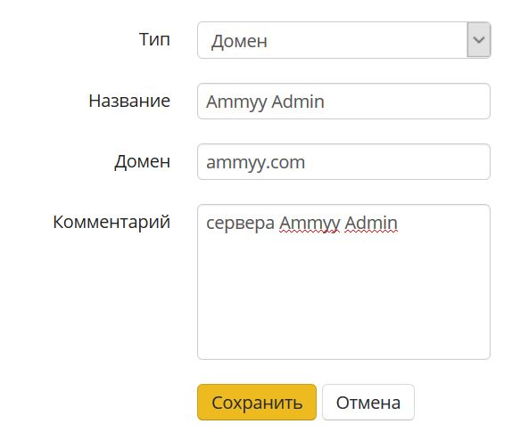
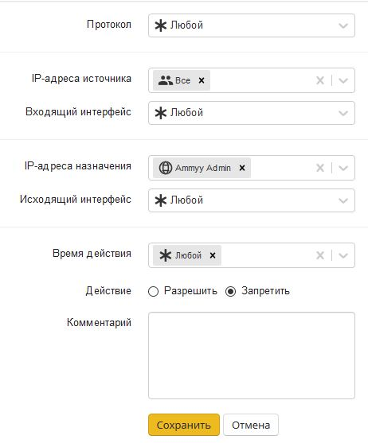
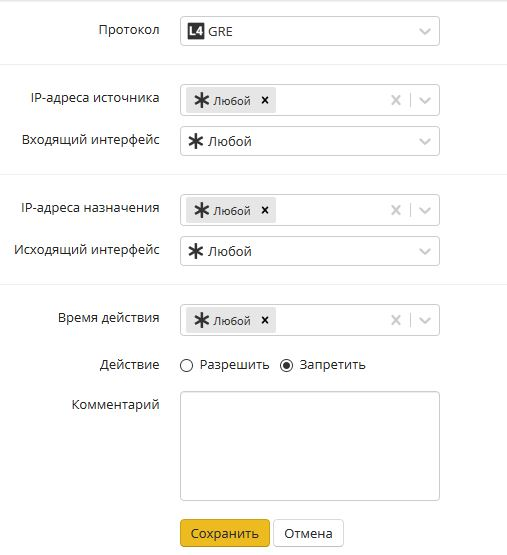
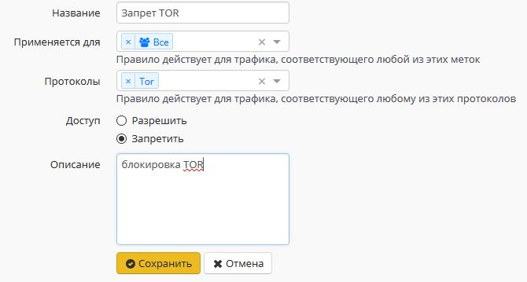
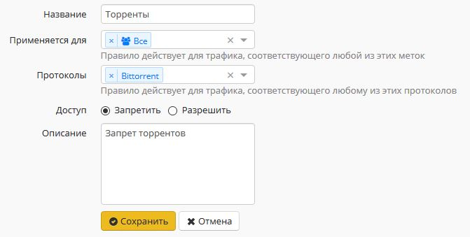
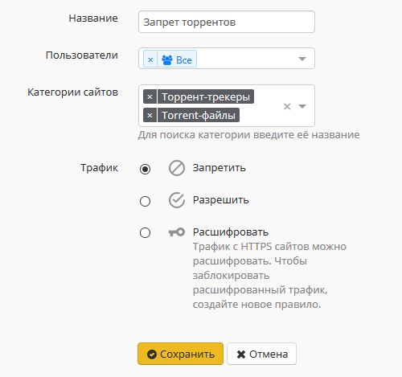

# Блокировка\_популярных\_ресурсов

## Блокировка популярных ресурсов

 - \[Заблокировать программы удаленного доступа\]\(\#id-Блокировкапопулярныхресурсов-Заблокироватьпрограммыудаленногодоступа\) - \[Заблокировать Ammyy Admin\]\(\#id-Блокировкапопулярныхресурсов-ЗаблокироватьAmmyyAdmin\) - \[Заблокировать TeamViewer\]\(\#id-Блокировкапопулярныхресурсов-ЗаблокироватьTeamViewer\) - \[Блокировка анонимайзеров\]\(\#id-Блокировкапопулярныхресурсов-Блокировкаанонимайзеров\) - \[Заблокировать Opera.Turbo, Opera VPN, Yandex.Turbo, friGate, Anonymox, Browsec\]\(\#id-Блокировкапопулярныхресурсов-ЗаблокироватьOpera.Turbo,OperaVPN,Yandex.Turbo,friGate,Anonymox,Browsec\) - \[Заблокировать TOR\]\(\#id-Блокировкапопулярныхресурсов-ЗаблокироватьTOR\) - \[Заблокировать ICQ\]\(\#id-Блокировкапопулярныхресурсов-ЗаблокироватьICQ\) - \[Заблокировать торренты\]\(\#id-Блокировкапопулярныхресурсов-Заблокироватьторренты\)

## Заблокировать программы удаленного доступа

### Заблокировать Ammyy Admin

В "Объектах" \(Правила доступа - Объекты\) предварительно создайте объект типа "домен" с доменным именем rl.ammyy.com



Затем в файрволе создайте правило запрета для нужных пользователе или групп. В IP-адресе назначения укажите Ammyy Admin:



### Заблокировать TeamViewer

Заблокируйте TeamViewer с помощью [контроля приложений](https://github.com/ideco-team/docsUTM/tree/54be5c28981601375569bdca6ef75ead87808b16/Контроль_приложений/README.md), выбрав одноименный протокол в правиле для пользователей или групп

## Блокировка анонимайзеров

Заблокировать анонимайзеры, работающие по HTTP\(S\), можно с помощью [контент-фильтра](https://github.com/ideco-team/docsUTM/tree/54be5c28981601375569bdca6ef75ead87808b16/Контент-фильтр/README.md) \(категория "Анонимайзеры"\).

Для блокировки VPN-анонимайзеров использующих протокол PPTP, как правило, достаточно заблокировать протокол GRE в правилах файрвола. Выберите протокол GRE:



Также для запрета обхода контент-фильтра рекомендуем создать правило запрета прямых обращений по IP-адресам в Контент-фильтре:


### Заблокировать Opera.Turbo, Opera VPN, Yandex.Turbo, friGate, Anonymox, Browsec

Заблокировать данные и некоторые другие плагины \(анонимайзеры\) и функции браузеров, которые часто используются для обхода контентной фильтрации, можно с помощью [системы предотвращения вторжений](https://github.com/ideco-team/docsUTM/tree/54be5c28981601375569bdca6ef75ead87808b16/Предотвращение_вторжений/README.md), активировав в ней группу правил "Анонимайзеры" и отдельную группу правил "Opera VPN" для блокировки одноименного сервиса.

В журнале системы предотвращения вторжений будут фиксироваться попытки обхода контентной фильтрации с помощью данного ПО \(и они будут заблокированы\):

```text
07/20/2017-15:06:04.056815  [Drop] [**] [1:1001697:1] Opera VPN [**] [Classification: Opera VPN] [Priority: 2] {TCP} 10.80.1.74:64784 -> 169.254.254.254:443

07/20/2017-15:09:20.531169  [Drop] [**] [1:1001675:0] Anonymox HTTP [**] [Classification: Анонимайзеры] [Priority: 2] {TCP} 10.80.20.95:35576 -> 207.244.89.90:88
```

### Заблокировать TOR

Tor - это система прокси-серверов, позволяющая устанавливать анонимное сетевое соединение для обхода контентной фильтрации.

 Tor - специально разработанное программное обеспечение и среда прокси-серверов, предназначенная для обхода различного рода блокировок, поэтому полностью заблокировать его в настоящее время не представляется возможным.

&lt;/div&gt;

Для противодействия использованию сети Tor, а также журналирования попыток подключения к ней и её использования необходимо сделать следующее:

Включить [систему предотвращения вторжений](https://github.com/ideco-team/docsUTM/tree/54be5c28981601375569bdca6ef75ead87808b16/Предотвращение_вторжений/README.md) и активировать в ней категорию "Блокирование атак", которая позволяет блокировать подключения к входным узлам сети Tor.

Включить [контроль приложений](https://github.com/ideco-team/docsUTM/tree/54be5c28981601375569bdca6ef75ead87808b16/Контроль_приложений/README.md) и добавить правила запрета приложения TOR к определенной группе или всем пользователям:



## Заблокировать ICQ

В модуле [контроль приложений](https://github.com/ideco-team/docsUTM/tree/54be5c28981601375569bdca6ef75ead87808b16/Контроль_приложений/README.md) создайте правила блокировки протокола Oscar и ICQ для нужных пользователей или групп.

## Заблокировать торренты

BitTorrent - P2P-протокол, предназначенный для обмена файлами через интернет.

 Программы-клиенты BitTorrent используют механизмы обхода блокировок: шифрование трафика, использование не специфических портов \(80, 443\) и др. механизмы. Поэтому полностью заблокировать их в настоящее время невозможно. Поэтому действия по блокированию торрентов с помощью файрвола и контент-фильтра, описанные в статье, должны сопровождаться настройкой \[полосы пропускания\]\(Ограничение\_скорости\) и \[лимитов трафика\]\(../ICS/Профили\_выхода\_в\_Интернет\) для пользователей.

&lt;/div&gt;

Для существенного ограничения возможности использования торрентов необходимо выполнить следующие настройки:

1. Запретите протокол BitTorrent с помощью правила в модуле \[контроль

   приложений\]\(Контроль\_приложений\)  

   

2. Использовать политику **"запретить все, кроме разрешенного"** при настройке файрвола. Разрешите нужные TCP и UDP порты пользователям, сделав последнее правило запрещающим.
3. Запретить сайты-каталоги торрент-файлов с помощью [контент-фильтра](https://github.com/ideco-team/docsUTM/tree/54be5c28981601375569bdca6ef75ead87808b16/Контент-фильтр/README.md), запретив категорию _Торрент-трекеры_. И запретить скачивание файлов с расширением .torrent 
4. Включить \[систему предотвращения

   вторжений\]\(Предотвращение\_вторжений\)

   и активировать в ней категорию "Запросы на скомпрометированные

   ресурсы", которая позволяет блокировать активность

   P2P-программ.

 \#\# Attachments:

 !\[\]\(images/icons/bullet\_blue.gif\) \[ammy.PNG\]\(attachments/4981077/4981076.png\) \(image/png\) !\[\]\(images/icons/bullet\_blue.gif\) \[icq.PNG\]\(attachments/4981077/4981081.png\) \(image/png\) !\[\]\(images/icons/bullet\_blue.gif\) \[запрет всего, кроме веб.PNG\]\(attachments/4981077/4981106.png\) \(image/png\) !\[\]\(images/icons/bullet\_blue.gif\) \[контент-фильтр-торренты.PNG\]\(attachments/4981077/4981107.png\) \(image/png\) !\[\]\(images/icons/bullet\_blue.gif\) \[торрент-файлы.PNG\]\(attachments/4981077/4981109.png\) \(image/png\) !\[\]\(images/icons/bullet\_blue.gif\) \[vpn.PNG\]\(attachments/4981077/4981142.png\) \(image/png\) !\[\]\(images/icons/bullet\_blue.gif\) \[block\\_01\\_ng.png\]\(attachments/4981077/4981726.png\) \(image/png\) !\[\]\(images/icons/bullet\_blue.gif\) \[block\\_02\\_ng.png\]\(attachments/4981077/4981727.png\) \(image/png\) !\[\]\(images/icons/bullet\_blue.gif\) \[block\\_04\\_ng.png\]\(attachments/4981077/4981732.png\) \(image/png\) !\[\]\(images/icons/bullet\_blue.gif\) \[tor.JPG\]\(attachments/4981077/4982977.jpg\) \(image/jpeg\) !\[\]\(images/icons/bullet\_blue.gif\) \[торренты.JPG\]\(attachments/4981077/7110731.jpg\) \(image/jpeg\) !\[\]\(images/icons/bullet\_blue.gif\) \[ip.JPG\]\(attachments/4981077/7110692.jpg\) \(image/jpeg\) !\[\]\(images/icons/bullet\_blue.gif\) \[торренты.JPG\]\(attachments/4981077/4982978.jpg\) \(image/jpeg\) !\[\]\(images/icons/bullet\_blue.gif\) \[торренты-ac.JPG\]\(attachments/4981077/7110734.jpg\) \(image/jpeg\) !\[\]\(images/icons/bullet\_blue.gif\) \[ammyy.JPG\]\(attachments/4981077/11239471.jpg\) \(image/jpeg\) !\[\]\(images/icons/bullet\_blue.gif\) \[ammyy2.JPG\]\(attachments/4981077/11239472.jpg\) \(image/jpeg\) !\[\]\(images/icons/bullet\_blue.gif\) \[gre.JPG\]\(attachments/4981077/11239474.jpg\) \(image/jpeg\)

