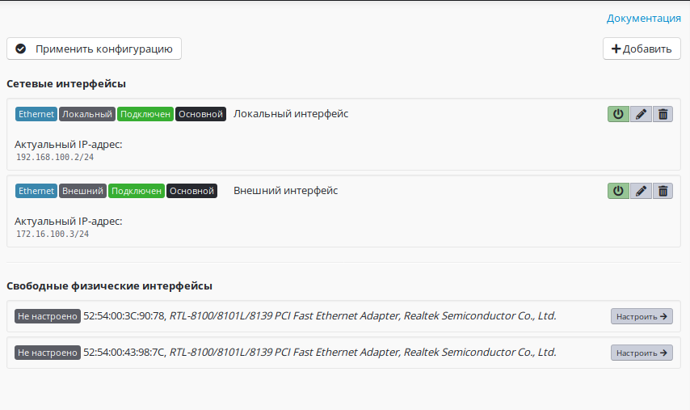
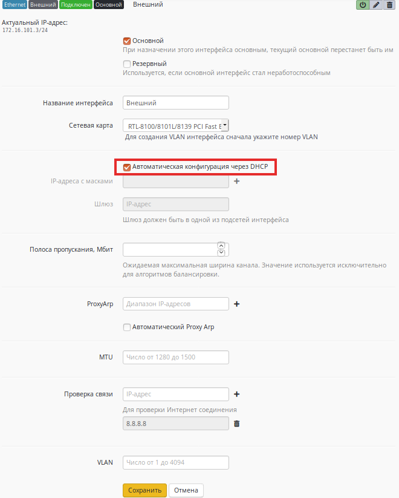

# Подключение по Ethernet

Прямое подключение по Ethernet является наиболее распространённым. Для настройки подключения в web-интерфейсе необходимо перейти в меню **Сервисы -> Интерфейсы**. Вы увидите перечень существующих сетевых интерфейсов, представленный на фрагменте экрана ниже. Для корректной работы интернет-шлюза необходимо, как минимум, два Ethernet-интерфейса.

Для подключения к интернет-провайдеру используется внешний интерфейс, в то время как внутренний необходим для подключения к локальной сети предприятия.

## Ручная настройка

Выберите в списке внешний Ethernet-интерфейс. Ниже на экране появятся его параметры, которые вам необходимо определить. Перечень параметров можно увидеть в следующей таблице. Как правило, вся необходимая информация содержится в договоре с вашим интернет-провайдером.

| Параметр            | Описание                                                                                                                                                                           |
| ------------------- | ---------------------------------------------------------------------------------------------------------------------------------------------------------------------------------- |
| Имя интерфейса      | Укажите любое имя, с помощью которого вы будете в дальнейшем идентифицировать интерфейс, например ISP                                                                              |
| Включен             | Отметьте для того, чтобы активировать интерфейс                                                                                                                                    |
| Роль                | Выберите **Внешний**                                                                                                                                                               |
| Сетевая карта       | Выберите из списка сетевой адаптер, который будет использоваться для подключения к интернет-провайдеру                                                                             |
| IP-адреса           | Вы можете назначить на интерфейс несколько IP-адресов. Для этого укажите IP-адрес, маску сети и нажмите кнопку **Добавить**. Как минимум, должен быть указан хотя бы один IP-адрес |
| Шлюз по умолчанию   | Укажите IP-адрес шлюза по умолчанию                                                                                                                                                |
| Основной            | Отметьте для того, чтобы сделать интерфейс основным                                                                                                                                |
| Резервный           | Отметьте для того, чтобы данный интерфейс был резервным. Трафик будет идти через него в случае не работоспособности основного интерфейса                                           |
| Полоса пропускания  | Максимальная скорость интернет-трафика по тарифу провайдера. **Введите ее только в случае необходимости использования балансировки каналов**                                       |


Интерфейс, помеченный как основной, используется по умолчанию для обработки трафика пользователей. Это нужно в случае, когда в Ideco UTM создано несколько Ethernet-интерфейсов с ролью External.


Настройки внешнего Ethernet-интерфейса показаны ниже:

## Автоматическая настройка

Если ваш интернет-провайдер поддерживает возможность автоматической настройки Ethernet-интерфейса с помощью протокола DHCP, то вы можете воспользоваться им. Для этого выберите в списке внешний Ethernet-интерфейс, параметры которого появятся на фрагменте ниже_**,**_ и отметьте в нём пункт **Автоматическая конфигурация через DHCP-сервер.**

После заполнения всех полей ещё раз убедитесь в корректности введённых значений. Если вся информация указана верно, нажмите кнопку **Сохранить** для завершения настройки подключения к интернет-провайдеру.

Для отслеживания состояния соединения перейдите в раздел **Сервисы -> Интерфейсы**. Если связь с провайдером установлена, то у интерфейса должен появиться статус **Подключен**, подсвеченный зеленым. Так же у подключенного интерфейса всегда есть **Актуальный IP-адрес**.

## VLAN

При указании VLAN ID в поле **VLAN** Ethernet-интерфейса, UTM начинает присутствовать в этом VLAN. Такой сетевой интерфейс считается VLAN-интерфейсом.

Можно создать неограниченное количество VLAN-интерфейсов (Ethernet-интерфейс с указанным VLAN ID) на одном физическом сетевом устройстве. У них в поле **Сетевая карта** может быть назначено одно и то же устройство.

Обычные Ethernet-интерфейсы, без указания VLAN ID, создаются на физическом интерфейсе только в единичном экземпляре.

Присутствуя в VLAN, UTM принимает трафик тегированый этим VLAN ID на программном интерфейсе с соответствующим VLAN ID.

Пример: UTM должен присутствовать в трех VLAN локального сегмента сети подключенного к сетевой карте на UTM (VLAN ID: 100, 101 и 102). Нужно создать три Ethernet-интерфейса с ролью Local с указанием соответствующих VLAN ID в поле **VLAN**. В поле _**Сетевая карта**_ у всех трех интерфейсов выбрать физический интерфейс локального сегмента сети.

При этом так же может быть создан один Ethernet-интерфейс без указания VLAN принадлежащий этому сегменту сети, который будет принимать нетегированный трафик.
