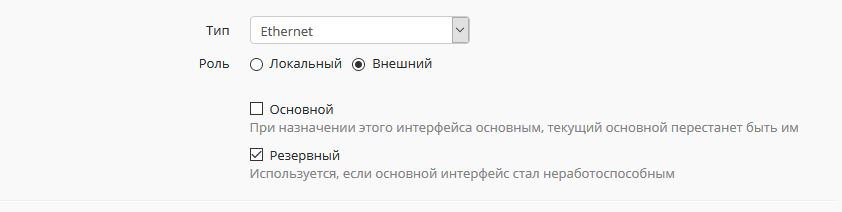
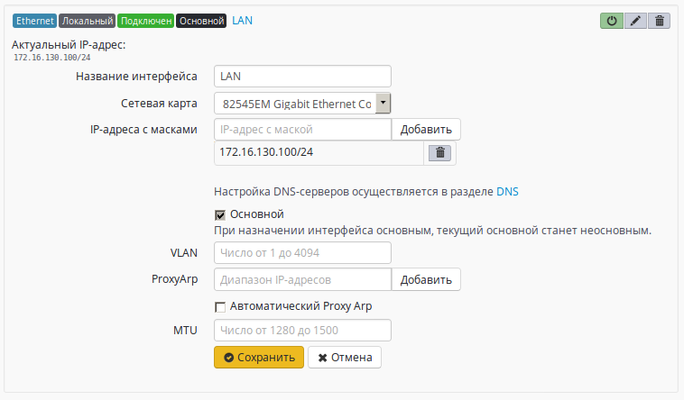
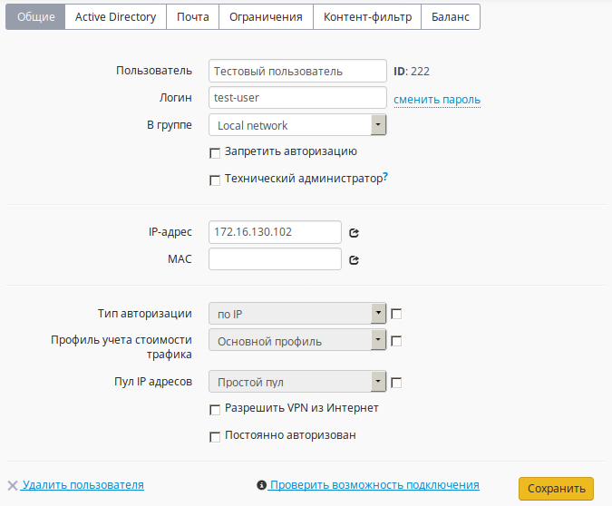

# Одновременное подключение к нескольким провайдерам

При наличии нескольких подключений к Интернет-провайдерам, можно задействовать их следующими способами:

* Резервирование основного канала, чтобы при его отключении трафик шел через резервный канал.
* Статическая балансировка трафика между несколькими подключениями. При этом часть пользователей локальной сети будет выходить в сеть Интернет через одного провайдера, часть через другого.
* Динамическая балансировка трафика между несколькими подключениями. При этом сессии будут поочередно перенаправляться на основной и дополнительные Интернет-каналы одновременно от всех пользователей в зависимости от загрузки интернет-подключений.

## Подготовка

Создайте дополнительное подключение к интернет-провайдеру. Процесс создания подключений описан в разделе [Подключение к провайдеру](./). Таким образом, у вас на сервере должно быть минимум два подключения к сети Интернет.

Необходимо понимать, что для работы с трафиком в Ideco UTM надо учитывать 2 момента: маршрутизация и NAT. Это касается и балансировки, и резервирования. Подробнее рассмотрим на конкретных примерах.

## Ситуация 1: резервирование каналов

Для переключения между интерфейсами мы должны отредактировать настройки основного и резервного интерфейсов. Для этого переходим в раздел веб-интерфейса **Сервер -&gt; Интерфейсы**. Нас интересуют всего 2 поля:

* **Проверка связи** – укажите адрес публичного ресурса с высоким показателем отказоустойчивости \(по умолчанию, если адрес не указан, используется адрес Google DNS 8.8.8.8\).
* **Резервный интерфейс** – выберите интерфейс на который должно произойти переключение в случае обрыва и восстановления. В качестве резервных может использоваться несколько интерфейсов, тогда в случае неработоспособности основного и резервных интерфейсов, будет использоваться любой из работоспособных резервных.

После того как оба интерфейса отредактированы выполните перезагрузку Ideco UTM.

## Ситуация 2: распределение нагрузки по нескольким подключениям, статическая балансировка

В описываемой схеме часть пользователей локальной сети будет иметь доступ к сети Интернет или другим внешним сетям через дополнительный канал связи. Нужно будет выделить пользователей в отдельную подсеть и создать маршрут, согласно которому трафик от них будет направлен в нужный интерфейс.

Далее нам потребуется пройти несколько шагов:

* добавить сеть на локальном интерфейсе;
* настроить маршрутизацию трафика;
* настроить пользовательские компьютеры и их учётные записи в веб-интерфейсе Ideco UTM.

### Шаг 1. Добавление сети на локальном интерфейсе

Прежде чем настраивать маршрутизацию, мы должно выделить пользователей, которые будут работать через дополнительного провайдера в отдельную локальную сеть. Это может быть дополнительный физический интерфейс, но можем обойтись добавлением сети в существующем локальном интерфейсе. Давайте предположим, что все пользователи находились в локальной сети 192.168.0.0/24, на локальном интерфейсе был прописан адрес 192.168.0.1/24. Нам надо на локальный интерфейс добавить адрес 192.168.50.1/24, для этого переходим в разделе **Сервер -&gt; Интерфейсы**, открываем настройки локального интерфейса, в поле **IP адреса** прописываем 192.168.50.1/24 и нажимаем кнопку **Добавить**, в итоге получим следующие настройки:


Этот шаг не является обязательным. Если вам нужно перенаправить всего двух или трёх пользователей на дополнительного провайдера, то проще прописать 2 или 3 маршрута. Примеры таких маршрутов вы можете посмотреть в статье по [маршрутизации](../services/routing.md).


### Шаг 2. Создание маршрута

Для маршрутизации трафика пользователей через разные каналы доступа в интернет на основе их принадлежности к IP-сетям перейдите в меню **Сервер -&gt; Сетевые параметры** веб-интерфейса и выберите вкладку **Маршруты**. Создадим маршрут для сети 192.168.50.0/24. Для этого нажмем кнопку **Добавить** и заполним поля, определяющие назначение маршрута:

**Адрес сети источника** - Адрес источника с маской, маска может быть прописана как в классическом виде, так и в виде количества бит.

**Адрес сети назначения** - Адрес назначения с маской, маска может быть прописана как в классическом виде, так и в виде количества бит.

**Шлюз/интерфейс** - Куда перенаправить трафик.


Если маршрутизация осуществляется на Ethernet-интерфейс то всегда указывается адрес шлюза этого Ethernet-интерфейса. Для виртуальных интерфейсов \(РРТР, РРРоЕ, OpenVPN\) всегда указывается интерфейс.


Например, для подсети 192.168.50.0/24 и адреса шлюза дополнительного провайдера 66.77.88.1 получится такой маршрут:

Для **одного компьютера**, например, с IP-адресом 192.168.50.10 в источнике уточните 192.168.50.10/32.

### Шаг 3. Настройка пользовательских компьютеров и учётных записей в веб-интерфейсе Ideco UTM

После того как создали профили, дополнительный адрес на локальном интерфейсе и маршрут, надо настроить пользовательские компьютеры и их учётные записи:

* На компьютерах пользователей, которые будут работать через дополнительное подключение, прописываем адрес из сети 192.168.50.0/24 и в качестве шлюза и DNS указываем адрес

  192.168.50.1.

* Там же в веб-интерфейсе у каждого пользователя, работающего через дополнительное подключение, прописываем те адреса из сети 192.168.50.0/24, которые в данный момент прописаны на их компьютерах.  


Эта инструкция написана с учётом авторизации пользователей по IP. Для динамических способов авторизации необходимо предусмотреть, чтобы присваиваемые по DHCP адреса попадали в нужные диапазоны.


### Если вы используете прокси-сервер

По умолчанию прокси-сервер работает с веб-трафиком только через основной интерфейс, вне зависимости от того, какие дополнительные каналы провайдеров настроены. Таким образом маршрутизироваться будет только не веб-трафик.

## Ситуация 3: доступ к разным ресурсам сети Интернет через определенные каналы связи, статическая балансировка

Такая схема подключения к нескольким интернет-провайдерам часто применяется в случае, когда некоторые ресурсы в сети Интернет тарифицируются дешевле через другого интернет-провайдера или в случае доступа к внутренним сетям дополнительного провайдера, минуя основной канал связи.

Перейдите в меню **Сервисы -&gt; Маршрутизация** веб-интерфейса администрирования. Создадим маршрут для каждого ресурса внешней сети. Для этого необходимо нажать кнопку **Добавить** и заполнить поля, определяющие назначение маршрута:

**Адрес сети источника** - Адрес источника с маской, маска может быть прописана как в классическом виде, так и в виде количества бит.

**Адрес сети назначения** - Адрес назначения с маской, маска может быть прописана как в классическом виде, так и в виде количества бит.

**Шлюз/интерфейс** - Куда перенаправить трафик.


Если маршрутизация осуществляется на Ethernet-интерфейс ,то всегда указывается адрес шлюза этого Ethernet-интерфейса. Для виртуальных интерфейсов \(РРТР, РРРоЕ, OpenVPN, IPsec\) всегда указывается интерфейс.


Меняем адрес сети назначения на нужный нам адрес и получаем такой маршрут:

Если в целевой сети вас интересуют веб-ресурсы, то всю сеть лучше [исключить из обработки прокси сервером](../services/proxy/exclusions.md).

## Ситуация 4: распределение нагрузки по нескольким подключениям, динамическая балансировка

В описываемой схеме мы будем переадресовывать на дополнительный канал связи не конкретных пользователей, а сетевые сессии от всех пользователей одновременно.

**Для работы данной схемы необходимо во всех внешних интерфейсах указать "полосу пропускания" - максимальную скорость Интернета по тарифам ваших провайдеров. Сервер автоматически будет балансировать трафик в зависимости от загрузки каналов.**

Создавать маршруты или выполнять еще какие-либо настройки для балансировки трафика не требуется. Трафик прокси-сервера также будет балансироваться автоматически.

