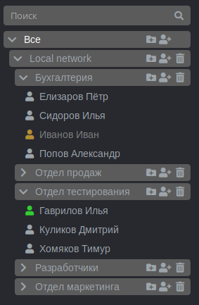

# Дерево пользователей

Пользователи в интерфейсе управления Ideco UTM отображаются в виде дерева. Пользователи могут быть организованы в группы. Уровень вложенности групп не ограничен. Дерево учетных записей пользователей доступно в разделе _**"Пользователи"**_.

В Ideco UTM реализован принцип наследования, что позволяет легко задавать и изменять общие для пользователей параметры, определяя их для родительской группы – квоты, удаленный доступ по VPN. Принцип наследования очень удобен для выполнения операций управления, осуществляемых по отношению ко всем пользователям группы.

Дерево пользователей показано ниже.

Пиктограмма пользователя может быть окрашена в разные цвета. В следующей таблице на примере пиктограммы обычного пользователя дается описание каждого цвета.

<table>
  <thead>
    <tr>
      <th style="text-align:left">
        
&#x421;&#x43E;&#x441;&#x442;&#x43E;&#x44F;&#x43D;&#x438;&#x435; &#x443;&#x447;&#x435;&#x442;&#x43D;&#x43E;&#x439;

        
&#x437;&#x430;&#x43F;&#x438;&#x441;&#x438; &#x43F;&#x43E;&#x43B;&#x44C;&#x437;&#x43E;&#x432;&#x430;&#x442;&#x435;&#x43B;&#x44F;

      </th>
      <th style="text-align:left">&#x41E;&#x43F;&#x438;&#x441;&#x430;&#x43D;&#x438;&#x435;</th>
    </tr>
  </thead>
  <tbody>
    <tr>
      <td style="text-align:left">
        
      </td>
      <td style="text-align:left">&#x412; &#x434;&#x430;&#x43D;&#x43D;&#x44B;&#x439; &#x43C;&#x43E;&#x43C;&#x435;&#x43D;&#x442;
        &#x432;&#x440;&#x435;&#x43C;&#x435;&#x43D;&#x438; &#x43F;&#x43E;&#x43B;&#x44C;&#x437;&#x43E;&#x432;&#x430;&#x442;&#x435;&#x43B;&#x44C;
        &#x43F;&#x440;&#x43E;&#x448;&#x435;&#x43B; &#x43F;&#x440;&#x43E;&#x446;&#x435;&#x434;&#x443;&#x440;&#x443;
        &#x430;&#x432;&#x442;&#x43E;&#x440;&#x438;&#x437;&#x430;&#x446;&#x438;&#x438;,
        &#x438; &#x435;&#x43C;&#x443; &#x431;&#x44B;&#x43B; &#x43F;&#x440;&#x435;&#x434;&#x43E;&#x441;&#x442;&#x430;&#x432;&#x43B;&#x435;&#x43D;
        &#x434;&#x43E;&#x441;&#x442;&#x443;&#x43F; &#x432; &#x438;&#x43D;&#x442;&#x435;&#x440;&#x43D;&#x435;&#x442;.</td>
    </tr>
    <tr>
      <td style="text-align:left">
        
      </td>
      <td style="text-align:left">&#x412; &#x434;&#x430;&#x43D;&#x43D;&#x44B;&#x439; &#x43C;&#x43E;&#x43C;&#x435;&#x43D;&#x442;
        &#x432;&#x440;&#x435;&#x43C;&#x435;&#x43D;&#x438; &#x43F;&#x43E;&#x43B;&#x44C;&#x437;&#x43E;&#x432;&#x430;&#x442;&#x435;&#x43B;&#x44C;
        &#x43D;&#x435; &#x43F;&#x440;&#x43E;&#x448;&#x435;&#x43B; &#x43F;&#x440;&#x43E;&#x446;&#x435;&#x434;&#x443;&#x440;&#x443;
        &#x430;&#x432;&#x442;&#x43E;&#x440;&#x438;&#x437;&#x430;&#x446;&#x438;&#x438;,
        &#x438; &#x435;&#x43C;&#x443; &#x43D;&#x435; &#x431;&#x44B;&#x43B; &#x43F;&#x440;&#x435;&#x434;&#x43E;&#x441;&#x442;&#x430;&#x432;&#x43B;&#x435;&#x43D;
        &#x434;&#x43E;&#x441;&#x442;&#x443;&#x43F; &#x432; &#x438;&#x43D;&#x442;&#x435;&#x440;&#x43D;&#x435;&#x442;.</td>
    </tr>
    <tr>
      <td style="text-align:left">
        
      </td>
      <td style="text-align:left">&#x423;&#x447;&#x435;&#x442;&#x43D;&#x430;&#x44F; &#x437;&#x430;&#x43F;&#x438;&#x441;&#x44C;
        &#x43F;&#x43E;&#x43B;&#x44C;&#x437;&#x43E;&#x432;&#x430;&#x442;&#x435;&#x43B;&#x44F;
        &#x43E;&#x442;&#x43A;&#x43B;&#x44E;&#x447;&#x435;&#x43D;&#x430;.</td>
    </tr>
  </tbody>
</table>

 \#\# Attachments:

 !\[\]\(images/icons/bullet\_blue.gif\) \[recycle-bin.png\]\(attachments/1278047/5472418.png\) \(image/png\) !\[\]\(images/icons/bullet\_blue.gif\) \[image2018-1-25 11:34:51.png\]\(attachments/1278047/5832882.png\) \(image/png\) !\[\]\(images/icons/bullet\_blue.gif\) \[image2018-1-25 11:35:1.png\]\(attachments/1278047/5832883.png\) \(image/png\) !\[\]\(images/icons/bullet\_blue.gif\) \[image2018-1-25 11:35:16.png\]\(attachments/1278047/5832884.png\) \(image/png\) !\[\]\(images/icons/bullet\_blue.gif\) \[image2018-1-25 11:35:29.png\]\(attachments/1278047/5832885.png\) \(image/png\) !\[\]\(images/icons/bullet\_blue.gif\) \[image2018-1-25 11:35:38.png\]\(attachments/1278047/5832886.png\) \(image/png\) !\[\]\(images/icons/bullet\_blue.gif\) \[image2018-1-25 11:35:48.png\]\(attachments/1278047/5832887.png\) \(image/png\) !\[\]\(images/icons/bullet\_blue.gif\) \[image2018-1-25 11:36:1.png\]\(attachments/1278047/5832888.png\) \(image/png\) !\[\]\(images/icons/bullet\_blue.gif\) \[user-tree.png\]\(attachments/1278047/6062113.png\) \(image/png\) !\[\]\(images/icons/bullet\_blue.gif\) \[новое дерево.png\]\(attachments/1278047/11436072.png\) \(image/png\)

