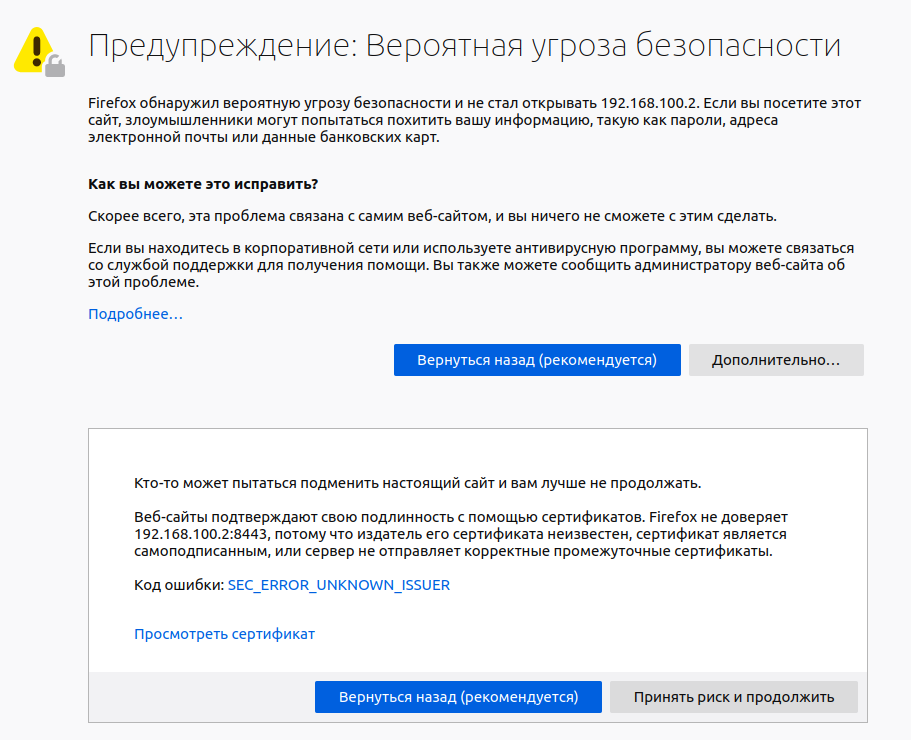
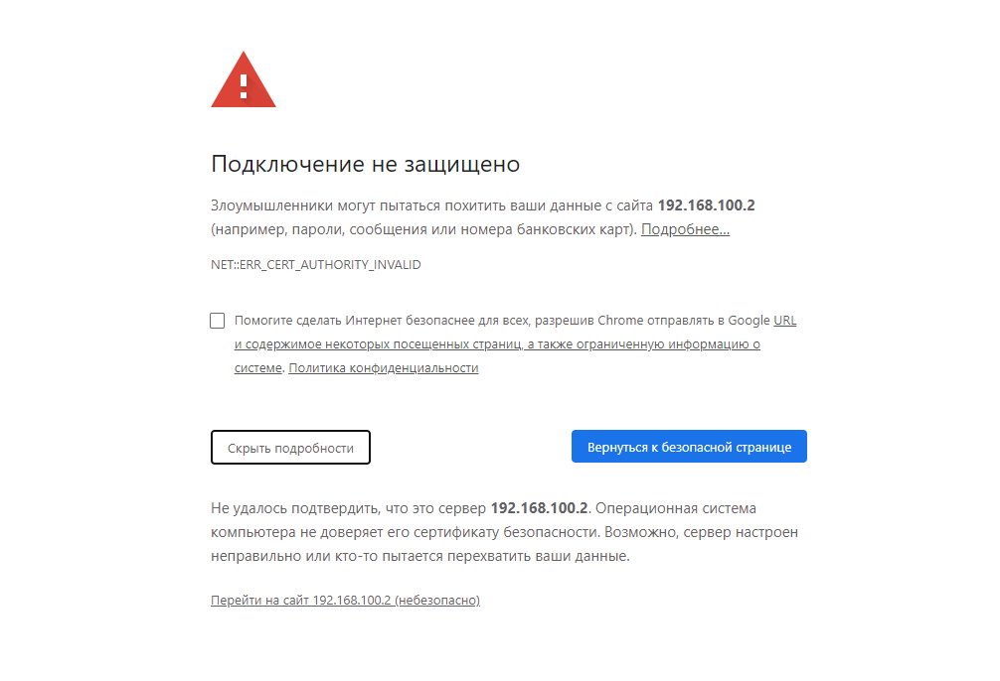
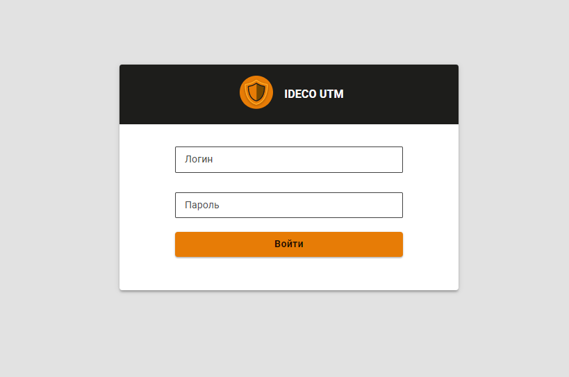
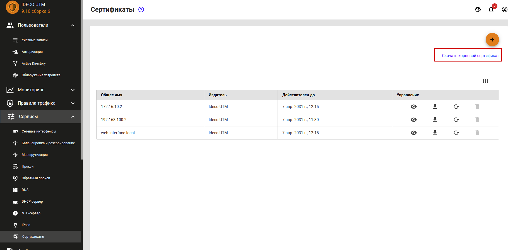
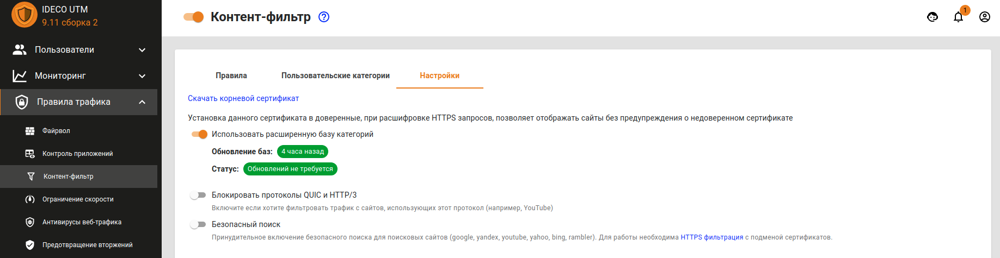
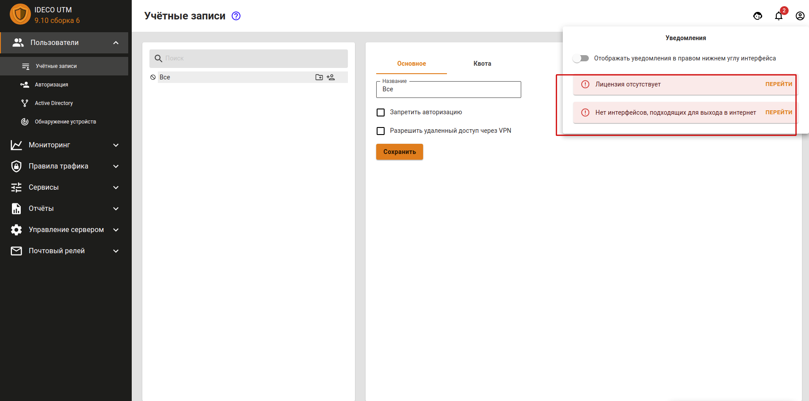

# Первоначальная настройка

## Подключение к веб-интерфейсу Ideco UTM


Если вы еще не установили Ideco UTM, перейдите в раздел [Процесс установки](installation-process.md).


После успешной установки Ideco UTM можно переходить к его первичной настройке.

Запустите на любом компьютере локальной сети интернет-браузер, например Mozilla Firefox или Google Chrome \(Internet Explorer не поддерживается\), введите в адресной строке локальный IP-адрес, который вы указали при установке в настройках локального сетевого интерфейса и порт 8443, на котором работает веб-интерфейс, в формате `IP-адрес:порт`.

Так как подключение к web-интерфейсу осуществляется с применением шифрования, интернет-браузер может выдать ошибку о том, что сертификат безопасности не был выпущен доверенным центром сертификации. В таком случае вам необходимо продолжить соединение, нажав на соответствующую кнопку в нижней части окна.

Пример ошибки в браузере Mozilla Firefox:

Пример ошибки в браузере Google Chrome:

После того как вы перешли на сайт по IP-адресу, в окне браузера должно появиться окно авторизации в веб-интерфейс Ideco UTM. Введите логин и пароль от учетной записи администратора, созданной на этапе установки Ideco UTM.

Чтобы ошибка больше не появлялась, импортируйте корневой сертификат UTM в браузер. Сертификат можно скачать тремя способами: 

1. В разделе **Сервисы -&gt; Сертификаты**, нажав на кнопку **Скачать корневой сертификат**: 

2. В разделе **Правила трафика -&gt; Контент-фильтр -&gt; Настройки**:  

3. Также корневой сертификат можно скачать, зайдя в личный кабинет Ideco UTM под учетной записью одного из имеющихся пользователей: 

После первого входа в веб-интерфейс вы увидите несколько уведомлений, которые подскажут вам, что для корректной работы Ideco UTM необходимо настроить подключение к провайдеру и зарегистрировать сервер.

## Настройка подключения к интернет-провайдеру

Для настройки подключения к провайдеру перейдите в раздел **Сервисы - Сетевые интерфейсы**.

### Настройка **Ethernet-подключения**

Данный тип подключения требует настройки параметров, описанных ниже в таблице.

| Параметр | Примечание |
| :--- | :--- |
| Сетевая карта | Необходимо указать сетевой адаптер, который будет использоваться для  подключения к интернет-провайдеру. Для идентификации адаптера вы можете  ориентироваться на наименование производителя или MAC-адрес |
| IP-адрес и маска | Сетевые  реквизиты, которые были назначены провайдером. Укажите IP-адрес и сетевую маску в формате CIDR или четырех  октетов |
| Шлюз по умолчанию | Укажите IP-адрес шлюза интернет-провайдера, через который будет осуществляться подключение к сети Интернет |


Если ваш провайдер поддерживает автоматическое конфигурирование внешнего сетевого интерфейса с помощью протокола DHCP, то отметьте пункт **Автоматическая конфигурация через DHCP**. 


Для настройки Ethernet-подключения выполните следующие шаги: 

1. Нажмите на иконку  в правом верхнем углу и выберите пункт **Внешний Ethernet**.

2. Выберите подходящую сетевую карту.

3. Заполните следующие поля, они являются обязательными:

* Название;
* IP-адрес/маска;
* Шлюз;

4. Проверьте правильность введенных данных и нажмите кнопку **Сохранить**.

### Настройка других типов подключений

Если ваш провайдер использует другой тип подключения, то ознакомиться с остальными инструкциями по настройке вы можете по следующим ссылкам:

* [Подключение по протоколу PPPoE ](podklyuchenie-k-provaideru/podklyuchenie-po-pppoe.md) 
* [Подключение по технологии VPN \(с использованием протокола PPTP\)](podklyuchenie-k-provaideru/podklyuchenie-po-pptp.md) 
* [Подключение по L2TP](podklyuchenie-k-provaideru/podklyuchenie-po-l2tp.md)
* [Подключение по Ethernet](podklyuchenie-k-provaideru/podklyuchenie-po-ethernet.md)
* [Подключение по 3G и 4G](podklyuchenie-k-provaideru/podklyuchenie-po-3g-i-4g.md)
* [Одновременное подключение к нескольким провайдерам](podklyuchenie-k-provaideru/odnovremennoe-podklyuchenie-k-neskolkim-provaideram.md)


После подключения к Интернету требуется [зарегистрировать сервер](obsluzhivanie-1/registraciya-servera.md). 


