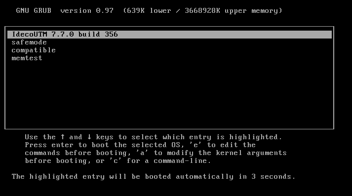
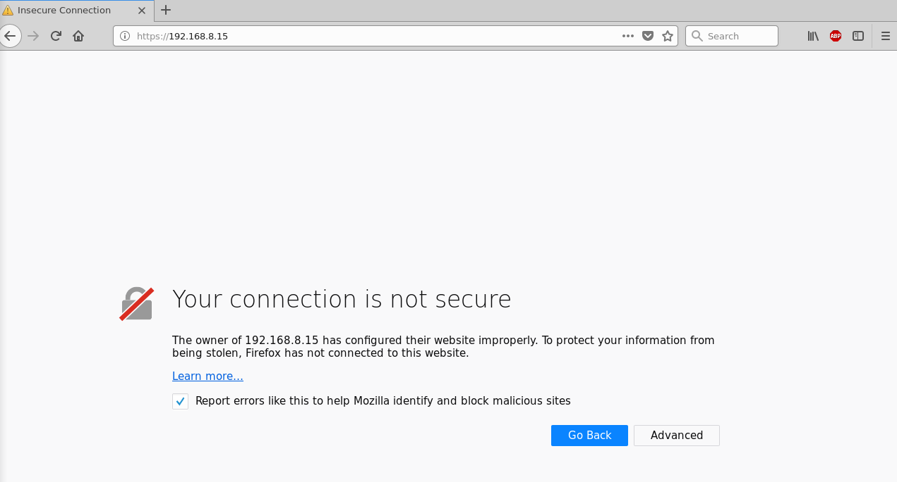
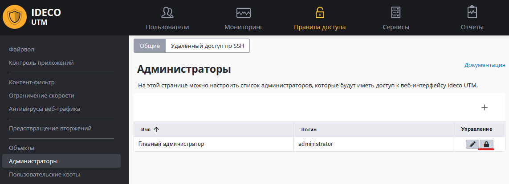
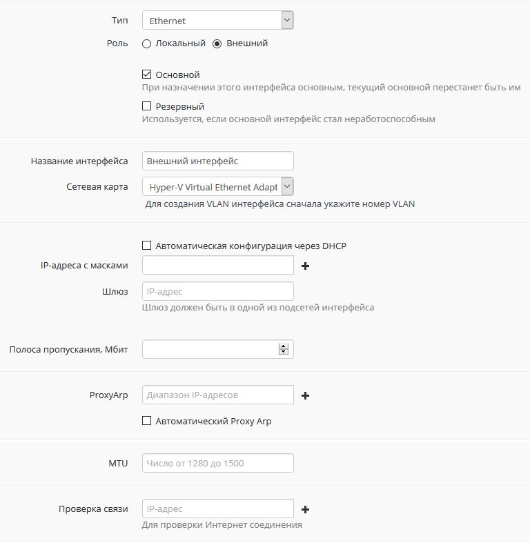

# Первоначальная настройка


Смотрите [запись вебинара](https://youtu.be/kiJAl16RkI0) по первоначальной настройке Ideco UTM 7.7.


## Загрузка Ideco UTM

При запуске системы вы увидите на экране меню загрузчика Ideco UTM. Через несколько секунд загрузка системы продолжится автоматически.

**При успешной загрузке Ideco UTM вы увидите на экране приглашение для смены пароля локального меню. Установите пароль.**

Теперь, когда процесс загрузки завершился, пришло время перейти к конфигурированию интернет-шлюза. Запустите на любом компьютере локальной сети интернет-браузер, например Mozilla Firefox или Google Chrome \(Internet Explorer не поддерживается\) и перейдите по тому локальному IP-адресу, который вы указали при установке в настройках локального сетевого интерфейса.

Так как подключение к web-интерфейсу осуществляется с применением шифрования, интернет-браузер может выдать ошибку о том, что сертификат безопасности не был выпущен доверенным центром сертификации. В таком случае вам необходимо продолжить соединение, нажав на соответствующую кнопку. В браузерах, отличных от Mozilla Firefox, ошибка может выглядеть иначе, но принцип её устранения тот же. Процесс подключения к административному web-интерфейсу Ideco UTM показан ниже.

Если вы все сделали правильно, то в окне интернет-браузера сможете увидеть приглашение для входа в панель управления. В качестве имени пользователя используйте **administrator**, а в качестве пароля – **servicemode**.

После первого входа системой будет предложено настроить внешний интерфейс и зарегистрировать сервер. А также ссылки на соответствующие страницы документации.


**Обязательно** смените пароль для входа в веб-интерфейс в разделе **Правила доступа -&gt; Администраторы**, нажав на иконку "замка":


### Настройка подключения к интернет-провайдеру

Настроить внешние интерфейсы сервера можно в меню **Сервисы -&gt; Интерфейсы**.

Рассмотрим процесс настройки для [Ethernet-подключения](connection-to-provider/ethernet-connection.md).

Данный тип подключения требует настройки параметров, описанных ниже в таблице:

| Параметр | Примечание |
| :--- | :--- |
| Внешний интерфейс | В случае, если в компьютере установлено более двух сетевых адаптеров, необходимо указать сетевой адаптер, который будет использоваться для подключения к интернет-провайдеру. Для идентификации адаптера вы можете ориентироваться на наименование производителя или MAC-адрес |
| IP-адрес и маска внешнего интерфейса | Сетевые реквизиты, которые были назначены провайдером внешнему сетевому интерфейсу. Укажите IP-адрес и сетевую маску в формате CIDR или четырех октетов |
| Шлюз по умолчанию | Укажите IP-адрес шлюза интернет-провайдера, через который будет осуществляться подключение к сети Интернет |

Если ваш провайдер поддерживает автоматическое конфигурирование внешнего сетевого интерфейса с помощью протокола DHCP, то отметьте пункт **Автоматическая конфигурация через DHCP**.

Настройка Ethernet-подключения показана на фрагменте экрана ниже:

Если ваш провайдер использует другой тип подключения, то ознакомиться с инструкциями по настройке вы можете по ссылкам:

* [Подключение по протоколу PPPoE](connection-to-provider/pppoe-connection.md);
* [Подключение по технологии VPN \(с использованием протокола PPTP\)](connection-to-provider/pptp-vpn-connection.md);
* [Подключение по L2TP](connection-to-provider/l2tp-vpn-connection.md).

На этом первоначальная настройка сервера закончена. После перезагрузки сервера можно переходить к настройке авторизации пользователей, служб и правил фильтрации трафика.

