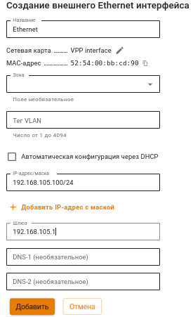
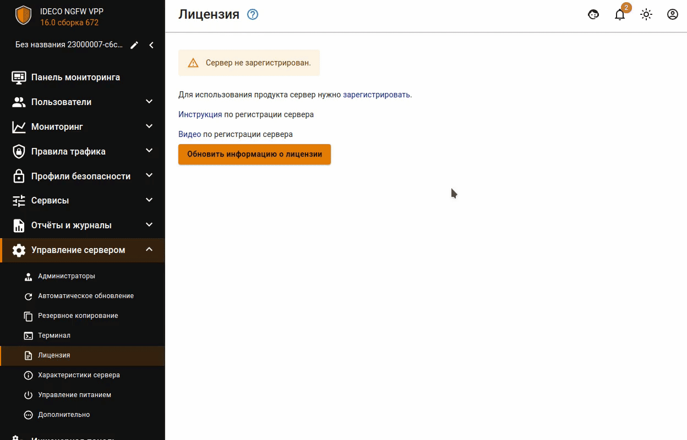

# Первоначальная настройка

**Поддержка браузеров для администрирования сервера в веб-интерфейсе:**
Поддерживаются современные версии браузеров Firefox, Chrome и браузеров, основанных на Chromium.

## Подключение к веб-интерфейсу Ideco UTM

1. Запустите на любом компьютере в Management сети поддерживаемый интернет-браузер.
2. Введите в адресной строке IP-адрес, указанный при настройке Management интерфейса, и порт 8443.\
**Пример:** `192.168.100.25:8443`
3. Браузер выдаст предупреждение о том, что сертификат безопасности не был выпущен доверенным центром сертификации. Продолжите соединение, нажав на соответствующую кнопку в нижней части окна:

4. Введите логин и пароль от учетной записи, созданной при установке UTM VPP.

## Импорт корневого сертификата UTM VPP в браузер

Для устранения предупреждения в браузере при входе в веб-интерфейс нужно импортировать корневой сертификат UTM VPP или добавить сертификат в **доверенные корневые центры сертификации** устройства.\
В разделе **Сервисы->Сертификаты** нажмите на кнопку  Скачать:

## Настройка WAN интерфейса

Для выхода UTM VPP в Интернет нужно настроить WAN интерфейс, выполнив действия:

1. Перейдите в раздел **Сервисы-> Cетевые интерфейсы**.
2. Нажмите **Добавить** и выберите **Внешний Ethernet**:

3. Выберите сетевую карту для WAN интерфейса:
   


Если провайдер поддерживает автоматическое конфигурирование через DHCP-сервер, то включите опцию **Автоматическая конфигурация через DHCP**.
При включении этой опции не требуется указывать IP-адрес сервера и шлюз.


4. Укажите **Название** интерфейса и введите локальный IP-адрес в формате `ip/маска`.
5. Укажите **Шлюз**, принадлежащий сети, в которой указан IP-адрес на прошлом шаге.
   

6. Проверьте правильность введенных данных и нажмите **Сохранить**.


При отсутствии выхода в Интернет WAN интерфейса пользователи шлюза Ideco UTM VPP не смогут выйти в Интернет.  


## Настройка LAN интерфейса

Для организации пользовательской локальной сети нужно настроить LAN интерфейс, выполнив действия:

1. Перейдите в раздел **Сервисы-> Сетевые интерфейсы**.
2. Нажмите **Добавить** и выберите **Локальный Ethernet**:

3. Выберите сетевую карту для LAN интерфейса:

4. Укажите **Название** интерфейса и введите локальный IP-адрес в формате `ip/маска`:
   


Для корректной работы UTM VPP **не указывайте** шлюз при настройке пользовательских LAN интерфейсов. 


## Регистрация сервера

### Онлайн регистрация


Для привязки лицензии сервер должен иметь выход в интернет через Control Plane интерфейс.


Шаги онлайн регистрации сервера и привязки лицензии:

Для полноценной работы Ideco UTM VPP нужно зарегистрировать сервер и получить лицензию, выполнив действия:

1. Перейдите в веб-интерфейс Ideco UTM VPP в раздел **Управление сервером -> Лицензия** и нажмите **Зарегистрировать**:

2\. В открывшемся окне перейдите по ссылке **Зарегистрировать новый сервер**, выберите компанию и нажмите **Добавить**. После добавления нажмите **Обновить информацию о лицензии** для проверки состояния лицензии:

### Офлайн-регистрация

Шаги офлайн-регистрации сервера и привязки лицензии:

1\. Привяжите сервер к личному кабинету в [my.ideco](https://my.ideco.ru/):
* Перейдите в веб-интерфейс Ideco UTM VPP в раздел **Управление сервером -> Терминал**;
* Выполните команду `cat /usr/share/ideco/license-backend/hwid`;
* Скопируйте hwid сервера. Пример: `t7m7H137w-pQXYjXuHmYbLnJw3YyxJAg5wl9FfARlh`;

2\. Обратитесь к вашему менеджеру для предоставления лицензии. 

3\. Перейдите в личный кабинет [my.ideco](https://my.ideco.ru/) в раздел **NGFW -> Офлайн** и заполните поле **HWID** скопированными на шаге 1 данными.

4\. Перейдите в раздел **NGFW -> Лицензирование** и нажмите **Привязать лицензию** рядом с нужным сервером. Пример наименования сервера для офлайн-регистрации: `UTM (UTM Unknown)`.  

Если была выбрана лицензия не подходящая для офлайн-регистрации сервера, то появится ошибка:

5\. Перейдите в раздел **NGFW -> Офлайн** и введите в соответствующие поля цифрами мажорный номер версии и номер лицензии:

6\. Нажмите **Получить ссылки** и сохраните файлы конфигураций, нажав на появившиеся ссылки:
* `license.json` - информация о лицензии;
* `geoip-<timestamp>.mmdb` - база для работы модуля **Предотвращение вторжений**;
* `iplist-<timestamp>.tar.gz` - база соответствия подсетей и стран, в которые они входят;
* `simple.tgz` - правила фильтрации для модуля **Предотвращение вторжений**;
* `sky-from-0-to-<timestamp>.sst` - база для работы модуля **Контент-фильтр**.

7\. Добавьте конфигурационный файл c информацией о лицензии в Ideco UTM VPP:
* Перейдите в раздел **Управление сервером -> Терминал**;
* Загрузите полученный файл `license.json` на сервер Ideco UTM VPP в директорию `/var/cache/ideco/license-backend/`;
* Перезапустите сервис лицензий командой `systemctl restart ideco-license-backend.service`;
* Перейдите в раздел **Управление сервером - Лицензия** и убедитесь, что лицензия установлена.

8\. Сохраните скрипты запуска обновления баз модулей безопасности в папку с файлами, скачанными на шаге 6:






9\. Обновите базы модулей безопасности: 
* Перейдите в директорию `scp -r <путь до папки со скачанными файлами> administrator@<IP-адрес UTM VPP>:~/`;
* Подключитесь к серверу по SSH `ssh administrator@<IP-адрес UTM VPP>`;
* Перед обновлением модулей перейдите в директорию `cd ~/<название папки со скаченными файлами>`;
* Обновите базы модулей безопасности выполнив команды:
  * Базы модуля **Предотвращения вторжений** - `python3 geoip.py <geoip-<timestamp>.mmdb>`;
  * Базы соответствия подсетей и стран - `python3 iplist.py <iplist-<timestamp>.tar.gz>`;
  * Правила фильтрации модуля **Предотвращение вторжений** - `python3 suricata.py simple.tgz`;
  * базы модуля **Контент-фильтр** - `python3 content_filter.py <sky-from-0-to-<timestamp>.sst>`.


Для регистрации сервера нужна учетная запись на [MY.IDECO](https://my.ideco.ru/). Подробнее в статье [MY.IDECO](my-ideco.md).
