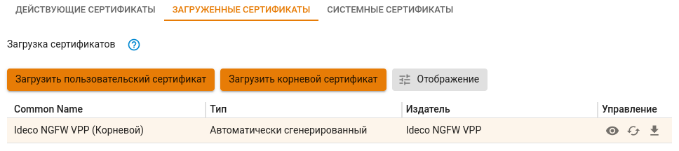

# Первоначальная настройка

**Поддержка браузеров для администрирования сервера в веб-интерфейсе:**
Поддерживаются современные версии браузеров Firefox, Chrome и браузеров, основанных на Chromium.

## Подключение к веб-интерфейсу Ideco NGFW

1. Запустите на любом компьютере в сети Control Plane интерфейса поддерживаемый интернет-браузер.
2. Введите в адресной строке IP-адрес, указанный при настройке Control Plane интерфейса, и порт 8443.\
**Пример:** `192.168.100.25:8443`
3. Браузер выдаст предупреждение о том, что сертификат безопасности не был выпущен доверенным центром сертификации. Продолжите соединение, нажав на соответствующую кнопку в нижней части окна:

4. Введите логин и пароль от учетной записи, созданной при установке NGFW VPP.

## Импорт корневого сертификата NGFW VPP в браузер

Для устранения предупреждения в браузере при входе в веб-интерфейс нужно импортировать корневой сертификат NGFW VPP или добавить сертификат в **доверенные корневые центры сертификации** устройства.\
В разделе **Сервисы->Сертификаты** нажмите на кнопку  Скачать:

## Настройка подключения к провайдеру


Перед настройкой Data Plane интерфейсов проверьте соответствие сетевых карт [системным требованиям](../general/data-update-source-utm-vpp.md).


Для выхода NGFW VPP в Интернет нужно настроить Data Plane интерфейс, выполнив действия:

1. Перейдите в раздел **Сервисы-> Cетевые интерфейсы**.
2. Нажмите **Добавить** и выберите **Внешний Ethernet**:

3. Выберите сетевую карту для Data Plane интерфейса:
   


Если провайдер поддерживает автоматическое конфигурирование через DHCP-сервер, то включите опцию **Автоматическая конфигурация через DHCP**.
При включении этой опции не требуется указывать IP-адрес сервера и шлюз.


4. Укажите **Название** интерфейса и введите локальный IP-адрес в формате `ip/маска`.
5. Укажите **Шлюз**, принадлежащий сети, в которой указан IP-адрес на прошлом шаге.
   

6. Проверьте правильность введенных данных и нажмите **Сохранить**.


Если ни один из Data Plane интерфейсов не имеет выхода в Интернет, то пользователи шлюза Ideco NGFW VPP не смогут получить доступ в Интернет.


## Настройка пользовательского интерфейса

Для организации пользовательской локальной сети нужно настроить Data Plane интерфейс, выполнив действия:

1. Перейдите в раздел **Сервисы-> Сетевые интерфейсы**.
2. Нажмите **Добавить** и выберите **Локальный Ethernet**:

3. Выберите сетевую карту для Data Plane интерфейса:

4. Укажите **Название** интерфейса и введите локальный IP-адрес в формате `ip/маска`:
   

5. Проверьте правильность введенных данных и нажмите **Сохранить**.

## Регистрация сервера


Для регистрации сервера нужна учетная запись на [MY.IDECO](https://my.ideco.ru/). Подробнее в статье [MY.IDECO](my-ideco.md).


Для полноценной работы Ideco NGFW VPP нужно зарегистрировать сервер и получить лицензию, выполнив действия:

1. Перейдите в веб-интерфейс Ideco NGFW VPP в раздел **Управление сервером -> Лицензия** и нажмите **Зарегистрировать**:

2. В открывшемся окне перейдите по ссылке **Зарегистрировать новый сервер**, выберите компанию и нажмите **Добавить**. После добавления нажмите **Обновить информацию о лицензии** для проверки состояния лицензии:

