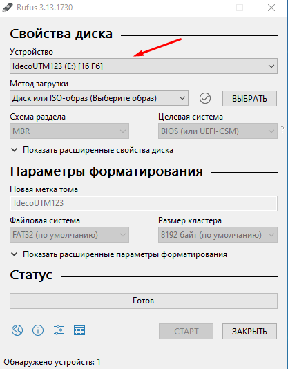
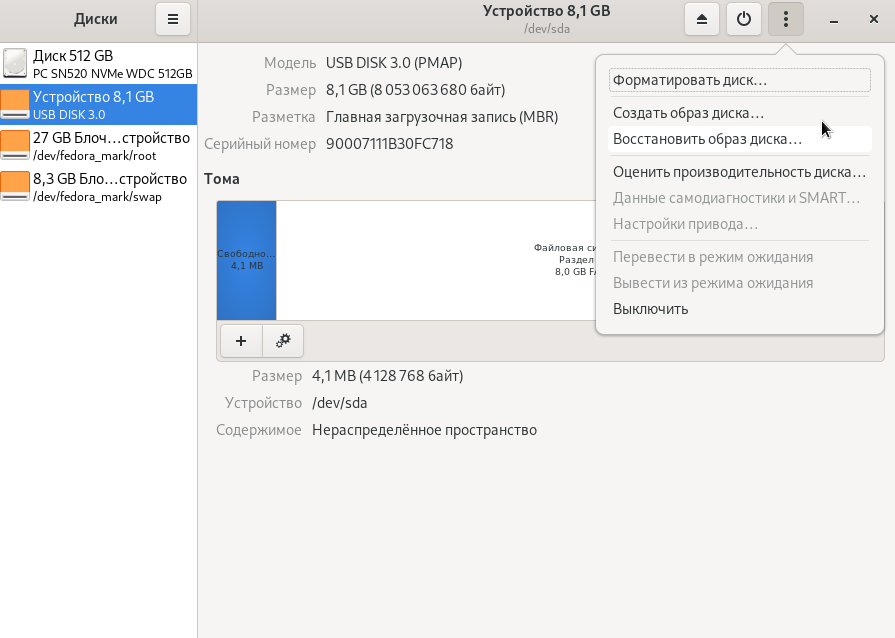

# Подготовка загрузочного диска


При записи ISO образа вся информация с USB накопителя будет удалена.


Для установки на отдельный сервер нужно подготовить загрузочный USB диск.

## В среде Windows

1. Скачайте программу [Rufus](https://rufus.ie/ru/) и запустите скачанный файл.
2. Выберите нужный USB диск в пункте **Устройство**:
   


3. Выберите метод загрузки **Диск или ISO-образ**.
4. Нажмите на кнопку **Выбрать** и откройте скачанный образ Ideco UTM VPP.
5. Нажмите **Старт** и в появившемся окне выберите пункт **Запись в режиме DD-образ**.
6. В диалоговом окне подтвердите запись на USB диск.


## В cреде Linux

Создать загрузочный USB диск в Linux можно двумя способами:

### С помощью программы gnome-disks:
  


### Вручную в терминале:

1. Проверьте целостность образа (хеш-сумма должна совпадать с суммой в личном кабинете):
    ```
    md5sum <путь_к_скачанному_загрузочному_образу>
    8c872cb6b720f6fd6683107681645156  /home/ideco/IdecoUTM.iso
    ```
2. Найдите USB-носитель в системе:
    ```
    lsblk --nodeps  -o name,size,fstype,tran,model,mountpoint /dev/sd*

    NAME  SIZE FSTYPE TRAN MODEL        MOUNTPOINT
    sdx   7,5G        usb  USB_DISK_3.0 
    sdx1  7,5G vfat                     /run/media/ideco/D661-82E2
    ```
3. Отмонтируйте файловую систему:
    ```
    sudo umount <точка_монтирования>
    sudo umount /run/media/ideco/D661-82E2
    ```

4. Запишите образ на носитель:
    ```
    sudo dd if=<путь_к_загрузочному_образу> of=<имя_устройства> bs=1M oflag=direct status=progress
    sudo dd if=/home/ideco/IdecoUTM.iso of=/dev/sdx bs=1M oflag=direct status=progress
    ```
5. Подготовьте носитель к извлечению:
    ```
    sudo eject <имя_устройства>
    sudo eject /dev/sdx
    ```