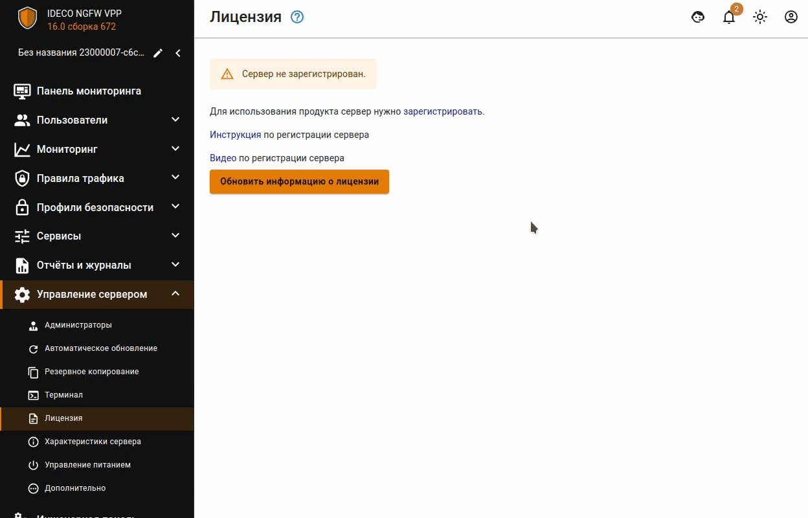

# Регистрация сервера


Для активации лицензии необходима обязательная регистрация сервера в [личном кабинете](https://my.ideco.ru/#/login/?next=/utm/license/).


## Онлайн-регистрация


Для привязки лицензии сервер должен иметь выход в интернет через Control Plane интерфейс.


Шаги онлайн-регистрации сервера и привязки лицензии:

1\. Перейдите в веб-интерфейс Ideco NGFW в раздел **Управление сервером -> Лицензия**, выберите **Автоматическое обновление** в качестве способа обновления, нажмите **Сохранить**.

2\. Перейдите в MY.IDECO, нажав **Зарегистрировать**.

3\. В открывшемся окне выберите компанию и нажмите **Добавить**. После добавления нажмите **Обновить информацию о лицензии** для проверки состояния лицензии:

## Офлайн-регистрация

Шаги офлайн-регистрации сервера и привязки лицензии:

1\. В веб-интерфейсе Ideco NGFW перейдите в раздел **Управление сервером -> Лицензия** и выберите **Ручная загрузка** в качестве способа обновления, нажмите **Сохранить**.

2\. Скачайте файл со ссылкой на регистрацию сервера, нажав на кнопку:

3\. На устройстве с доступом к интернету перейдите по ссылке из файла, скачанного в пункте 2. Сервер автоматически появится в списке серверов в [MY.IDECO](https://my.ideco.ru/).

4\. Обратитесь к вашему менеджеру для предоставления лицензии.

5\. В личном кабинете MY.IDECO перейдите в раздел **NGFW -> Лицензирование** и нажмите **Привязать лицензию** рядом с нужным сервером. Пример наименования сервера для офлайн-регистрации: `UTM (UTM Unknown)`.  

Если была выбрана лицензия, не подходящая для офлайн-регистрации сервера, то появится ошибка:

6\. Нажмите на  напротив названия сервера.

7\. Выберите версию Ideco NGFW:

8\. Скачайте файлы, нажав на соответствующие ссылки в открывшейся форме:

9\. В веб-интерфейсе Ideco NGFW перейдите в раздел **Управление сервером -> Лицензия** и загрузите файл с лицензией, скачанный в пункте 8:

## Офлайн-обновление баз модулей безопасности

Чтобы обновить базы модулей безопасности в режиме офлайн, перейдите в веб-интерфейс Ideco NGFW VPP в раздел **Управление сервером -> Обновления -> Базы фильтрации** и загрузите скачанные в пункте 8 [Офлайн-регистрации](/initial-setup/server-registration.md#офлайн-регистрация) файлы, нажав на соответствующие кнопки:


Базы фильтрации Ideco NGFW могут меняться ежедневно, поэтому при ручной загрузке обновляйте их как можно чаще.

