# Установка на сервер


При установке Ideco UTM VPP с загрузочного USB диска выберите загрузку с USB диска в настройках UEFI компьютера.


## Особенности сетевых интерфейсов
Ideco UTM VPP использует в работе три типа сетевых интерфейсов:
* Management - интерфейс администратора, используемый для настройки UTM VPP через браузер. Имеет свой выход в Интернет;
* WAN - интерфейс, используемый для выхода пользователей и UTM VPP в сеть Интернет.
* LAN - интерфейс для пользователей локальной сети UTM VPP. Не имеет выхода в Интернет.

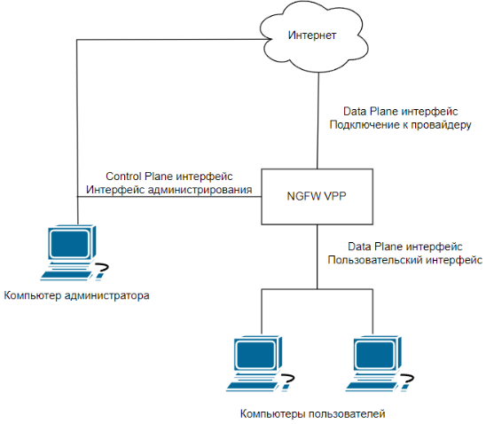

В процессе установки будет настроен Management интерфейс, который используется под интеграции с Active Directory и ALD Pro.


Перед настройкой сетевых интерфейсов проверьте соответствие сетевых карт [системным требованиям](../general/data-update-source-utm-vpp.md).


## Процесс установки
Для установки Ideco UTM VPP выполните действия:
1. Перейдите к установке, нажав **Install Ideco UTM VPP**.
2. Выберите диск для установки и ознакомьтесь с **предупреждением об уничтожении данных на диске**. При наличии только одного диска будет сразу предложено установить систему на него:

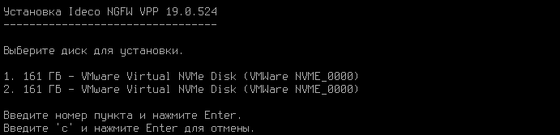

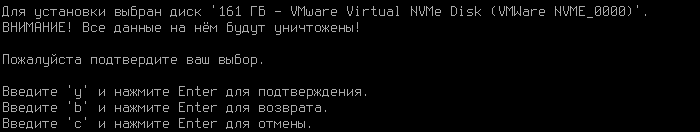

3. Выберите временную зону, в которой вы находитесь:

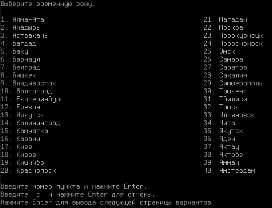

4. Настройте дату и время в соответствии с вашей временной зоной. **Обязательно проверьте правильность даты и времени**:

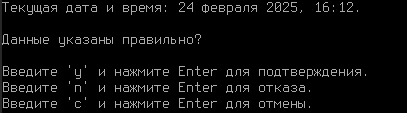


Не забудьте извлечь USB диск после установки Ideco UTM VPP, чтобы загрузка с USB диска не началась заново.


## Создание учетной записи администратора

Для входа в веб-интерфейс Ideco UTM VPP нужно создать учетную запись администратора с соблюдением требований к паролю:

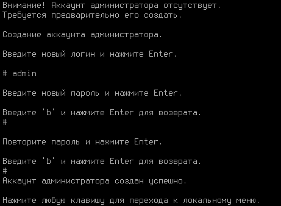

Требования к паролю

* **Минимальная длина пароля** - 10 символов;
* **Cодержит только строчные и заглавные латинские буквы**;
* **Содержит цифры**;
* **Содержит специальные символы** (! # $ % & ' * + и другие).


Если пароль не соответствует требованиям политики безопасности, то появится надпись с информацией, что пароль не надежен. Потребуется ввести новый пароль с учетом требований к паролю.


## Настройка Management интерфейса 


Для корректной работы Ideco UTM VPP Management интерфейс должен иметь возможность выхода в Интернет.



При использовании сетевых карт одного производителя могут возникнуть трудности при идентификации сетевой карты для настройки сетевого интерфейса.
Для корректной идентификации сетевой карты используйте ее MAC-адрес.


Для настройки Ideco UTM VPP через веб-интерфейс нужно настроить Management интерфейс в консоли: 

1. Введите номер сетевого адаптера под Management интерфейс:

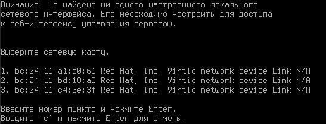

2. Настройте локальную сеть автоматически через DHCP или вручную:

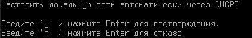

3. При настройке вручную введите локальный IP-адрес сети и маску в формате `ip/маска`.
4. Введите адрес шлюза в формате `ip`, который **будет использоваться для выхода в Интернет**:

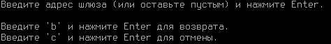


Если через шлюз не будет выхода в интернет, то Ideco UTM VPP не сможет получить лицензию на сервер и будет некорректно работать.


5. Задайте тег VLAN при необходимости (стандарт VLAN 802.3ad):

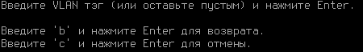

6. После создания Management интерфейса cервер перезагрузится и откроется меню управления сервером:

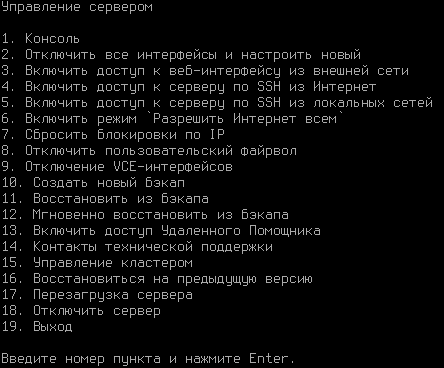

Дальнейшая настройка Ideco UTM VPP выполняется через веб-интерфейс. Подробнее можно узнать в статье [Первоначальная настройка](../initial-setup/initial-setup-web.md).