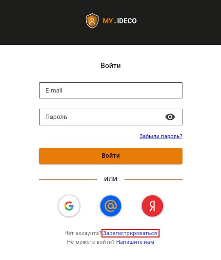
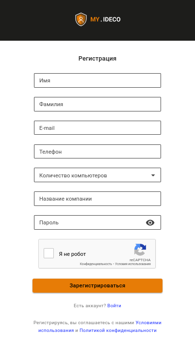

# Личный кабинет my.ideco


Личный кабинет my.ideco.ru позволяет пользователю получить информацию:

* об имеющихся лицензиях;
* о [сроке окончания подписки](https://2020.ideco.ru/development) на обновления модулей и технической поддержки.



Нужна помощь при настройке Ideco NGFW? Получите быстрый ответ от [чат-бота](https://gpt-docs.ideco.ru/) нашей документации!


## Регистрация на my.ideco

Перед загрузкой образа системы зарегистрируйтесь на [my.ideco.ru](https://my.ideco.ru/):

1. Зайдите на [my.ideco.ru](https://my.ideco.ru/) и нажмите **Зарегистрироваться**:

2. Укажите свои личные данные и данные о компании:

3. Подтвердите электронную почту, следуя инструкциям в письме.


Адрес электронной почты используется в качестве логина на **my.ideco.ru** и для восстановления пароля.


## Загрузка образа Ideco NGFW 

Перед установкой на устройство скачайте образ системы с [my.ideco.ru](https://my.ideco.ru/):

1. Перейдите в раздел **UTM** на вкладку **Скачать**.
2. Найдите образ Ideco NGFW и нажмите **Скачать**.

Для установки на устройство следуйте шагам в [статье](./preparation-install.md).
