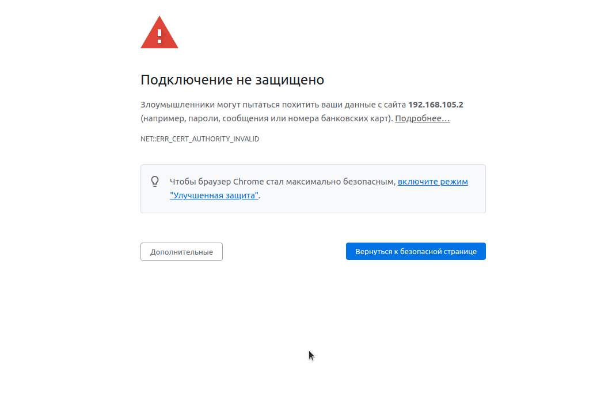
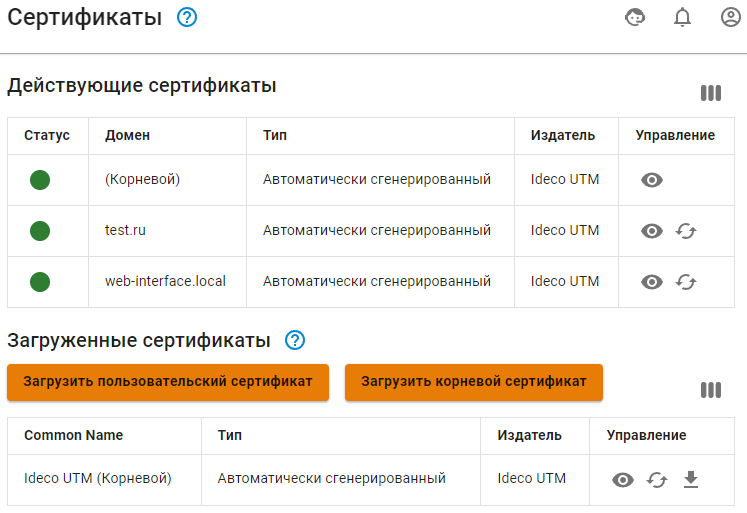
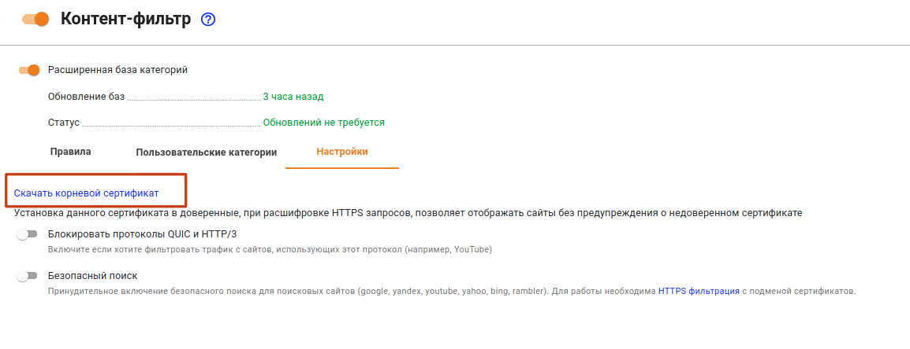
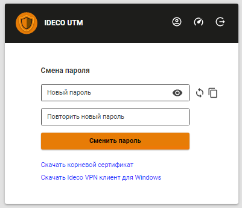
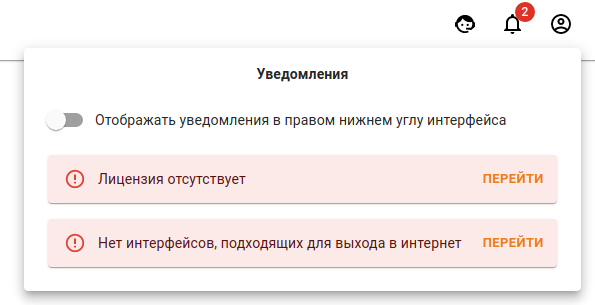
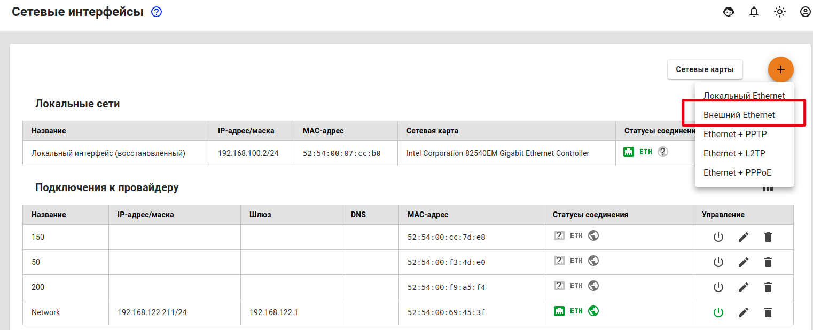
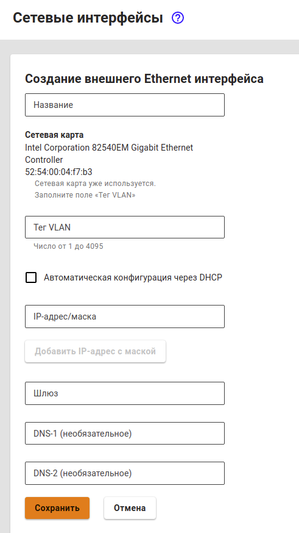

# Первоначальная настройка

## Подключение к веб-интерфейсу Ideco UTM


Если вы еще не установили Ideco UTM, перейдите в раздел [Процесс установки](installation-process.md).


После успешной установки Ideco UTM можно переходить к его первичной настройке.

Запустите на любом компьютере локальной сети интернет-браузер, например Mozilla Firefox или Google Chrome (Internet Explorer не поддерживается), введите в адресной строке локальный IP-адрес, указанный при установке в настройках локального сетевого интерфейса и порт **8443**, на котором работает веб-интерфейс в формате:

 `IP-адрес:порт`

Так как подключение к web-интерфейсу осуществляется с применением шифрования, интернет-браузер может выдать ошибку о том, что сертификат безопасности не был выпущен доверенным центром сертификации. В таком случае вам необходимо продолжить соединение, нажав на соответствующую кнопку в нижней части окна.

Пример ошибки в браузере Google Chrome:

После того как вы перешли на сайт по IP-адресу, в окне браузера должно появиться окно авторизации в веб-интерфейс Ideco UTM. Введите логин и пароль от учетной записи администратора, созданной на этапе установки Ideco UTM.

Чтобы ошибка больше не появлялась, импортируйте корневой сертификат UTM в браузер. Сертификат можно скачать тремя способами: 

1\. В разделе **Сервисы -> Сертификаты**, нажав на кнопку **Скачать корневой сертификат**: 

2\. В разделе **Правила трафика -> Контент-фильтр -> Настройки**:  

3\. Также корневой сертификат можно скачать, зайдя в личный кабинет Ideco UTM под учетной записью одного из имеющихся пользователей: 

После первого входа в веб-интерфейс вы увидите несколько уведомлений, которые подскажут вам, что для корректной работы Ideco UTM необходимо настроить подключение к провайдеру и зарегистрировать сервер.

## Настройка подключения к интернет-провайдеру

Для настройки подключения к провайдеру перейдите в раздел **Сервисы - Сетевые интерфейсы**.

### Настройка **Ethernet-подключения**

Данный тип подключения требует настройки параметров, описанных ниже в таблице.

| Параметр          | Примечание                                                                                                                                                                                                 |
| ----------------- | ---------------------------------------------------------------------------------------------------------------------------------------------------------------------------------------------------------- |
| Сетевая карта     | Необходимо указать сетевой адаптер, который будет использоваться для  подключения к интернет-провайдеру. Для идентификации адаптера вы можете  ориентироваться на наименование производителя или MAC-адрес |
| IP-адрес и маска  | Сетевые  реквизиты, которые были назначены провайдером. Укажите IP-адрес и сетевую маску в формате CIDR или четырех  октетов                                                                               |
| Шлюз по умолчанию | Укажите IP-адрес шлюза интернет-провайдера, через который будет осуществляться подключение к сети Интернет                                                                                                 |


Если ваш провайдер поддерживает автоматическое конфигурирование внешнего сетевого интерфейса с помощью протокола DHCP, то отметьте пункт **Автоматическая конфигурация через DHCP**. 


Для настройки Ethernet-подключения выполните следующие шаги: 

1\. Нажмите на иконку  (3) (3) (6) (6) (5) (6).png>) в правом верхнем углу и выберите пункт **Внешний Ethernet**.


**Будте внимательны! **

Если вы выберете пункт **Локальный Ethernet **и настроите его как **Внешний Ethernet, доступ в сеть Интернет будет отсутствовать.**


2\. Выберите подходящую сетевую карту.

3\. Заполните следующие поля, они являются обязательными:

* Название;
* IP-адрес/маска;
* Шлюз;

4\. Проверьте правильность введенных данных и нажмите кнопку **Сохранить**.

### Настройка других типов подключений

Если ваш провайдер использует другой тип подключения, то ознакомиться с остальными инструкциями по настройке вы можете по следующим ссылкам:

* [Подключение по протоколу PPPoE ](../settings/connection-to-provider/pppoe-connection.md) 
* [Подключение по технологии VPN (с использованием протокола PPTP)](../settings/connection-to-provider/pptp-connection.md) 
* [Подключение по L2TP](../settings/connection-to-provider/l2tp-connection.md)
* [Подключение по Ethernet](../settings/connection-to-provider/ethernet-connection.md)
* [Подключение по 3G и 4G](../settings/connection-to-provider/3g-4g-connection.md)
* [Одновременное подключение к нескольким провайдерам](../settings/connection-to-provider/multiple-simultaneous-connections.md)


После подключения к Интернету требуется [зарегистрировать сервер](../service/server-registration.md). 

