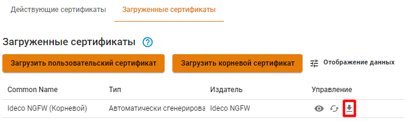
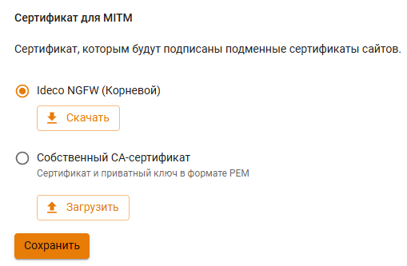
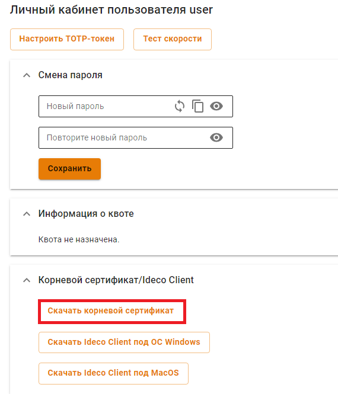

# Первоначальная настройка


Поддерживаются современные версии браузеров Firefox, Chrome и браузеров, основанных на Chromium для администрирования сервера через веб-интерфейс.



Нужна помощь при настройке Ideco NGFW? Получите быстрый ответ от [чат-бота](https://gpt-docs.ideco.ru/) нашей документации!


## Подключение к веб-интерфейсу Ideco NGFW

1. Запустите на любом компьютере в локальной сети поддерживаемый интернет-браузер.
2. Введите в адресной строке IP-адрес, указанный при настройке локального интерфейса, и порт 8443.\
**Пример:** `192.168.100.2:8443`
3. Браузер выдаст предупреждение о том, что сертификат безопасности не был выпущен доверенным центром сертификации. Продолжите соединение, нажав на соответствующую кнопку в нижней части окна:

4. Введите логин и пароль от учетной записи, созданной при установке NGFW.

## Импорт корневого сертификата NGFW в браузер

Для устранения предупреждения в браузере при входе в веб-интерфейс нужно импортировать корневой сертификат NGFW или добавить сертификат в **доверенные корневые центры сертификации** устройства.\

* В разделе **Сервисы->Сертификаты -> Загруженные сертификаты** нажмите на кнопку :

* В разделе **Правила трафика -> Контент-фильтр -> Настройки**:

* Зайдите в личный кабинет Ideco NGFW под учетной записью одного из имеющихся пользователей:

После первого входа в веб-интерфейс появится несколько уведомлений, которые подскажут, что для корректной работы Ideco NGFW необходимо настроить подключение к провайдеру и зарегистрировать сервер.

## Настройка **Ethernet-подключения**

Данный тип подключения требует настройки параметров, описанных ниже в таблице.

| Параметр          | Примечание                      |
| ----------------- | --------------------------------------------------- |
| Сетевая карта     | Необходимо указать сетевой адаптер, который будет использоваться для подключения к интернет-провайдеру. Для идентификации адаптера ориентируйтесь на наименование производителя или MAC-адрес |
| IP-адрес и маска  | Сетевые реквизиты, которые были назначены провайдером. Укажите IP-адрес и сетевую маску в формате CIDR или четырех октетов  |
| Шлюз по умолчанию | Укажите IP-адрес шлюза интернет-провайдера, через который будет осуществляться подключение к сети Интернет                        |


Если провайдер поддерживает автоматическое конфигурирование внешнего сетевого интерфейса с помощью протокола DHCP, то отметьте пункт **Автоматическая конфигурация через DHCP**.


Для настройки Ethernet-подключения выполните следующие шаги:

1. Перейдите в раздел **Сервисы -> Сетевые интерфейс**. 

2\. Нажмите на иконку  в правом верхнем углу и выберите пункт **Внешний Ethernet**.


**Будьте внимательны!**

При выборе пункта **Локальный Ethernet** и настройке его как **Внешний Ethernet, доступ в сеть Интернет будет отсутствовать.**


3\. Выберите подходящую сетевую карту.

4\. Заполните следующие поля, они являются обязательными:

* Название;
* IP-адрес/маска;
* Шлюз (или установите флаг в строке _Автоматическая конфигурация через DHCP_);

5\. Проверьте правильность введенных данных и нажмите кнопку **Сохранить**.

## Настройка других типов подключений

Если провайдер использует другой тип подключения, то ознакомиться с остальными инструкциями по настройке можно по следующим ссылкам:

* [Подключение по протоколу PPPoE](../settings/services/connection-to-provider/pppoe-connection.md);
* [Подключение по технологии VPN (с использованием протокола PPTP)](../settings/services/connection-to-provider/pptp-connection.md);
* [Подключение по L2TP](../settings/services/connection-to-provider/l2tp-connection.md);
* [Подключение Локального Ethernet](../settings/services/connection-to-provider/local-ethernet.md);
* [Подключение по 3G и 4G](../settings/services/connection-to-provider/3g-4g-connection.md);
* [Одновременное подключение к нескольким провайдерам](../settings/services/multiple-simultaneous-connections.md).

После подключения к интернету зарегистрируйте сервер и получите лицензию. Подробнее в статье [Регистрация сервера](../recipes/server-maintenance/server-registration.md).
