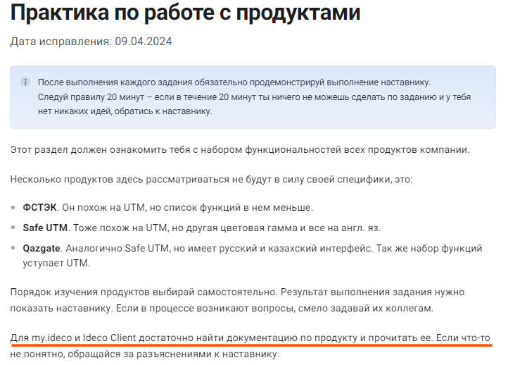

# Процесс установки

## Системные требования


**Обязательные условия для работы с Ideco UTM:**

1. Поддержка UEFI.
2. Отключить режим Legacy загрузки, он может называться CSM (Compatibility Support Module).
3. Отключить опцию Secure Boot в UEFI.


| Комплектующие            | Минимальные системные требования                                                                                                              | Примечание                                                                                                                                                                                                                                                                           |
| ------------------------ | --------------------------------------------------------------------------------------------------------------------------------------------- | ------------------------------------------------------------------------------------------------------------------------------------------------------------------------------------------------------------------------------------------------------------------------------------ |
| Процессор                | Intel Pentium G/i3/i5/Xeon E3/Xeon E5 с поддержкой инструкций SSE 4.2                                                                         | Требования могут варьироваться в зависимости от сетевой нагрузки и используемых сервисов, таких как контентная фильтрация, антивирусы и система предотвращения вторжений. Для работы системы требуется минимум два, лучше четыре ядра процессора                                     |
| Объем оперативной памяти | 8 Гб (16 Гб при количестве пользователей более 75)                                                                                            | Требования могут варьироваться в зависимости от сетевой нагрузки и используемых сервисов, таких как контентная фильтрация, антивирусы и система предотвращения вторжений                                                                                                             |
| Дисковая подсистема      | Жесткий диск или SSD объемом 64 ГБ или больше с интерфейсом SATA, SAS. В случае использования почтового сервера - второй жесткий диск или SSD | Не поддерживаются программные RAID-контроллеры (интегрированные в чипсет или материнскую плату). Не рекомендуется использование аппаратных RAID-контроллеров                                                                                                                         |
| Сетевые адаптеры         | Один сетевой адаптер                                                                                                                          | Рекомендуются гигабитные (или 10G) сетевые карты Intel                                                                                                                                                                                                                               |
| Дополнительно            | Монитор и клавиатура                                                                                                                          | Для установки и работы Ideco UTM не требуется предустановленная ОС и дополнительное программное обеспечение. Ideco UTM устанавливается на выделенный сервер с загрузочного USB flash диска, при этом автоматически создается файловая система и устанавливаются все необходимые компоненты |


Для оптимального выбора аппаратной платформы обратите внимание на [рекомендации](../recipes/popular-recipes/choosing-hardware-platform.md) по подбору оборудования для Ideco UTM. Примерный объем необходимого места на диске для хранения статистики веб-отчетности для 1000 пользователей за 1 год составляет 10-15 Гб.


### Поддержка браузеров для веб-интерфейса администрирования сервера

Поддерживаются современные версии браузеров Firefox, Chrome и браузеров основанных на Chromium. Internet Explorer не поддерживаются.

### Поддержка гипервизоров

Microsoft Hyper-V (2-го поколения, Windows 2012R2 и выше), VMware, VirtualBox, KVM, Citrix XenServer. Подробнее об [особенностях настройки](specifics-of-hypervisor-settings.md).

### Примеры конфигураций

Примеры нескольких типов конфигураций, зависящие от количества пользователей, представлены ниже в таблице.

| Комплектующие            | 25                                       | 50-200                        | 200-500                                        | 1000                              | 2000                                    |
| ------------------------ | ---------------------------------------- | ----------------------------- | ---------------------------------------------- | --------------------------------- | --------------------------------------- |
| Модель процессора        | Intel Pentium Gold G5400 или совместимый | Intel i3 8100 или совместимый | Intel i5, i7, Xeon E3 от 3 ГГц или совместимый | Intel Xeon E3, E5 или совместимый | Intel Xeon E5 или совместимый 8-ядерный |
| Объем оперативной памяти | 8 Гб                                     | 8 Гб                          | 16 Гб                                          | 16 Гб                             | 32 Гб                                   |
| Дисковая подсистема      | 64 Гб                                    | 64 Гб                         | 250 Гб                                         | 500 Гб                            | 500 Гб                                  |
| Сетевые адаптеры         | 2 шт.                                    | 2 шт.                         | 2 шт.                                          | 2 шт.                             | 2 шт.                                   |

#### Данные по производительности

Пример конфигурации №1: Intel Atom C3758, 8 GB DDR4, 1GB LAN.

* В режиме L3: TCP до 1 Гбит/c, UDP до 1 Гбит/c, HTTP до 600 Мбит/с.
* **\***В режиме L7: TCP до 160 Мбит/c, UDP до 280 Мбит/c, HTTP до 100 Мбит/c.

Пример конфигурации №2: Intel Xeon E-2234, 16 GB DDR4, 1 GB LAN.

* В режиме L3: TCP до 1 Гбит/c, UDP до 1 Гбит/c, HTTP до 1 Гбит/c.
* **\***В режиме L7: TCP до 550 Мбит/c, UDP до 900 Мбит/c, HTTP до 500 Мбит/c.

**\*** - Режим L7: включенные модули IPS, контент-фильтр, контроль приложений, антивирусная проверка.

## Варианты установки

Вы можете установить Ideco UTM на отдельный сервер или на виртуальную машину. Выбор варианта установки зависит от предполагаемой нагрузки и мощности оборудования.

### Установка Ideco UTM с USB flash диска

Ideco UTM можно установить с flash-накопителя, записав на него установочный ISO-образ. Процесс подготовки установочного flash-накопителя описан в статье [Создание загрузочного USB flash диска](usb.md).

### Установка на отдельный сервер

Для установки шлюза безопасности Ideco UTM вам необходимо выполнить следующие действия:

1. Подготовьте оборудование, отвечающее системным требованиям;
2. Подготовьте USB flash диск объемом не менее 2 Гб;
3. Скачайте ISO-образ из личного кабинета пользователя: [my.ideco.ru](https://my.ideco.ru);
4. В целях обеспечения безопасности рекомендуется проверить контрольные суммы загруженного файла, которые можно найти на странице загрузки Ideco UTM в личном кабинете;
5. Запишите ISO-образ на USB flash диск;
6. В параметрах UEFI компьютера выберите загрузку с USB flash диск и начните загрузку системы с приготовленного носителя. На экране монитора должен появиться установщик Ideco UTM, как проиллюстрировано ниже.

## Процесс установки

### Этап 1. Режим установки

**Выберите режим установки:**

1. Install Ideco UTM.
2. Install Ideco UTM in basic graphics mode.

Выберите второй вариант, если при установке у вас есть проблемы отображения элементов установщика.

Меню выбора режима установки:

.png>)

### Этап 2. Начало установки

Выберите диск для установки. Для этого введите номер диска, который хотите использовать и нажмите **Enter**.

.png>)

Система предупредит о том, что при установке будут уничтожены все данные, которые хранятся на жестком диске. Рекомендуем вам убедиться в том, что диск не содержит важной информации, так как её восстановление будет невозможно. Предупреждение об уничтожении данных представлено на снимке экрана ниже. Для продолжения введите **y** и нажмите **Enter**.

Далее необходимо выбрать часовой пояс. Выберите временную зону, в которой вы находитесь. Для этого введите **y** и нажмите **Enter**.

.png>)

В следующем диалоговом окне необходимо настроить дату и время. Если настройки верны, то введите **y** и нажмите **Enter**.

Если настройки не актуальны, то введите **n** и укажите верные данные, после чего нажмите **Enter**.

 (1).png>)

Далее установщик выполнит необходимые действия для установки системы на диск:

* создание таблицы разделов и их форматирование;
* копирование системных файлов на диск;
* настройка основных параметры системы в соответствии с конфигурацией вашего компьютера.


Не забудьте извлечь носитель с дистрибутивом во время перезагрузки UTM, чтобы система не начала загрузку с установочного носителя.


После перезагрузки сервера вы увидите окно с информацией о системе. Пример такого окна отображен ниже. Для продолжения нажмите любую клавишу.

.png>)

Если требуется настроить сервер как вторую ноду кластера, нажмите **y**, а затем **Enter**. Подробнее о настройке кластеризации смотрите в статье [cluster.md](../settings/cluster.md "mention").

Если настройка кластеризации не требуется, то нажмите **n**, а затем **Enter**.

### Этап 3. Создание учетной записи администратора

Создайте учетную запись администратора. После ввода логина нажмите **Enter** и введите новый пароль для учетной записи, после чего нажмите **Enter**.

Требования к созданию пароля администратора:

* Минимальная длина пароля - 10 символов;
* Строчные и заглавные латинские символы;
* Цифры;
* Специальные символы (! # $ % & ' \* + и т.д.).

**Если пароль не будет соответствовать требованиям политики безопасности, то появится надпись с информацией о том, что пароль не надёжен.** Необходимо ввести новый пароль, учитывая требования к созданию паролей и нажать **Enter**.

.png>)

После того как аккаунт будет создан, нажмите любую клавишу для перехода в локальное меню и введите данные от только что созданной учетной записи администратора.

### Этап 4. Настройка сетевого адаптера

Теперь система предложит вам настроить локальный сетевой интерфейс. Локальным считается интерфейс, к которому будет подключена локальная сеть вашего предприятия. Введите номер сетевого адаптера из списка и нажмите **Enter**.


При определении локального интерфейса вы можете столкнуться со сложностями идентификации сетевой карты. Иногда у нескольких адаптеров может быть один и тот же производитель. В этом случае для правильного выбора необходимо будет идентифицировать устройство по его MAC-адресу. Не бойтесь ошибиться, в дальнейшем вы сможете изменить эти настройки.


.png>)

Введите локальный IP-адрес и маску подсети в формате `ip/маска` и нажмите **Enter**.

Далее, если необходимо, задайте тег VLAN или оставьте поле пустым и нажмите **Enter**.

.png>)

После создания локального интерфейса откроется меню управления сервером.

.png>)

Следующий шаг - конфигурирование Ideco UTM. Этот процесс рассмотрен в разделе [Первоначальная настройка](initial-setup.md).
